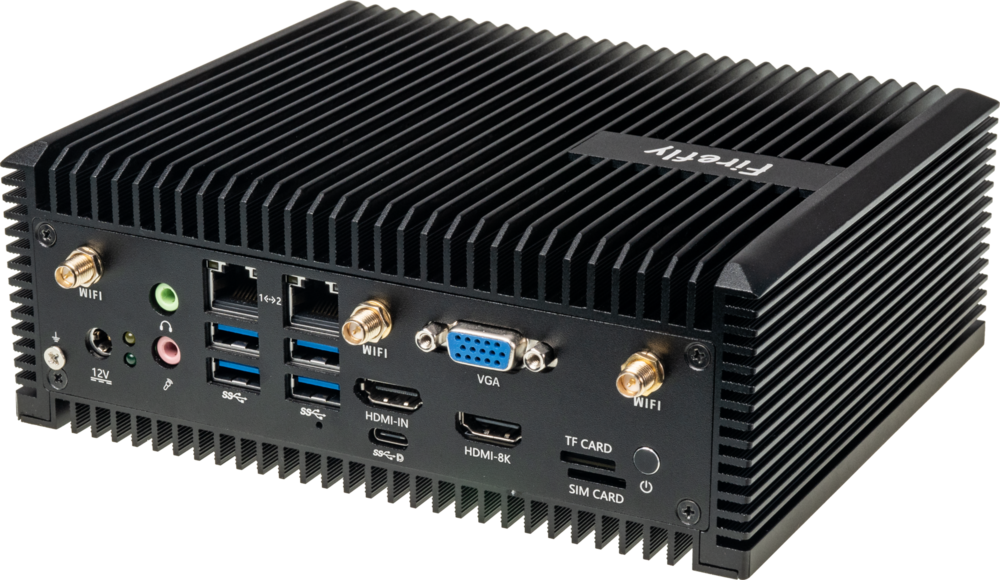
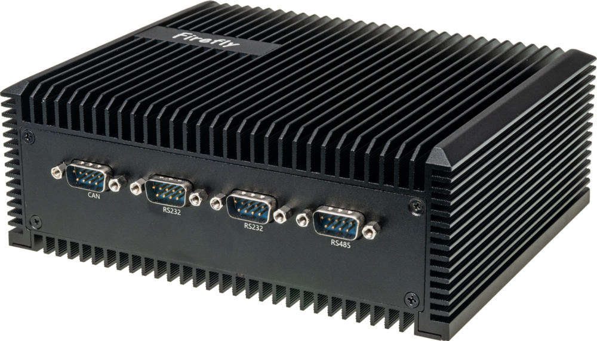

## Product introduction

EC-A3588Q Octa-Core 8K AI Embedded Computer with High Computing Power 
The Rockchip RK3588 series, a new-gen flagship processor, features an octa-core 64-bit ARM architecture, up to 32GB of RAM,
and 8K video encoding and decoding. This embedded computer supports Gigabit Ethernet, WIFI 6, 5G/4G expansion, a variety
of video input and output, and M.2 SATA SSD expansion. It is equipped with an industrial-grade metal enclosure, featuring
fanless design and efficient heat dissipation. The device can be used in ARM PCs, edge computing, cloud terminals,
cloud servers, industrial control, smart vehicles, and more.

 