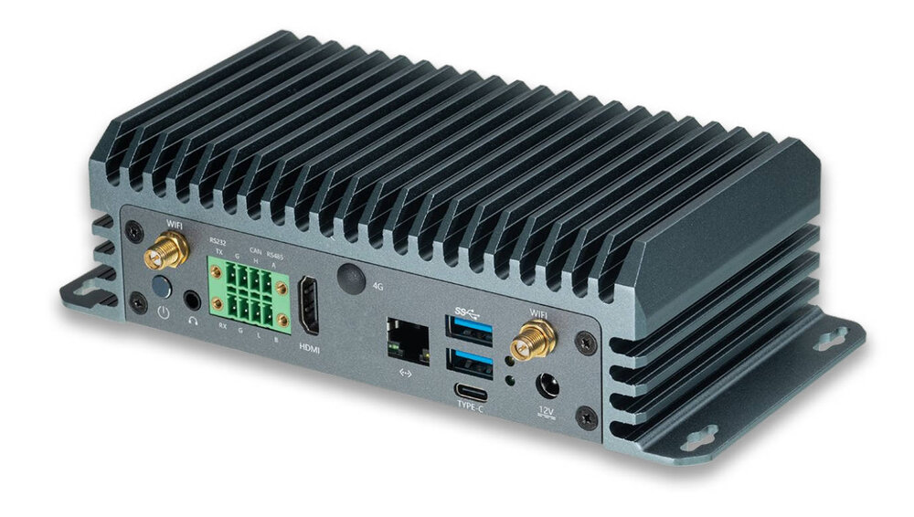

# Product introduction

Adopting Rockchip's new AIoT chip RK3588S, 8nm LP process. It is equipped with an octa-core 64-bit CPU with a frequency of up to 2.4GHz. Integrated ARM Mali-G610 MP4 quad-core GPU can bring better performance to various AI application scenarios. Built-in powerful NPU, computing power up to 6TOPS. It supports INT4/INT8/INT16/FP16 hybrid computing, meet the needs of edge computing AI applications in most terminal devices. Supports 8K@60fps H.265/VP9, 8K@30fps H.264 video decoding, and 8K@30fps H.265/H.264 video encoding. Support the same compilation and interpretation. The device features an industrial-grade, all-metal enclosure with an aluminum alloy structure for efficient heat dissipation. Its fanless design contributes to silent operation, ensuring 24/7 uninterrupted and stable performance. Equipped with HDMI2.1, USB3.0, RS485, RS232, CAN, TF Card, SIM Card, Type-C and other expansion interfaces, convenient for connecting various external devices. 

 