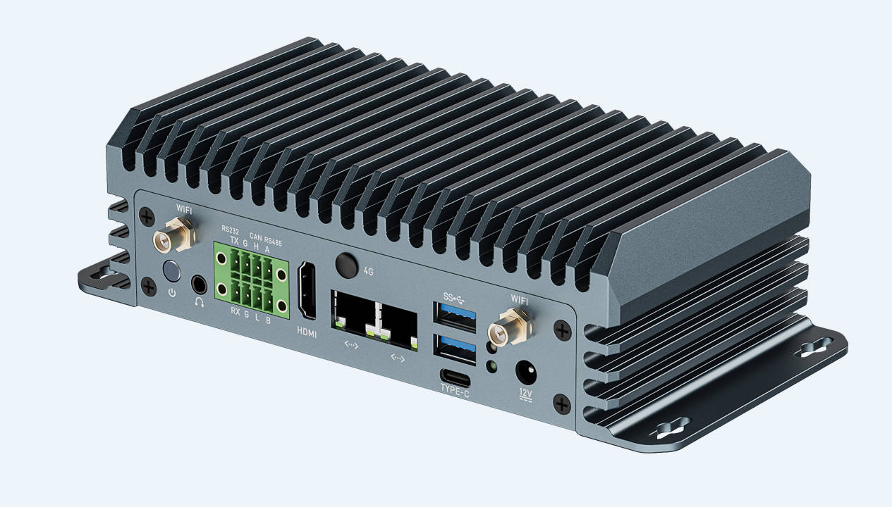
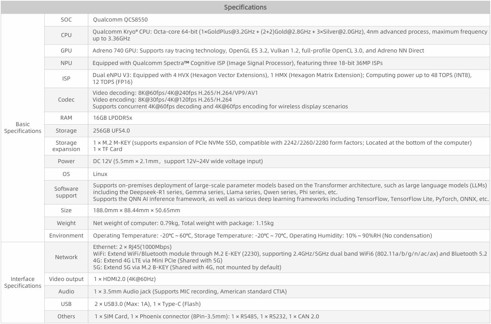
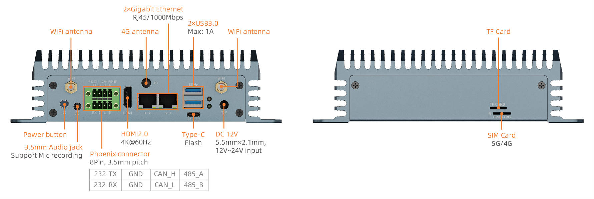
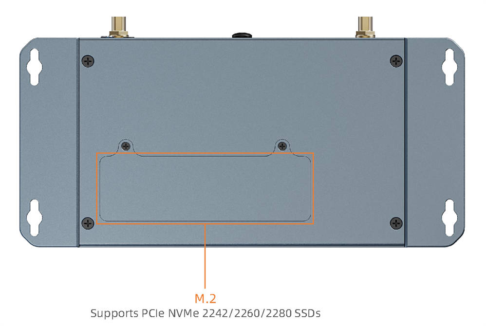
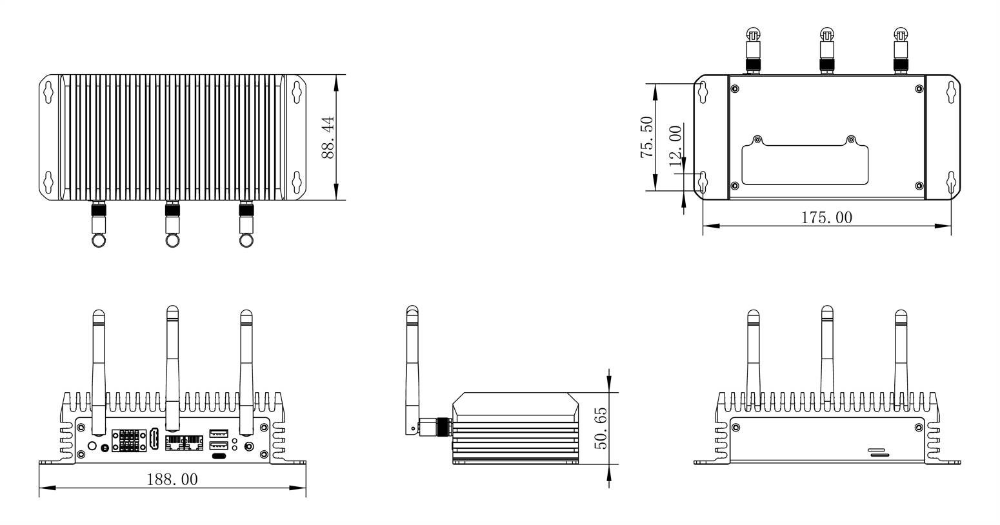

# Introduction

**EC-A8550JD4** Equipped with the Qualcomm QCS8550 octa-core AI processor with a 48 TOPS NPU, it supports mainstream AI models and frameworks. It also features an Adreno 740 GPU for ray tracing and 8K video. It includes multiple expansion interfaces such as HDMI 2.0, RS485, RS232, and USB 3.0, and provides AI model optimization tools, wiki tutorials, and other technical resources for efficient secondary development.

# Specification

# Size

# Resources

* [Manual](../../Mainboards/AIO-8550JD4/index.md) Includes building instructions, system usage, interfaces usage, etc. (AIO-8550JD4 wiki)
* [Download Page](https://en.t-firefly.com/doc/download/381.html) Includes firmware, rootfs and tools download links.
* [Forum](https://bbs.t-firefly.com/forum.php?mod=forumdisplay&fid=100) Tech communication platform for over 100K company and individual customers.

# Support

Contact E-commerce customer service or post on forum for general supports. Professional tech supports or detail informations please contact us:

* Email: sales@t-firefly.com
* Mobile: (+86) 186 8811 7175
* Landline: 0760-89881218
* Service Hotline: 4001-511-533
* Address: Room 2101, Hongyu Building, No. 57 Zhongshan 4th Road, East District, Zhongshan City, Guangdong Province
