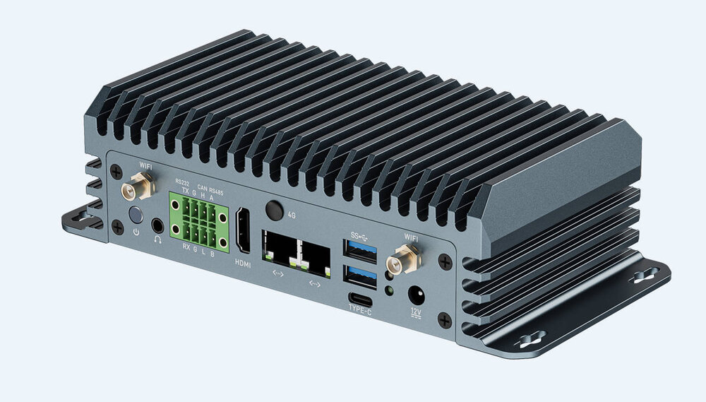

# Introduction

**EC-A8550JD4** Equipped with the Qualcomm hexa-core (1+2+3) QCS8550 AI processor with a 48 TOPS NPU, it supports mainstream AI models and frameworks. It also features an Adreno 740 GPU for ray tracing and 8K video. It includes multiple expansion interfaces such as HDMI 2.0, RS485, RS232, and USB 3.0, and provides AI model optimization tools, wiki tutorials, and other technical resources for efficient secondary development.

