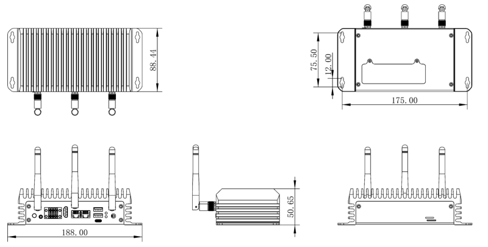

# Introduction

[Specification](https://download.t-firefly.com/Spec/Computers/EC-A8550JD4_Specification_EN.pdf) | [Purchase](https://www.t-firefly.com/products/ec-a8550jd4-48-tops-ai-computer) | [Downloads](https://community.t-firefly.com/en/doc/download/)

**EC-A8550JD4** is equipped with the Qualcomm hexa-core (1+2+3) QCS8550 AI processor with a 48 TOPS NPU, it supports mainstream AI models and frameworks. It also features an Adreno 740 GPU for ray tracing and 8K video. It includes multiple expansion interfaces such as HDMI 2.0, RS485, RS232, and USB 3.0, and provides AI model optimization tools, wiki tutorials, and other technical resources for efficient secondary development.

## Interface Description

**EC-A8550JD4** provides rich interfaces, mainly including:

The interface layout and product specifications are shown below (the complete interface list is to be supplemented):

## Structure and Dimension

## 结构尺寸

## Resources and Support

* [[Forum]](https://forum.t-firefly.com/): Tech communication platform for over 100K company and individual customers.

### Contact

* Email: sales@t-firefly.com
* Mobile: (+86) 186 8811 7175
* Landline: 0760-89881218
* Service Hotline: 4001-511-533
* Address: Room 2101, Hongyu Building, No. 57 Zhongshan 4th Road, East District, Zhongshan City, Guangdong Province