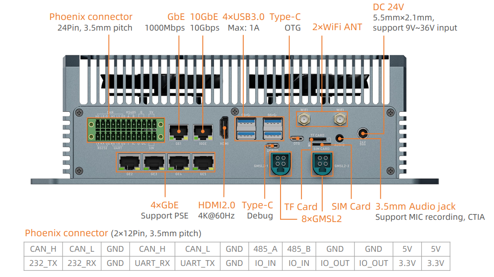
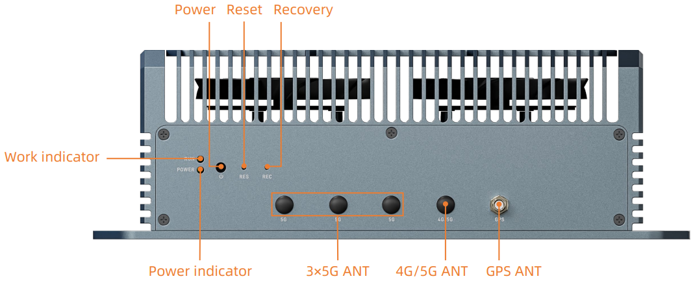

# Introduction
EC-AGXOrin is equipped with the Nvidia Jetson AGX Orin module, is available in 64GB Memory, up to 275 TOPS. It can run AI models, including Transformer and ROS robot models. It can realize larger and more complex deep neural networks, such as using TENSORFLOW, OPENCV, JETPACK, KERASMXNET, PY-TORCH, etc., to achieve object recognition, object detection and tracking, speech recognition, and other visual development functions, meeting the needs of higher AI artificial intelligence application scenarios. 

# Interface description

