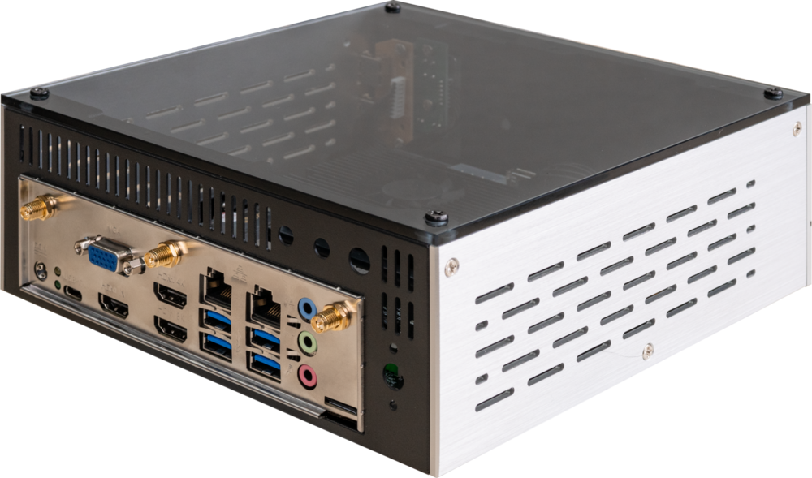
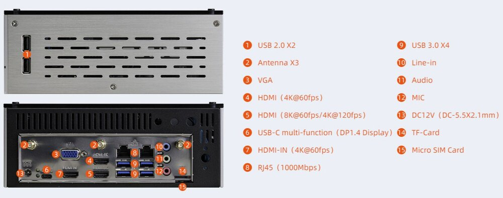

# Product introduction

EC-I3588J embedded host, based on ITX-3588 high-performance open-source platform, equipped with industrial grade casing, dustproof and anti-interference, stable operation for long time, supporting 8K encoding and decoding, and rich interfaces for easy connection to various industrial devices.Based on Rockchip's all-new flagship AIoT chip -- **RK3588**, it adopts an 8nm LP process; Equipped with an eight core (Cortex-A76 x 4+Cortex-A55 x 4) 64 bit CPU, with a main frequency of up to 2.4 GHz. Integrated ARM Mali-G610 MP4 quad core GPU with built-in AI accelerator NPU, capable of providing 6 Tops of computing power, supporting mainstream deep learning frameworks

 