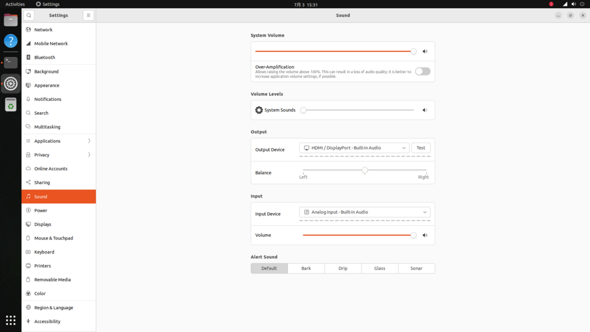

# Hardware Function Usage

The device can also log in to the desktop via HDMI: at the login interface, select `nvidia` for both the Ubuntu session and the password.

## Important Notes

<font color=red>Do NOT run `sudo apt-get upgrade` or `sudo apt-get dist-upgrade`.</font>

<font color=red>Do NOT run `sudo apt upgrade` or `sudo apt dist-upgrade`.</font>

To prevent automatic upgrades:

* Modify `/etc/apt/apt.conf.d/20auto-upgrades` (create it if the file does not exist):

```
APT::Periodic::Update-Package-Lists "0";
APT::Periodic::Unattended-Upgrade "0";
```

* Disable and stop the apt-daily timers services:

```
sudo systemctl disable apt-daily.timer
sudo systemctl disable apt-daily-upgrade.timer
sudo systemctl stop apt-daily.timer
sudo systemctl stop apt-daily-upgrade.timer
```

## Display Interface

The EC-Orin NX provides 1 HDMI output interface.

## Ethernet

The EC-Orin NX provides 1 gigabit Ethernet port.

## USB Interface

The EC-Orin NX provides 2 USB 3.0 ports.

## SIM Card

The SIM card slot of the EC-Orin NX is used together with a 4G module to provide mobile network connectivity. **The 4G module is optional**, and the SIM card function is available only after the module has been installed inside the chassis. The SIM card insertion direction is shown in the figure below. Please power off the device before inserting or removing the SIM card.

<center>


</center>

## CAN

### CAN Introduction

CAN (Controller Area Network) bus is a serial communication network that effectively supports distributed control or real-time control. The CAN bus is a bus protocol widely used in automobiles, designed for communication between microcontrollers in automotive environments. For more information, please refer to the [CAN Application Report](https://www.ti.com/lit/an/sloa101b/sloa101b.pdf).

### Hardware Connection

The location of the CAN interface of the EC-Orin NX is [shown in the figure](started.md). Since there is only one CAN, the first device created in the kernel is `can0` by default.

### CAN Communication Test

Use the candump and cansend tools to test sending and receiving messages:

```
# Close the can0 device on both the receiving and sending ends
ip link set can0 down
# Set the bitrate to 250Kbps
ip link set can0 type can bitrate 250000
# Open the can0 device
ip link set can0 up
# Run candump on the receiving end, blocking and waiting for messages
candump can0
# Run cansend on the sending end to send a message
cansend can0 123#1122334455667788
```

### FAQS

#### The message is received a long time after sending, or is not received.

Check whether the CAN_H and CAN_L bus DuPont wires are loose or reversed.

## Serial Port (RS232 / RS485)

* RS485: Half Duplex, device name: `/dev/ttyTHS2`, default baud rate `9600`
    * Before sending data: `echo 1 > /sys/class/leds/RS485_H_SEND_L_RECV/brightness`
    * Before receiving data: `echo 0 > /sys/class/leds/RS485_H_SEND_L_RECV/brightness`
* RS232: Full Duplex, device name: `/dev/ttyTHS1`, default baud rate `115200`

### Debugging Method

Take the RS485 debugging steps as an example:

(1) Connect the hardware

Connect the RS485B-A, RS485B-B and GND pins of the EC-Orin NX to the A, B and GND pins of the host serial port adapter (USB to 485 serial port module) respectively.

(2) Open the serial terminal on the host

Open kermit in the terminal and set the baud rate:

```
$ sudo kermit
C-Kermit> set line /dev/ttyUSB0
C-Kermit> set speed 9600
C-Kermit> set flow-control none
C-Kermit> connect
```

* `/dev/ttyUSB0` is the device file of the USB to serial port adapter

(3) Send data

The device file of RS485 is `/dev/ttyTHS2`. Run the following commands on the device:

```
sudo -s
stty -F /dev/ttyTHS2 9600 -echo
echo firefly RS485 test... > /dev/ttyTHS2
```

The serial terminal on the host will receive the string "firefly RS485 test..."

(4) Receive data

First run the following commands on the device:

```
sudo -s
cat /dev/ttyTHS2
```

Then enter the string "Firefly RS485 test..." in the serial terminal of the host, and the same string can be seen on the device side.

## Audio

The EC-Orin NX has two audio outputs and one audio input.

### Audio Output

Users can output audio through the headphone jack and HDMI port.

#### Interface Switching

Switch between the headphone and HDMI interfaces in the system settings, selecting one for output:

<center>


</center>

#### Command Line Mode

In the terminal, execute the command:

```shell
# cat /proc/asound/cards
 0 [HDA            ]: tegra-hda - NVIDIA Jetson Orin Nano HDA
                       NVIDIA Jetson Orin Nano HDA at 0x3518000 irq 120
 1 [APE            ]: tegra-ape - NVIDIA Jetson Orin Nano APE
                       NVIDIA-NVIDIAJetsonOrinNanoDeveloperKit-NotSpecified-Jetson
```

* `HDA` represents the HDMI sound card, device number `3`
* `APE` represents the headphone sound card, device number `0`

* HDMI

    ```shell
    aplay -D hw:HDA,3 hdmi.wav # where hdmi.wav needs to be a stereo format file
    ```

* Headphones

    ```shell
    amixer -c APE cset name="I2S2 Mux" ADMAIF1
    aplay -D hw:APE,0 test.wav
    ```

### Audio Input

Using the `APE` sound card, connect the headphones to start recording, execute the command line:

```shell
amixer -c APE cset name="ADMAIF1 Mux" I2S2
arecord -D hw:APE,0 -c 2 -r 16000  -f S32_LE test.wav
```

## RTC

### Introduction

The EC-Orin NX has one internal RTC powered by an external motherboard battery, represented as `rtc0` in the kernel.

### Interface Usage

Linux provides three user-space call interfaces. The paths are:

* SYSFS interface: /sys/class/rtc/rtc0/
* PROCFS interface: /proc/driver/rtc
* IOCTL interface: /dev/rtc0

Synchronize the latest system time to the RTC:

```
hwclock -w
```

### SYSFS Interface

You can directly use `cat` and `echo` to operate the interfaces under `/sys/class/rtc/rtc0/`.

For example, check the current RTC date and time:

```
# cat /sys/class/rtc/rtc0/date
2024-07-10
# cat /sys/class/rtc/rtc0/time
02:36:30
```

### PROCFS Interface

Print the RTC related information:

```
# cat /proc/driver/rtc
rtc_time        : 02:37:00
rtc_date        : 2024-07-10
alrm_time       : 00:00:00
alrm_date       : 1970-01-01
alarm_IRQ       : no
alrm_pending    : no
update IRQ enabled      : no
periodic IRQ enabled      : no
periodic IRQ frequency  : 1
max user IRQ frequency  : 64
24hr            : yes
```

### IOCTL Interface

You can use `ioctl` to control `/dev/rtc0`.

For detailed usage, please refer to the document `kernel-jammy-src/Documentation/admin-guide/rtc.rst`.

## Watchdog

The external watchdog device name is `/dev/wdt_crl`, and the usage is as follows:

```shell
# Write different fields to enable the watchdog and set the time
# The numbers 0, 1, 2, 3 represent 0.64s, 2.56s, 10.24s, 40.96s respectively
# The letter e represents enabling the watchdog, and the letter d represents disabling the watchdog

# Enable and set a timeout of 10.24 seconds; it must be written to once every 10.24 seconds, and different numbers can be written at any time to change the time
echo e >/dev/wdt_crl // Enable
echo 2 >/dev/wdt_crl // Set timeout to 10 seconds
```