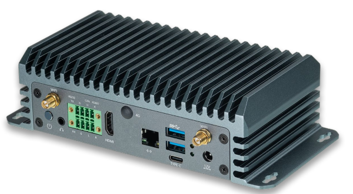
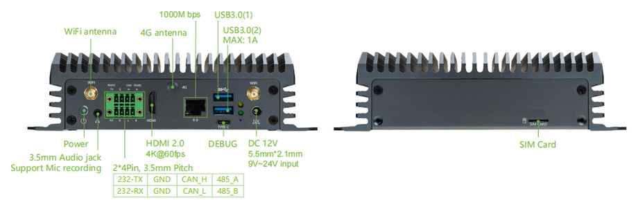
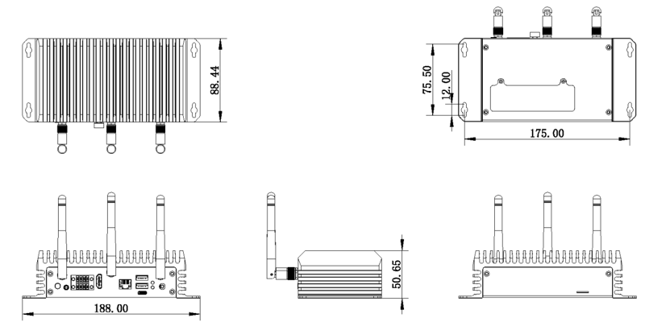

# Introduction

[Specification](https://download.t-firefly.com/Spec/Computers/EC-OrinNano_EC-OrinNX_Specification_EN.pdf) | [Purchase](https://www.t-firefly.com/products/ec-orinnx-157tops-computing-power-ai-edge-computing-host-jetson-module-nvidia-nvidia) | [Downloads](https://community.t-firefly.com/en/doc/download/259)

EC-Orin NX is equipped with the official NVIDIA Jetson Orin NX core board module, featuring 16GB of memory and a computing power of up to 157 TOPS. It can run all modern AI models, including Transformer and ROS robot models. It enables larger and more complex deep neural networks, utilizing TENSORFLOW, OPENCV, JETPACK, KERASMXNET, PY-TORCH, etc., to achieve functionalities such as object recognition, target detection and tracking, speech recognition, and other visual development, meeting the demands of higher AI application scenarios.

## Interface Description

**EC-Orin NX** provides rich interfaces, mainly including:
- 12V Power Interface（5.5*2.5mm）
- POWER Button
- RS232
- RS485
- CAN
- Gigabit Ethernet x 1
- USB 3.0 x 2
- HDMI
- SIM Card Slot
- BT Antenna
- WIFI Antenna x 2
- 4G Antenna
- Headphone Jack
- NVME Interface (PCIE3.0 x 1)
- Type-C (USB 2.0, used as debug serial port by default)
- Power LED

## 结构尺寸

## Resources and Support

* [SDK DeveloperGuide (r36.3)](https://docs.nvidia.com/jetson/archives/r36.3/DeveloperGuide/index.html)
* [Jetson GPIO](https://github.com/NVIDIA/jetson-gpio)
* [Jetson Benchmarks](https://github.com/NVIDIA-AI-IOT/jetson_benchmarks)
* [Jetson Download Center](https://developer.nvidia.com/embedded/downloads)
* [Jetson Archived Documentation](https://docs.nvidia.com/jetson/archives/)
* [Technical Forum](https://forum.t-firefly.com/): A communication platform with more than 100,000 enterprise customers and users

### Contact

* Email: sales@t-firefly.com
* Mobile: (+86) 186 8811 7175
* Landline: 0760-89881218
* National Service Hotline: 4001-511-533
* Address: Room 2101, Hongyu Building, No. 57 Zhongshan 4th Road, East District, Zhongshan City, Guangdong Province