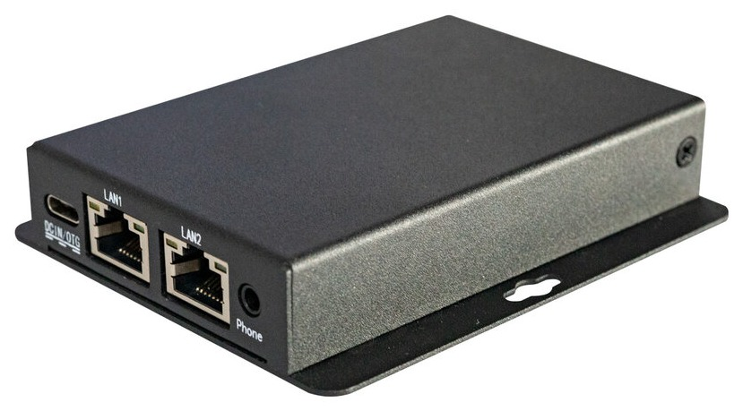

# Introduction

[Specification](https://download.t-firefly.com/Spec/Computers/EC-R3308CC_Specification_EN.pdf) | [Purchase](https://www.t-firefly.com/products/ec-r3308cc-industrial-pc) | [Downloads](https://community.t-firefly.com/en/doc/download/87)

The EC-R3308CC adopts the Rockchip dedicated IoT processor RK3308B, based on the ARM quad-core 64-bit Cortex-A35 core with a main frequency of 1.3GHz, and can be quickly applied to IoT, industrial control, intelligent robots and other fields. The beautiful aluminum alloy casing makes the product more perfect and simple, and the integrated overall design greatly shortens the customer development period. It is a low-threshold, high-efficiency development product.

## Interface Description

**EC-R3308CC** provides rich interfaces, mainly including:

The list of external interfaces of the complete machine is to be supplemented, subject to the actual product. For the usage of the debug serial port, please refer to [Hardware Function Usage](hardware_usage.md).

The host interfaces are shown below:

## Structure and Dimensions

## Resources and Support

* [[Wiki]](../../System%20on%20Module/Core-3308Y/index.md): Contains driver development and other materials (refer to the Core-3308Y Wiki)
* [[Git link]](https://gitlab.com/TeeFirefly/rk3308-linux): SDK source code
* [[Technical Forum]](https://forum.t-firefly.com/): A communication platform with more than 100,000 enterprise customers and users

### Contact

* Email: sales@t-firefly.com
* Mobile: (+86) 186 8811 7175
* Landline: 0760-89881218
* National Service Hotline: 4001-511-533
* Address: Room 2101, Hongyu Building, No. 57 Zhongshan 4th Road, East District, Zhongshan City, Guangdong Province
 