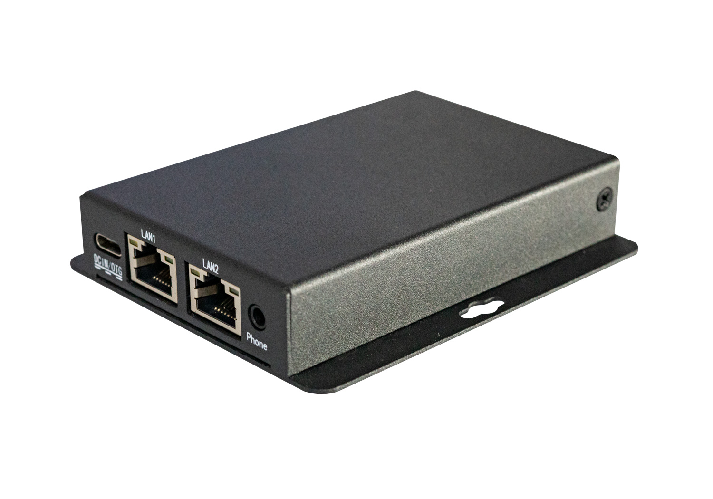
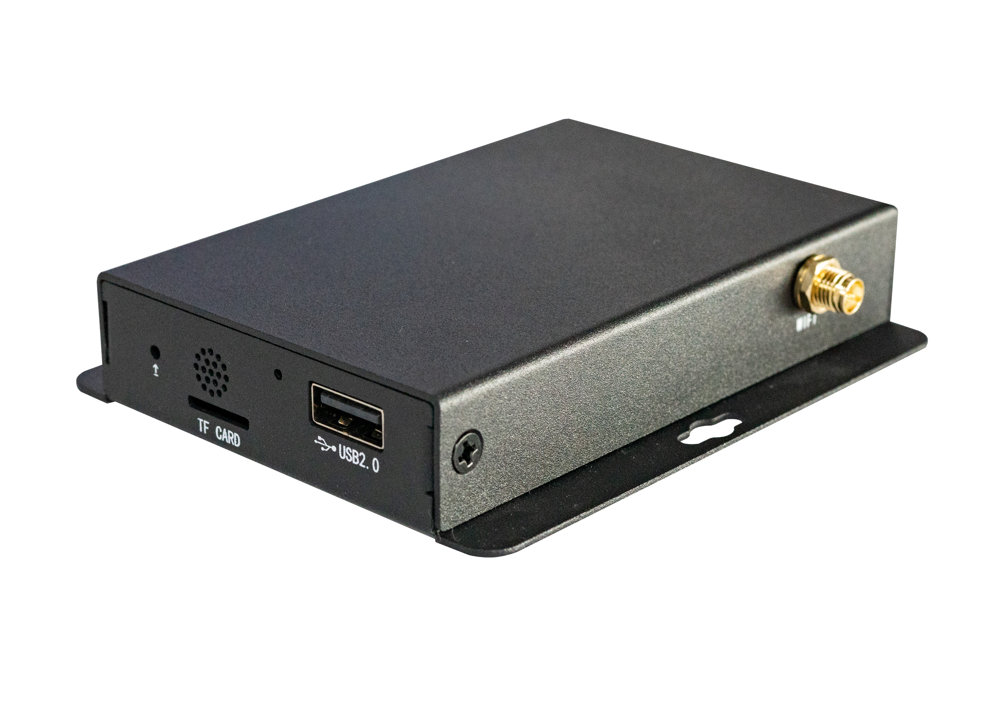
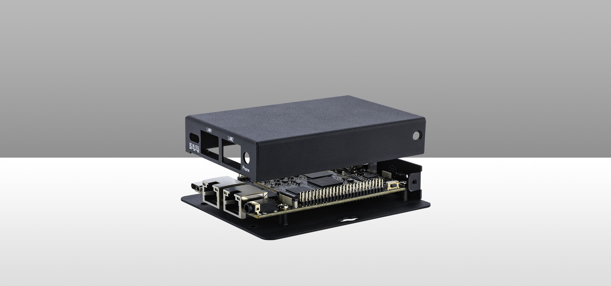
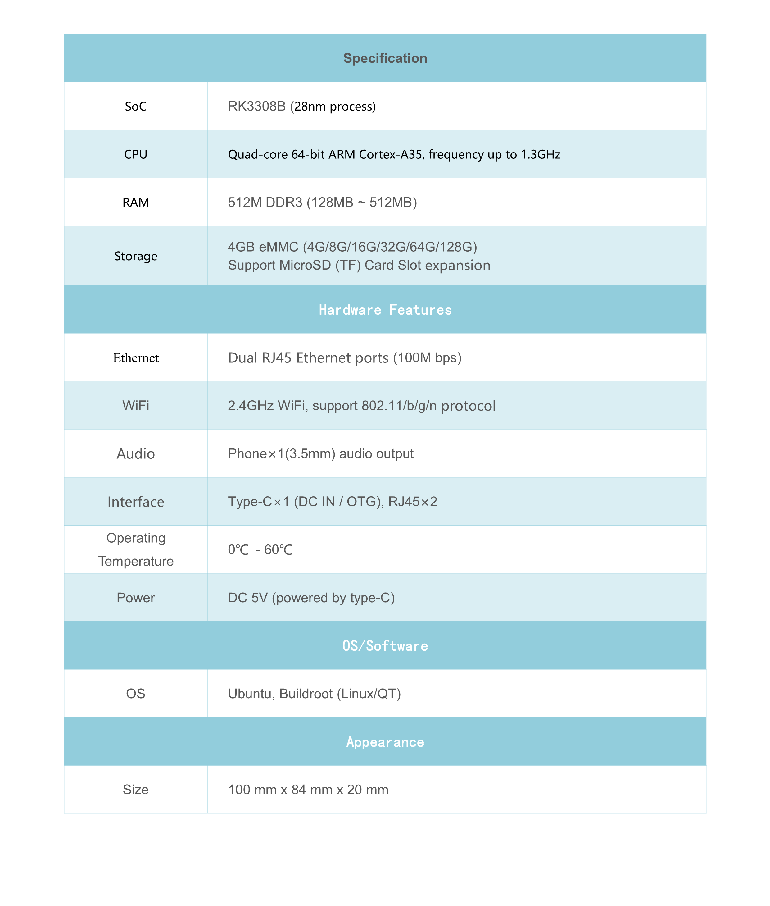
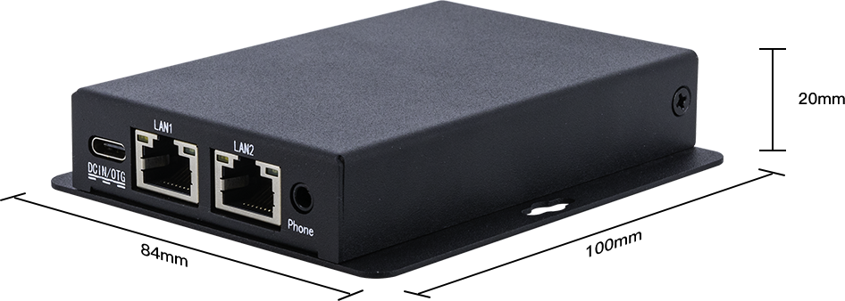

# Introduction
## Product introduction

EC-R3308CC Four-core Mini Embedded Computer，Based on the Core-3308Y high-performance 
open-source platform, equipped with industrial case and efficient fanless cool ing system, 
high-temperature resistance, 7x24 stable work, and with rich interfaces for high applicability.
Equipped with ARM Cortex-A35 architecture, four-core 64-bit high-performance processor, frequency 
up to 1.3GHz. 

## Product parameters

## Product size

## Product board
ROC-RK3308B-CC-PLUS

## Product resources

* [[Wiki]](../../../en/System\ on\ Module/Core-3308Y/index.md)
Includes information on Linux driver development (see Core-3308Y Wiki)
 
* [[Git link]](https://gitlab.com/TeeFirefly/rk3308-linux) 
SDK source code

* [[Technical forum]](http://bbs.t-firefly.com/forum.php?mod=forumdisplay&fid=100)
More than 100,000 corporate customers and users communication platform

## Product technical support
EC-R3308CC can realize the different needs of customers in a variety of scenarios. It has been widely used in industrial control, IoT, etc. The quality and performance have already had a very good reputation in the industry, professional technical team.Solve a variety of problems in hardware design and software functions for our customers.Please contact us for professional technical support and more detailed information.

<!--
### Technical case
-->

### Contact information
* Email: sales@t-firefly.com
* Mobile: (+86) 186 8811 7175
* Landline: 0760-89881218
* National Service Hotline: 4001-511-533
* Address: Room 2101, Hongyu Building, No. 57 Zhongshan 4th Road, East District, Zhongshan City, Guangdong Province
 