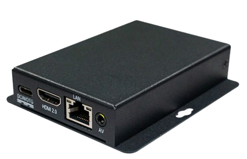
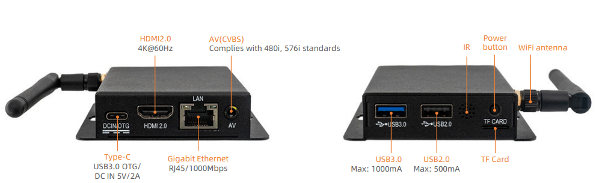
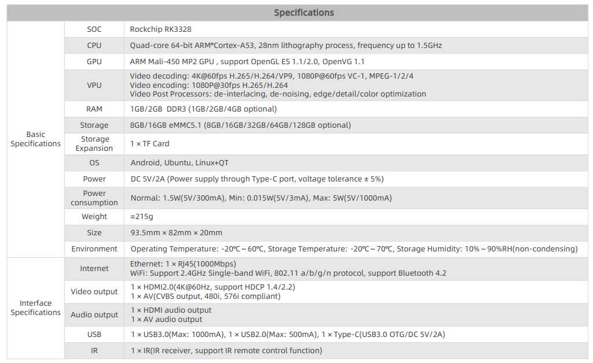
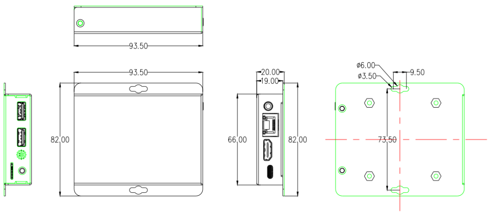

# Product Introduction

The EC-R3328PC embedded host is built on the high-performance open-source ROC-RK3328-PC platform. It is equipped with a RK3328 quad-core 64-bit Cortex-A53 processor running at 1.5 GHz. The chip integrates a quad-core Mali-450 GPU supporting OpenGL ES 1.1/2.0 and OpenVG 1.1 for powerful graphics performance. Its built-in VPU video engine enables 4K@60fps decoding for VP9 and 10-bit H.264, 1080p decoding of VC-1, MPEG, VP8 and other formats, as well as 1080p H.264 encoding. Featuring a premium metal enclosure, the device delivers efficient heat dissipation, dust resistance and shockproof performance. Compact and easy to deploy, it is ideal for long-term continuous stable operation.

# Product Specification

# Size

# Product resources

* [[Development document]](../../Mainboards/ROC-RK3328-PC/index.md) 
Includes information on Android & Ubuntu driver development (see ROC-RK3328-PC Wiki)

* [[Technical forum]](http://bbs.t-firefly.com/forum.php?mod=forumdisplay&fid=100)
More than 100,000 corporate customers and users communication platform

# Contact information

EC-R3328PC can realize the different needs of customers in a variety of scenarios. It has been widely used in game equipment, advertising machines, vending machines, robots, etc. The quality and performance have already had a very good reputation in the industry, professional technical team.Solve a variety of problems in hardware design and software functions for our customers.Please contact us for professional technical support and more detailed information.

* Email: sales@t-firefly.com
* Mobile: (+86) 186 8811 7175
* Landline: 0760-89881218
* National Service Hotline: 4001-511-533
* Address: Room 2101, Hongyu Building, No. 57 Zhongshan 4th Road, East District, Zhongshan City, Guangdong Province
 