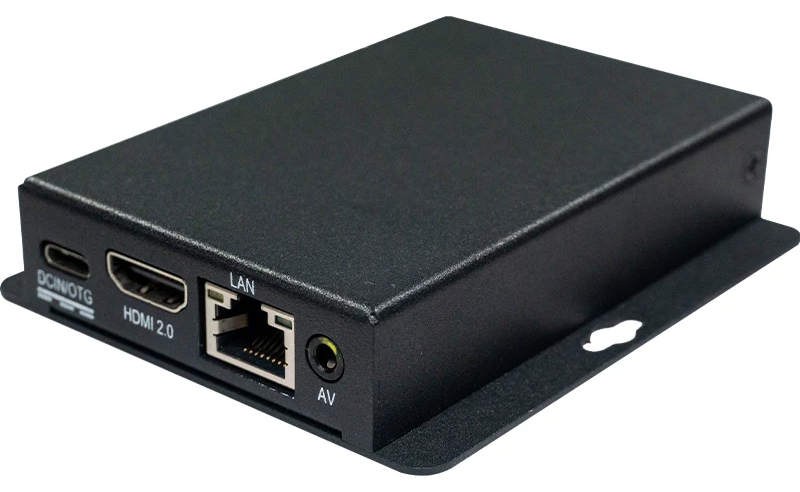
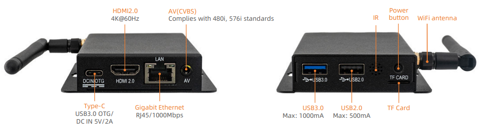

# Product Introduction

The EC-R3328PC embedded host is built on the high-performance open-source ROC-RK3328-PC platform. It is equipped with a RK3328 quad-core 64-bit Cortex-A53 processor running at 1.5 GHz. The chip integrates a quad-core Mali-450 GPU supporting OpenGL ES 1.1/2.0 and OpenVG 1.1 for powerful graphics performance. Its built-in VPU video engine enables 4K@60fps decoding for VP9 and 10-bit H.264, 1080p decoding of VC-1, MPEG, VP8 and other formats, as well as 1080p H.264 encoding. Featuring a premium metal enclosure, the device delivers efficient heat dissipation, dust resistance and shockproof performance. Compact and easy to deploy, it is ideal for long-term continuous stable operation.

 