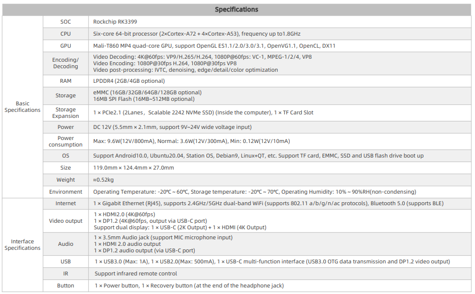

# Product Introduction

EC-R3399PC Mini PC，Based on ROC-RK3399-PC high-performance open source platform, industrial shell configuration, dust and interference prevention, long-term stable operation, support 4K hard solution.Equipped with Rockchip RK3399 six-core processor, using "server level" (dual-core Cortex-A72+ quad-core Cortex-A53) size core architecture, the main frequency up to 1.8GHz, support OpenGL ES1.1/2.0/3.0/3.1, built-in VPU video processor.

# Product Specification

# Size

# Product resources

* [[Development document]](../../Mainboards/ROC-RK3399-PC/index.md) 
Includes information on Android & Ubuntu driver development (see ROC-RK3399-PC Wiki)

* [[Technical forum]](http://bbs.t-firefly.com/forum.php?mod=forumdisplay&fid=100)
More than 100,000 corporate customers and users communication platform

# Contact information

EC-R3399PC can realize the different needs of customers in a variety of scenarios. It has been widely used in game equipment, advertising machines, vending machines, robots, etc. The quality and performance have already had a very good reputation in the industry, professional technical team.Solve a variety of problems in hardware design and software functions for our customers.Please contact us for professional technical support and more detailed information.

* Email: sales@t-firefly.com
* Mobile: (+86) 186 8811 7175
* Landline: 0760-89881218
* National Service Hotline: 4001-511-533
* Address: Room 2101, Hongyu Building, No. 57 Zhongshan 4th Road, East District, Zhongshan City, Guangdong Province
 