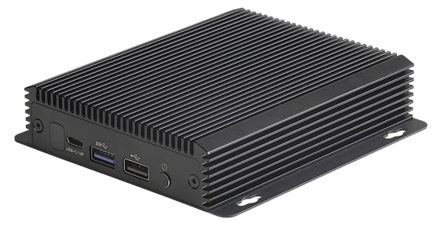

# Product Introduction

EC-R3399PC Mini PC，Based on ROC-RK3399-PC high-performance open source platform, industrial shell configuration, dust and interference prevention, long-term stable operation, support 4K hard solution.Equipped with Rockchip RK3399 six-core processor, using "server level" (dual-core Cortex-A72+ quad-core Cortex-A53) size core architecture, the main frequency up to 1.8GHz, support OpenGL ES1.1/2.0/3.0/3.1, built-in VPU video processor.

 