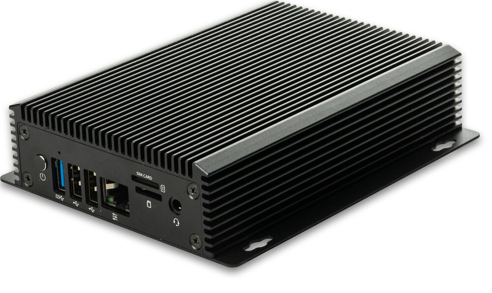

# Introduction

[Specification](https://download.t-firefly.com/Spec/Computers/EC-R3568PC_Specification_EN.pdf) | [Purchase](https://www.t-firefly.com/products/ec-r3568pcquad-core-64-bit-ai-embedded-computer) | [Downloads](https://community.t-firefly.com/en/doc/download/162)

The EC-R3568PC embedded computer is based on the high-performance open-source ROC-RK3568-PCSE platform, with an industrial-grade enclosure that is dustproof and anti-interference for long-term stable operation. It supports 4K hardware decoding and provides rich interfaces for easy connection to various industrial devices. It is equipped with an ARM Cortex-A55 architecture quad-core 64-bit high-performance processor with a frequency up to 2.0GHz, an ARM G52 2EE GPU, and an RKNN NPU AI accelerator (integrated in the SoC).

## Interface Description

**EC-R3568PC** provides rich interfaces, mainly including:

* 1 x Power Key
* 2 x RJ45 (1000Mbps)
* 1 x RJ45 Control Port (expands RS232 / RS485 signals)
* 1 x HDMI 2.0 (4K@60Hz)
* 1 x USB 3.0 (Max 1A)
* 2 x USB 2.0 (Max 500mA)
* 1 x USB-C (OTG)
* 1 x SIM card slot
* 1 x TF Card slot
* 1 x 3.5mm Audio Jack
* 1 x WiFi antenna (ANT)
* 1 x DC 12V power interface (5.5*2.1mm, supports 9V~24V wide voltage input)

As shown in the figure below:

## Structure and Dimensions

## Resources and Support

* [[Wiki]](../../Motherboard/ROC-RK3568-PC%20SE/index.md): Contains firmware building, system usage, interface usage and other tutorials (refer to the ROC-RK3568-PCSE Wiki)
* [[Download Page]](https://community.t-firefly.com/en/doc/download/162): Includes firmware, rootfs and tools download links
* [[Technical Forum]](https://forum.t-firefly.com/): A communication platform with more than 100,000 enterprise customers and users

### Contact

* Email: sales@t-firefly.com
* Mobile: (+86) 186 8811 7175
* Landline: 0760-89881218
* National Service Hotline: 4001-511-533
* Address: Room 2101, Hongyu Building, No. 57 Zhongshan 4th Road, East District, Zhongshan City, Guangdong Province
 