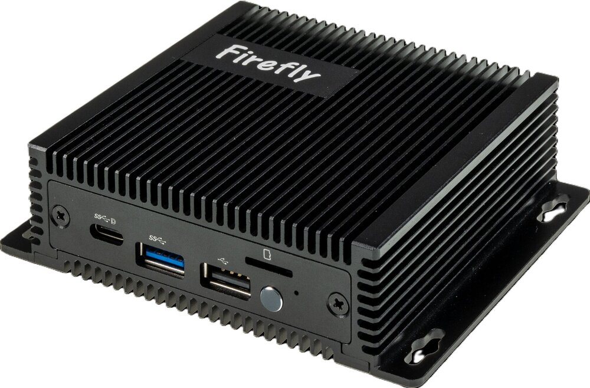
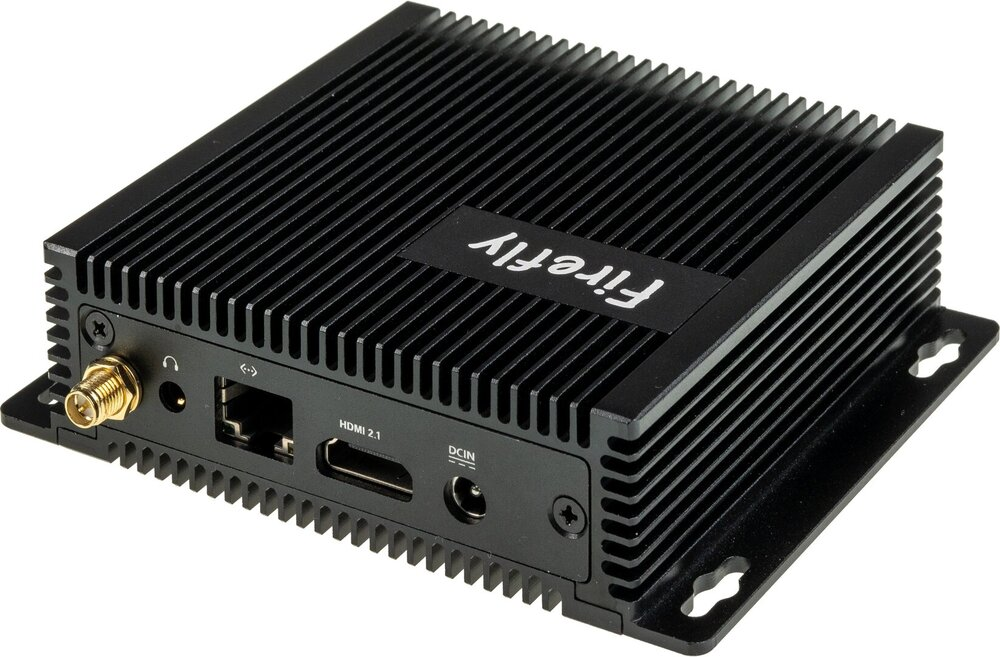

# Product Introduction

**EC-R3576PC-FD** Powered by the Rockchip RK3576, an octa-core 64-bit AIOT processor, EC-R3576PC FD features an advanced lithography process to deliver high performance while maintaining low power consumption. It is equipped with an ARM Mali G52 MC3 GPU and a 6 TOPS NPU, supporting the private deployment of large-scale models under the Transformer architecture. With support for 4K@120fps decoding/4K@60fps encoding, the computer boasts a powerful display capability with 4K resolution at a high frame rate of 120 fps. Its industrial-grade metal enclosure and fanless design enable passive cooling. With an external watchdog, it provides industrial-grade stability, making it an excellent choice for AI applications requiring local deployment.

 