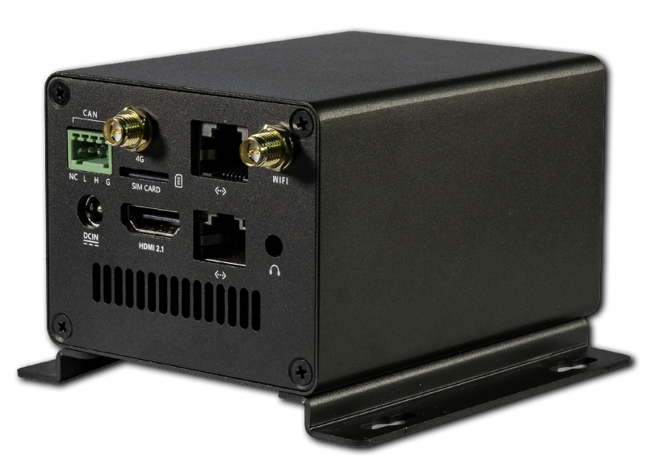
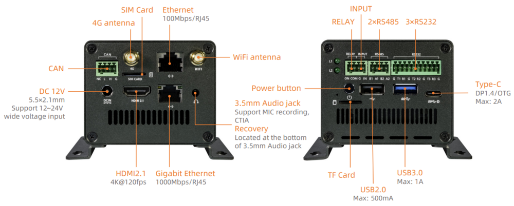
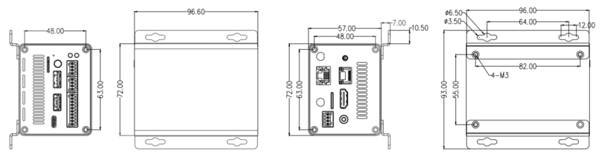

# Introduction

[Specification](https://download.t-firefly.com/Spec/Computers/EC-R3576PC_Specification_EN.pdf) | [Purchase](https://www.t-firefly.com/products/ec-r3576pc-large-model-industrial-mainframe-1) | [Downloads](https://community.t-firefly.com/en/doc/download/279)

**EC-R3576PC** is powered by the Rockchip RK3576, an octa-core 64-bit AIOT processor. With an advanced lithography process, it delivers high performance while maintaining low power consumption. It is equipped with an ARM Mali G52 MC3 GPU and a 6 TOPS NPU, supporting the private deployment of large-scale models under the Transformer architecture. With support for 4K@120fps decoding/4K@60fps encoding, the computer boasts a powerful display capability with 4K resolution at a high frame rate of 120 fps. Its industrial-grade metal enclosure and fanless design enable passive cooling. With an external watchdog, it provides industrial-grade stability, making it an excellent choice for AI applications requiring local deployment.

## Interface Description

**EC-R3576PC** provides rich interfaces, mainly including:

* 1 x HDMI2.1 (Max output support 4K@120Hz)
* 1 x Display Port1.4 (Max output support 4K@60Hz)
* 1 x USB3.0 OTG (Type-C)
* 1 x USB3.0
* 1 x USB2.0
* 2 x RJ45 (One supports 1Gbps, and the other supports 100Mbps)
* 1 x CAN
* 3 x RS232
* 2 x RS485
* 1 x SATA3.0 or PCIe2.0
* 1 x RELAY (Relay output)
* 1 x INPUT (Optocoupler isolation input)
* 3 x LED (One tricolor led, two monochrome leds)
* 1 x TF Card
* 1 x WIFI
* 1 x Bluetooth
* 1 x 3.5mm Headphone

As shown in the figure below:

## Structure and Dimensions

## Resources and Support

* [[Wiki]](../../Motherboard/ROC-RK3576-PC/index.md): Contains Android & Ubuntu driver development and other materials (refer to the EC-R3576PC Wiki)
* [[Technical Forum]](https://forum.t-firefly.com/): A communication platform with more than 100,000 enterprise customers and users

### Contact

* Email: sales@t-firefly.com
* Mobile: (+86) 186 8811 7175
* Landline: 0760-89881218
* National Service Hotline: 4001-511-533
* Address: Room 2101, Hongyu Building, No. 57 Zhongshan 4th Road, East District, Zhongshan City, Guangdong Province