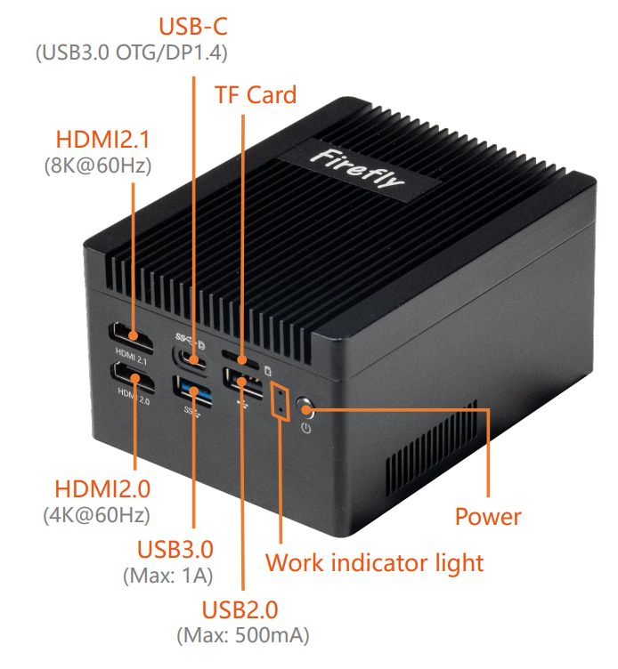

# Introduction

[Specification](https://download.t-firefly.com/Spec/Computers/EC-R3588RT_EC-R3588RT%202G5_EC-R3588RT%2010G_Specification_EN.pdf) | [Purchase](https://www.firefly.store/collections/other-computers/products/ec-r3588rt-2g5-smart-router) | [Downloads](https://community.t-firefly.com/en/doc/download/277)

The EC-R3588RT_10G is powered by the Rockchip RK3588 flagship octa-core 64-bit processor, with a maximum frequency of 2.4GHz and a 6 TOPS NPU; it supports 8K video encoding and decoding, 8K HDMI and 8K DP output;
it provides 1 x 2.5G Ethernet port and 2 x Gigabit Ethernet ports, supports M.2 expansion for WiFi6, and has rich expansion interfaces (2 x 10G optical fiber ports). It supports multiple operating systems such as OpenWRT, Linux and Android;
the 2.5G Ethernet port supports jumbo frames, and features high bandwidth and low latency, making it easy to connect to mainstream industrial cameras. It is suitable for smart routing, vision controllers and other fields.

## Interface Description

**** provides rich interfaces, mainly including:

* 2 x HDMI2.1 (up to 8K@60Hz output)
* 1 x Display Port 1.4 / Type-C OTG (up to 8K@30Hz output)
* 1 x PCIe2.0 (M.2 NVMe)
* 1 x PCIe2.0 (M.2 E-KEY for WiFi6/BT5.0)
* 1 x TF Card
* 1 x USB3.0
* 1 x USB2.0
* 2 x RJ45 (1Gbps)
* 1 x RJ45 (2.5Gbps)
* 1 x 3.5mm headphone jack
* 1 x BTB Connector

The host interfaces are shown below:

## Structure and Dimensions

## Resources and Support

* [[Wiki]](../../Motherboard/ROC-RK3588-RT/index.md): Contains Android & Ubuntu driver development and other materials (refer to the ROC-RK3588-RT Wiki)
* [[Technical Forum]](https://forum.t-firefly.com/): A communication platform with more than 100,000 enterprise customers and users

### Contact

* Email: sales@t-firefly.com
* Mobile: (+86) 186 8811 7175
* Landline: 0760-89881218
* National Service Hotline: 4001-511-533
* Address: Room 2101, Hongyu Building, No. 57 Zhongshan 4th Road, East District, Zhongshan City, Guangdong Province