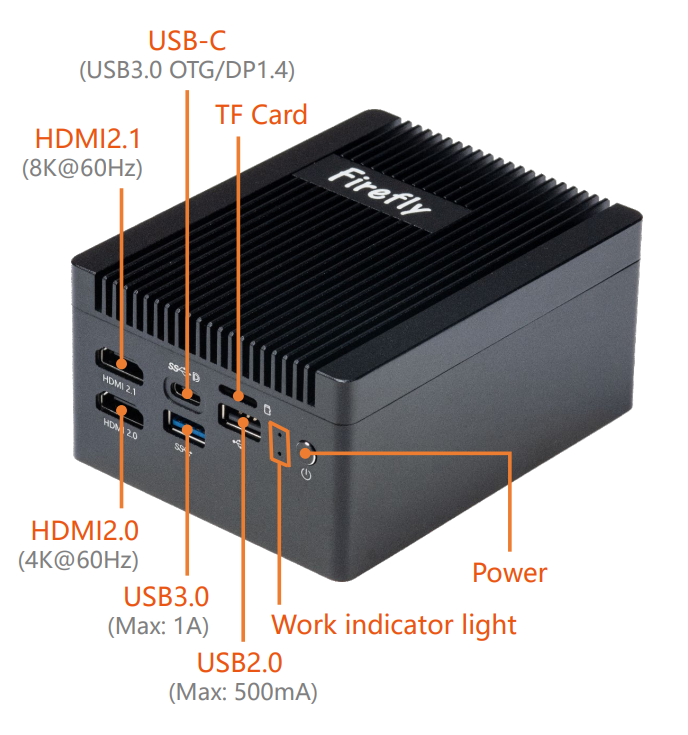
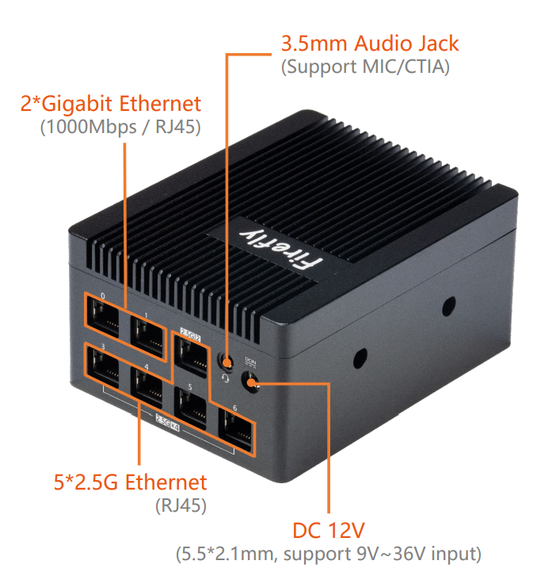

## Product introduction

EC-R3588RT_2G5 Powered by Rockchip RK3588, a new-gen flagship octa-core 64-bit processor, this mini SBC features a clock frequency of up to 2.4GHz, 
an NPU with 6 TOPS computing power, and up to 32GB of RAM. It supports multiple operating systems, 8K video encoding and decoding, 
2.5G/dual Gigabit Ethernet, M.2 WiFi slot, 8K HDMI, and 8K DP output. This device offers a wide range of expansion interfaces (4-port 2.5 GbE), 
such as M.2 SATA, PCIe, and USB3.0/2.0.

 