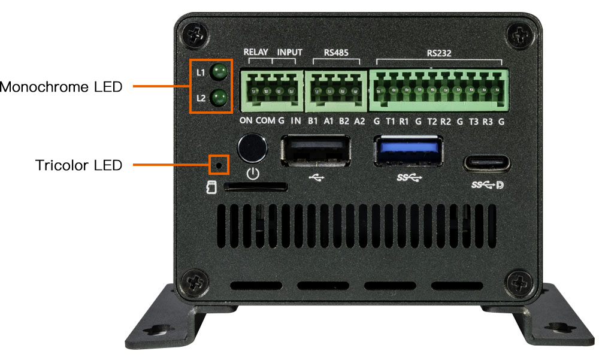

# Hardware Function Usage
## Debug Serial

The EC-R3588SPC does not expose a debug serial port on the enclosure. You need to open the host to access the debug serial port on the carrier board and connect an external USB to TTL serial module for debugging.

For the connection and usage of the debug serial port, see: [Debug Serial](usb_to_ttl.md).

## CAN
### Introduction
Controller area network (can) is a kind of serial communication network which can effectively support distributed control or real-time control. Can bus is a bus protocol widely used in automobile, which is designed as the communication of microcontroller in automobile environment.
* Check [TI application report for more](https://www.ti.com/lit/an/sloa101b/sloa101b.pdf)
### Hardware Connection
Connection between two CAN devices, only need CAN_H to CAN_H, CAN_L to CAN_L.

<center>


</center>

### DTS Configuration
* Common `kernel-5.10/arch/arm64/boot/dts/rockchip/rk3588s.dtsi`

```
        can0: can@fea50000 {
                compatible = "rockchip,can-2.0";
                reg = <0x0 0xfea50000 0x0 0x1000>;
                interrupts = <GIC_SPI 341 IRQ_TYPE_LEVEL_HIGH>;
                clocks = <&cru CLK_CAN0>, <&cru PCLK_CAN0>;
                clock-names = "baudclk", "apb_pclk";
                resets = <&cru SRST_CAN0>, <&cru SRST_P_CAN0>;
                reset-names = "can", "can-apb";
                pinctrl-names = "default";
                pinctrl-0 = <&can0m0_pins>;
                tx-fifo-depth = <1>;
                rx-fifo-depth = <6>;
                status = "disabled";
        };

        can1: can@fea60000 {
                compatible = "rockchip,can-2.0";
                reg = <0x0 0xfea60000 0x0 0x1000>;
                interrupts = <GIC_SPI 342 IRQ_TYPE_LEVEL_HIGH>;
                clocks = <&cru CLK_CAN1>, <&cru PCLK_CAN1>;
                clock-names = "baudclk", "apb_pclk";
                resets = <&cru SRST_CAN1>, <&cru SRST_P_CAN1>;
                reset-names = "can", "can-apb";
                pinctrl-names = "default";
                pinctrl-0 = <&can1m0_pins>;
                tx-fifo-depth = <1>;
                rx-fifo-depth = <6>;
                status = "disabled";
        };

        can2: can@fea70000 {
                compatible = "rockchip,can-2.0";
                reg = <0x0 0xfea70000 0x0 0x1000>;
                interrupts = <GIC_SPI 343 IRQ_TYPE_LEVEL_HIGH>;
                clocks = <&cru CLK_CAN2>, <&cru PCLK_CAN2>;
                clock-names = "baudclk", "apb_pclk";
                resets = <&cru SRST_CAN2>, <&cru SRST_P_CAN2>;
                reset-names = "can", "can-apb";
                pinctrl-names = "default";
                pinctrl-0 = <&can2m0_pins>;
                tx-fifo-depth = <1>;
                rx-fifo-depth = <6>;
                status = "disabled";
        };
```
* Board `arch/arm64/boot/dts/rockchip/roc-rk3588s-pc-ext.dtsi`
```
&can2 {
    status = "okay";
    pinctrl-names = "default";
    pinctrl-0 = <&can2m0_pins>;
};
```

Because there is only one CAN device created by the system according to the dts , and the first device created is CAN0.
### Communication
#### CAN communication test
Use the "candump" and "cansend" tools directly to send and receive messages, push tool into /system/bin/ . Tools "candump/cansend" are included with the SDK and download from [Officail link](http://www.t-firefly.com/share/index/index/id/3cacb04c663f9fe97bf494ca55763dcd.html) or [github](https://github.com/linux-can/can-utils).

```
#Close the can0 device at the transceiver
ip link set can0 down
#Set the bit rate to 250Kbps at the transceiver                    
ip link set can0 type can bitrate 250000
#Show can0 details
ip -details link show can0
#Open the can0 device at the transceiver 
ip link set can0 up
#Perform candump on the receiving end, blocking waiting for messages               
candump can0
#Execute cansend at the sending end to send the message                         
cansend can0 123#1122334455667788
```

### More Command
```
1、 ip link set canX down 		//turn off CAN device
2、 ip link set canX up   		//turn on CAN device
3、 ip -details link show canX 		//show CAN device details
4、 candump canX  			//Receive data from CAN bus
5、 ifconfig canX down 			//shutdown CAn device
6、 ip link set canX up type can bitrate 250000 //Set CAN Baudrate
7、 conconfig canX bitrate + (Baudrate)
8、 canconfig canX start 		//start CAN device
9、 canconfig canX ctrlmode loopback on //loopback test
10、canconfig canX restart 		//restart CAN device
11、canconfig canX stop 		//stop CAN device
12、canecho canX 			//check CAN device status查看can设备总线状态；
13、cansend canX --identifier=ID+data 	//send data
14、candump canX --filter=ID:mask 	//Use the filter to receive ID matching data
```

### FAQS
Summarize several problems and solutions encountered during debugging.
#### Check if the CAN_H and CAN_L lines of the bus are loose or connected in reverse.
The receiving end only successfully received the message once, and then no longer received the message.
#### Configuration about clock rate
##### CAN

If the bitrate of CAN is 1M, it is recommended to modify the CAN clock rate to 300M to make the signal more stable. If the bitrate is lower than 1M, the clock rate can be set to 200M.


# Display


<center>


</center>


RK3588 has four video output ports, each video output port is bound to a fixed display controller, such as Port0 can be used to connect with display controllers such as DP0, DP1, HDMI/eDP0 and HDMI/eDP1, other Portx and so on.

Each Portx has its own maximum resolution:
* Port0 can output up to 7680x4320@60Hz
* Port1 can output up to 4096x2304@60Hz
* Port2 can output up to 4096x2304@60Hz
* Port3 can output up to 1920x1080@60Hz

In software, if the HDMI0 display controller is connected to Port0, and the hardware phy supports HDMI2.1, then HDMI0 supports 8K@60Hz output.

If each Portx is assigned a separate display controller, it can support four-screen simultaneous display (different display) at the same time.

But from the software point of view, there are the following configuration considerations:

1. When RK3588 does 8K output, in fact, the chip uses the resources of Port0 and Port1 at the same time, but only borrows the Port0 port for output, so when the display controller connected to Port0 is connected to an external 8K display for output and the  Port1 is using. The display controller will work abnormally.

   For example, when HDMI0 (connected to Port0) is connected to 8K output, the display of DP0 (connected to Port1) will be abnormal. Only when the output of Port0 is less than or equal to 4K@60Hz, Port1 can output 4K@60Hz normally.
  


## EC-R3588SPC Displays the configuration of the interface

 EC-R3588SPC  There are two display output interfaces, namely HDMI and Display Port , which can achieve Dual-screen simultaneous display/exclusive display. The interface diagram is as follows:

* HDMI0/ Display Port

<center>


</center>


The following is a basic introduction to the configuration and use of each display output interface. For details, please refer to the file:
* `kernel-5.10/arch/arm64/boot/dts/rockchip/roc-rk3588s-pc.dtsi`  

### HDMI

EC-R3588SPC There are one HDMI display output interfaces on the hardware:

* HDMI0 supports HDMI2.1 protocol, resolution can support up to 7680x4320@60Hz


#### Software configuration

The following takes the configuration of HDMI0 as an example.

```
//enable hdmi0
&hdmi0 {
        enable-gpios = <&gpio4 RK_PB2 GPIO_ACTIVE_HIGH>;
        status = "okay";
};

//connect hdmi0 with Port0
&hdmi0_in_vp0 {
        status = "okay";
};

//enable hdmi0 audio output
&hdmi0_sound {
        status = "okay";
};

//enable hdmi0's phy
&hdptxphy_hdmi0 {
        status = "okay";
};

//enable hdmi0 logo of startup
&route_hdmi0{
        status = "okay";
};

```

It should be noted that since HDMI0 will be connected to Port0 by default, that is, in order to support 8K output. If DP0 is connected to the Port1 port at this time, such as:

```
&dp0_in_vp1 {
        status = "okay";
};
```

There will be an abnormal display of DP0 as mentioned above, so if you want to support HDMI0 (8K) + DP0 (4K) scenarios, you need to connect DP0 to Port2, such as:

```
diff --git a/kernel-5.10/arch/arm64/boot/dts/rockchip/roc-rk3588s-pc.dtsi b/kernel-5.10/arch/arm64/boot/dts/rockchip/roc-rk3588s-pc.dtsi
index afb176b9f8..099cccbf65 100644
--- a/kernel-5.10/arch/arm64/boot/dts/rockchip/roc-rk3588s-pc.dtsi
+++ b/kernel-5.10/arch/arm64/boot/dts/rockchip/roc-rk3588s-pc.dtsi
@@ -94,7 +94,7 @@ &dp0 {

+&dp0_in_vp2 {
         status = "okay";
 };
```


### Display Port

EC-R3588SPC has a Display Port display output interface, supports DP TX 1.4a protocol, and resolution can support up to 7680x4320@30Hz.


#### Software configuration

Display Port is represented as  `dp0` on the system status tree, add:

```
// enable dp0 audio output
&spdif_tx2{
        status = "okay";
};

&dp0_sound{
        status = "okay";
};

//enable dp0
&dp0 {
        status = "okay";
};

//connect dp0 with port2
&dp0_in_vp2 {
        status = "okay";
};

//enable Type-C's PD power chip
&usbc0{
        status = "okay";
        interrupt-parent = <&gpio0>;
        interrupts = <RK_PC4 IRQ_TYPE_LEVEL_LOW>;
};

&vbus5v0_typec_pwr_en{
		status = "okay";
		regulator-min-microvolt = <5000000>;
		regulator-max-microvolt = <5000000>;
		gpio = <&gpio1 RK_PB1 GPIO_ACTIVE_HIGH>;
		vin-supply = <&vcc5v0_usb>;
		pinctrl-names = "default";
		pinctrl-0 = <&typec5v_pwren>;
};

/* Note：Currently dp0 does not support the startup logo display function */

```

It should be noted here that SDK default software configuration is to connect dp0 to vp2, which will cause dp0 to output only 4096x2304@60Hz at most, so if you need 7680x4320@30Hz functions, you need to connect dp0 to vp0. The software is modified as follows:

```
diff --git a/kernel-5.10/arch/arm64/boot/dts/rockchip/roc-rk3588s-pc.dtsi b/kernel-5.10/arch/arm64/boot/dts/rockchip/roc-rk3588s-pc.dtsi
index fc08eb7543..fee53ed2e9 100644
--- a/kernel-5.10/arch/arm64/boot/dts/rockchip/roc-rk3588s-pc.dtsi
+++ b/kernel-5.10/arch/arm64/boot/dts/rockchip/roc-rk3588s-pc.dtsi
@@ -301,7 +301,7 @@ &dp0 {
        status = "okay";
 };

-&dp0_in_vp2 {
+&dp0_in_vp0 {
        status = "okay";
 };

```

## EC-R3588SPC  Dual scene configuration

Here are some general scenarios about Portx and configuration methods between display controllers:

* HDMI0（8K@60Hz） + Display Port（4K@60Hz）
```
&hdmi0_in_vp0 {
        status = "okay";
};

&dp0_in_vp2 {
        status = "okay";
};
```
  
* HDMI0（8K@60Hz） + Display Port（4K@60Hz）
```
&hdmi0_in_vp0 {
        status = "okay";
};

&dp0_in_vp2 {
        status = "okay";
};
```

## Debug method

* Set resolution in the system

System mouse click: 'Settings — > Display — > HDMI- > resolution settings'

* Get the edid of HDMI/Display Port (take HDMI as an example)
```
:/ # busybox hexdump /sys/class/drm/card0-HDMI-A-1/edid
0000000 ff00 ffff ffff 00ff 040d 0030 0001 0000
0000010 1e01 0301 8b80 784e 502a a31f 4959 2497
0000020 4fbb 2153 0008 8081 c081 0081 c0d1 7c61
0000030 fc81 0101 0101 7404 7c00 70f6 805a 58fc
0000040 008a 1072 0053 1e00 3a02 1880 3871 402d
0000050 2c58 0045 1072 0053 1e00 0000 fc00 4300
0000060 5348 5648 200a 2020 2020 2020 0000 fd00
0000070 1700 0f4c 1e50 0a00 2020 2020 2020 4a01
0000080 0302 f07c 015f 0302 0504 0706 1190 1312
0000090 1514 1f16 2220 5e5d 605f 6261 6564 c266
00000a0 c4c3 c7c6 0932 0717 0715 5750 0106 0467
00000b0 3d03 c007 7e5f e601 4611 00d0 8070 4783
00000c0 0000 036e 000c 0020 3cb8 0020 0180 0302
00000d0 6d04 5dd8 01c4 8078 2267 0000 67cf e51f
00000e0 000f 3000 e363 0506 e301 c305 e201 ff00
00000f0 01eb d046 4800 42af 38a2 d727 0000 a400
0000100
```  

* Get the resolutions supported by HDMI/Display Port (take HDMI as an example)
```
:/ # cat /sys/class/drm/card0-HDMI-A-1/modes
3840x2160
7680x4320
7680x4320
7680x4320
7680x4320
7680x4320
7680x4320
7680x4320
7680x4320
4096x2160
4096x2160
4096x2160
4096x2160
4096x2160
4096x2160
4096x2160

```  
* Get the connection status of HDMI/Display Port (take HDMI as an example)
```
:/ # cat /sys/class/drm/card0-HDMI-A-1/status
connected
```  

* Get information on the Video Portx in use on the system (with the connected display controller)
```
:/ # cat /d/dri/0/summary
Video Port0: ACTIVE
    Connector: HDMI-A-1
        bus_format[2026]: UYYVYY8_0_5X24
        overlay_mode[1] output_mode[e] color_space[3], eotf:0
    Display mode: 7680x4320p60
        clk[2376000] real_clk[2376000] type[40] flag[5]
        H: 7680 8232 8408 9000
        V: 4320 4336 4356 4400
    Cluster0-win0: ACTIVE
        win_id: 0
        format: AB24 little-endian (0x34324241)[AFBC] SDR[0] color_space[0] glb_alpha[0xff]
        rotate: xmirror: 0 ymirror: 0 rotate_90: 0 rotate_270: 0
        csc: y2r[0] r2y[1] csc mode[1]
        zpos: 0
        src: pos[0, 0] rect[3840 x 2160]
        dst: pos[0, 0] rect[7680 x 4320]
        buf[0]: addr: 0x0000000010971000 pitch: 15360 offset: 0
Video Port1: DISABLED
Video Port2: DISABLED
Video Port3: DISABLED
```


Generally, if you encounter the problem that HDMI/Display Port cannot be displayed, you need to execute the above command to see if the connection status, edid and resolution are correct.
## Ethernet

### DTS configure

#### Common
`kernel-5.10/arch/arm64/boot/dts/rockchip/rk3588-firefly-port.dtsi`
```
&gmac1 {                                                                                                                                                                
    /* Use rgmii-rxid mode to disable rx delay inside Soc */
    phy-mode = "rgmii-rxid";
    clock_in_out = "output";

    snps,reset-gpio = <&gpio3 RK_PB7 GPIO_ACTIVE_LOW>;
    snps,reset-active-low;
    /* Reset time is 20ms, 100ms for rtl8211f */
    snps,reset-delays-us = <0 20000 100000>;

    pinctrl-names = "default";
    pinctrl-0 = <&gmac1_miim
            &gmac1_tx_bus2
            &gmac1_rx_bus2
            &gmac1_rgmii_clk
            &gmac1_rgmii_bus>;

    tx_delay = <0x42>;
    //rx_delay = <0x4f>;

    phy-handle = <&rgmii_phy1>;
    status = "disbaled";
};

```

#### Board
`kernel-5.10/arch/arm64/boot/dts/rockchip/roc-rk3588s-pc.dtsi`
```
/* gmac1 */
&gmac1{
 	snps,reset-gpio = <&gpio0 RK_PD3 GPIO_ACTIVE_LOW>;
	tx_delay = <0x43>;
	status = "okay";
};

```
### How to use dual Ethernet
Android The dual Ethernet port is divided into internal network and external network.

<font color=#FF0000>Note: The eth1 secondary network interface is a USB 2.0 extended network interface, so the maximum speed is 100M</font>

| hardware device name |driver | Android system device name | Primary and auxiliary |speed|
|---|---|---|---|---|
| eth0 | rk_gmac | Ethernet | Primary network port for external network| 1000Mpbs|
| eth1 | r8152 | Ethernet 2 | Auxiliary network port for intranet|100Mpbs|

<center>


</center>

#### IP Addrs
* get from debug or adb by ifconfig

	```
	ifconfig eth0
	eth0      Link encap:Ethernet  HWaddr 52:22:4b:e4:f8:3c  Driver rk_gmac-dwmac
          inet addr:168.168.104.210  Bcast:168.168.255.255  Mask:255.255.0.0
          inet6 addr: 240e:3b1:f175:9df0:ea6d:9993:33e6:202d/64 Scope: Global
          inet6 addr: 240e:3b1:f175:9df0:e0e8:b021:fc7a:dafc/64 Scope: Global
          inet6 addr: fe80::9cd8:e64d:b9c2:6f4/64 Scope: Link
          UP BROADCAST RUNNING MULTICAST  MTU:1500  Metric:1
          RX packets:229 errors:0 dropped:0 overruns:0 frame:0
          TX packets:62 errors:0 dropped:0 overruns:0 carrier:0
          collisions:0 txqueuelen:1000
          RX bytes:40526 TX bytes:6698
          Interrupt:70


	```
	```
	ifconfig eth1
	eth1      Link encap:Ethernet  HWaddr e2:76:ef:f2:13:4f  Driver r8152
          inet addr:168.168.105.2  Bcast:168.168.255.255  Mask:255.255.0.0
          inet6 addr: 240e:3b1:f175:9df0:7355:7ec7:fed3:ecab/64 Scope: Global
          inet6 addr: 240e:3b1:f175:9df0:2e23:792d:f04a:2975/64 Scope: Global
          inet6 addr: fe80::564f:1114:e491:4bbd/64 Scope: Link
          UP BROADCAST RUNNING MULTICAST  MTU:1500  Metric:1
          RX packets:124 errors:0 dropped:1 overruns:0 frame:0
          TX packets:18 errors:0 dropped:0 overruns:0 carrier:0
          collisions:0 txqueuelen:1000
          RX bytes:12387 TX bytes:2072


	```

#### PING Test
* eth0

	```
	ping -I eth0 -c 10  www.baidu.com
	PING www.a.shifen.com (14.215.177.38) from 168.168.104.210 eth0: 56(84) bytes of data.
	64 bytes from 14.215.177.38: icmp_seq=1 ttl=55 time=9.45 ms
	64 bytes from 14.215.177.38: icmp_seq=2 ttl=55 time=9.36 ms
	64 bytes from 14.215.177.38: icmp_seq=3 ttl=55 time=10.0 ms
	64 bytes from 14.215.177.38: icmp_seq=4 ttl=55 time=11.3 ms
	64 bytes from 14.215.177.38: icmp_seq=5 ttl=55 time=41.7 ms
	64 bytes from 14.215.177.38: icmp_seq=6 ttl=55 time=9.73 ms
	64 bytes from 14.215.177.38: icmp_seq=7 ttl=55 time=9.28 ms
	64 bytes from 14.215.177.38: icmp_seq=8 ttl=55 time=9.26 ms
	64 bytes from 14.215.177.38: icmp_seq=9 ttl=55 time=9.50 ms
	64 bytes from 14.215.177.38: icmp_seq=10 ttl=55 time=12.9 ms

	--- www.a.shifen.com ping statistics ---
	10 packets transmitted, 10 received, 0% packet loss, time 9013ms
	rtt min/avg/max/mdev = 9.265/13.262/41.757/9.562 ms
	```

* eth1

	```
	ping -I eth1 -c 10 168.168.4.168
	PING 168.168.4.168 (168.168.4.168): 56 data bytes
	64 bytes from 168.168.4.168: seq=0 ttl=64 time=2.408 ms
	64 bytes from 168.168.4.168: seq=1 ttl=64 time=1.574 ms
	64 bytes from 168.168.4.168: seq=2 ttl=64 time=1.669 ms
	64 bytes from 168.168.4.168: seq=3 ttl=64 time=1.913 ms
	64 bytes from 168.168.4.168: seq=4 ttl=64 time=1.666 ms
	64 bytes from 168.168.4.168: seq=5 ttl=64 time=1.500 ms
	64 bytes from 168.168.4.168: seq=6 ttl=64 time=1.631 ms
	64 bytes from 168.168.4.168: seq=7 ttl=64 time=1.740 ms
	64 bytes from 168.168.4.168: seq=8 ttl=64 time=1.590 ms
	64 bytes from 168.168.4.168: seq=9 ttl=64 time=1.924 ms

	--- 168.168.4.168 ping statistics ---	
	10 packets transmitted, 10 packets received, 0% packet loss
	round-trip min/avg/max = 1.500/1.761/2.408 ms

	```
# LED

## Introduction

EC-R3588SPCThere is a three color LED light and two monochrome lights on the development board, as shown in the following table：

| LED     | Pin name  | Pin number |remarks|
| ----    | ----      | ----       |----|
| Blue    | GPIO1_D5  | 61         |Tricolor Led|
| Red     | GPIO3_B2  | 106        |Tricolor Led|
| Green   | GPIO3_C0  | 112        |Tricolor Led|
| Ext Yellow（L2）    | GPIO3_B7  | 111         |Lower Monochrome Led work with Relay|
| Ext Green（L1）    | GPIO3_C1  | 113        |Upper Monochrome Led|

<center>


</center>


LEDs can be controlled by using the LED device subsystem or by directly operating GPIO.

## Controlling LEDs by device

Linux has its own LED subsystem for LED devices. In EC-R3588SPC, LEDs are configured as LED class devices.You can control them via `/sys/class/leds/`.

Tricolor led：
*   Blue:  Turn on after the system powers on.
*   Red:   defined by user.
*   Green: defined by user.

Monochrome led：
*   Ext Yellow : Relay work in indicator(Silk screen：L2)
*   Ext Green : defined by user.  (Silk screen：L1)


You can change the behavior of each LED by using the echo command to write command to its brightness property:


Tricolor led：
```
echo 1 > sys/class/leds/\:power/brightness //Blue led on
echo 0 > sys/class/leds/\:power/brightness //Blue led off
```
```
echo 1 > sys/class/leds/\:user/brightness //Red led on
echo 0 > sys/class/leds/\:user/brightness //Red led off
```
```
echo 1 > sys/class/leds/\:user1/brightness //Green led on
echo 0 > sys/class/leds/\:user1/brightness //Green led off
```

L1 Monochrome led：
```
echo 1 > /sys/class/leds/ext_led1/brightness //Ext Yellow led on
echo 0 > /sys/class/leds/ext_led1/brightness //Ext Yellow led off
```

L2 Monochrome led：
```
echo 1 > /sys/class/leds/ext_led2/brightness //Ext Green led on
echo 0 > /sys/class/leds/ext_led2/brightness //Ext Green led off
```


## Using trigger control LED

Trigger contains a variety of ways to control the LED, here with two examples to illustrate.

* Simple trigger LED
* Complex trigger LED

For more information, please read the document `leds-class.txt`.

First of all, we need to know how many LED definition, while the corresponding property of the LED is.

Define Tricolor led node in file `kernel/arch/arm64/boot/dts/rockchip/roc-rk3588s-pc.dtsi`：
```
firefly_leds: leds {
    compatible = "gpio-leds";
    power_led: power {
        label = ":power"; //blue led
        linux,default-trigger = "ir-power-click";
        default-state = "on";
        gpios = <&gpio1 RK_PD5 GPIO_ACTIVE_HIGH>;
        pinctrl-names = "default";
        pinctrl-0 = <&led_power>;
    };

    user_led: user {
        label = ":user"; //red led
        linux,default-trigger = "ir-user-click";
        default-state = "off";
        gpios = <&gpio3 RK_PB2 GPIO_ACTIVE_HIGH>;
        pinctrl-names = "default";
        pinctrl-0 = <&led_user>;
    };

    user1_led: user1 {
        label = ":user1"; //green led
        default-state = "off";
        gpios = <&gpio3 RK_PC0 GPIO_ACTIVE_HIGH>;
        pinctrl-names = "default";
        pinctrl-0 = <&led_user1>;
    };
};

```
Define Monochrome led node in file `kernel/arch/arm64/boot/dts/rockchip/roc-rk3588s-pc-ext.dtsi` ：
```
&firefly_leds {
               ext_yellow_led: ext_led1 {
                       gpios = <&gpio3 RK_PB7 GPIO_ACTIVE_HIGH>;//yellow led
                       pinctrl-names = "default";
                       pinctrl-0 = <&led_user2>;
               };

               ext_green_led: ext_led2 {
                       gpios = <&gpio3 RK_PC1 GPIO_ACTIVE_HIGH>;//green led
                       pinctrl-names = "default";
                       pinctrl-0 = <&led_user3>;
               };
};
```


Note: The value of `compatible` must match the one in `drivers/leds/leds-gpio.c`.

### Simple trigger LED

It is a simple trigger mode to control LEDs, as follows on the default open yellow LED. And EC-R3588SPC's yellow LED will be turned on after boot.

(1) Defined LED trigger In the `kernel/drivers/leds/trigger/led-firefly-demo.c` add the following:

```
DEFINE_LED_TRIGGER(ledtrig_default_control);
```

(2) Register the trigger.

```
led_trigger_register_simple("ir-user-click", &ledtrig_default_control);
```

(3) Control the LED.

```
led_trigger_event(ledtrig_default_control, LED_FULL);     #yellow led on
```

（4）Enable LED demo.

led-firefly-demo is disabled in default,if you need to open the demo drive can use the following patch:

```
--- a/kernel/arch/arm64/boot/dts/rockchip/rk3588-firefly-demo.dtsi
+++ b/kernel/arch/arm64/boot/dts/rockchip/rk3588-firefly-demo.dtsi
@@ -52,7 +52,7 @@
            led_demo: led_demo {
-                status = "disabled";
+                status = "okay";
                 compatible = "firefly,rk3588-led";
                 };
```

### Complex trigger LED

The following is the trigger mode control LED complex example, `timer trigger` is to let the LED to achieve constant light off effect.

We need to configure the timer trigger on the kernel.

In the `kernel-5.10` path using `make menuconfig`, in accordance with the following method to chose `timer trigger` driver.

```
Device Drivers
--->LED Support
   --->LED Trigger support
      --->LED Timer Trigger
```
Save the configuration and compile the kernel, the `kernel.img` burn EC-R3588SPC board. We can use the serial input command, you can see the blue light non-stop interval flashing.

```
echo "timer" > /sys/class/leds/:user/trigger
```

The user can also use the `cat` command to get the available values for the trigger:

```
# cat /sys/class/leds/:user/trigger
none ir-power-click rfkill-any rfkill-none test_ac-online test_battery-charging-or-full 
test_battery-charging test_battery-full test_battery-charging-blink-full-solid 
test_usb-online mmc0 [timer] heartbeat backlight default-on ir-user-click mmc1 
rfkill0 tcpm-source-psy-6-0022-online rfkill1 rfkill2
```

# RELAY 

EC-R3588SPC supports one relay output where ON corresponds to OUTPUT1 in the hardware schematic and COM corresponds to RELAY_COM1 the hardware schematic.

### Interface Diagram
<center>


</center>

### schematic diagram
<center>


</center>

### control
When GPIO3_C1_Output low level, OUTPUT1 will be disconnected with RELAY_COM1 ; When RELAY_CTL1 output high level, OUTPUT1 will be connected witch RELAY_COM1.

Since the lower layer Ext Yellow(L2) and relay are controlled by the same GPIO, controlling Ext Yellow(L2) is controlling relay output

The control mode is as follows：
```
echo 1 > /sys/class/leds/ext_led2/brightness //The lower monochrome led is on, the relay is worked
echo 0 > /sys/class/leds/ext_led2/brightness //The lower monochrome led is off, the relay isn't worked
```

[EC-R3588SPC LED wiki](usage_led.md)
# DIN

EC-R3588SPC supports an optocoupler isolation input, where IN corresponds to INPUT1 in the hardware schematic diagram and G corresponds to INPUT_COM in the hardware schematic diagram.

### Interface Diagram
<center>


</center>

### schematic diagram
<center>


</center>

### Detect
The `INPUT1` in the schematic corresponds to the `IN` for silk screen printing, and the `INPUT_COM` corresponds to `G`. When `INPUT1(IN)` and INPUT_COM(G) are conducting, `GPIO3_D2_INPUT` will detect a low level; When `INPUT1(IN)` and INPUT_COM(G) are disconnected, `GPIO3_D2_INPUT` will detect a high level.

* Example 1: If 'Input (IN)' is connected to 5V, then it is to detect the input status of 'Input-COM (G)'. When 'Input-COM (G)' is low, the main control detects that 'GPIO3DD2-INPUT' is low;

*Example 2: If you want to connect to 24V, you need to connect a resistor (with a resistance value between 3.9K and 4.7K) before connecting to 'Input (IN)' to prevent burning out the optocoupler isolation chip. The logic is consistent with Example 1;

<font color=#FF0000>Note: It is strongly recommended to use the solution of Example 1. If you have other configuration ideas, please configure 'Input (IN)' and 'Input-COM (G)' according to the actual circuit schematic to prevent burning the optocoupler</font>

The Detect mode is as follows：
```
# get GPIO export
echo 122 > /sys/class/gpio/export
# set direction to input
echo in > /sys/class/gpio/gpio122/direction
# read value
cat /sys/class/gpio/gpio122/value
```
# RTC

## Introduction

EC-R3588SPC development BOARD uses HYM8563 as RTC(*Real Time Clock*), HYM8563 is a low power CMOS real-time Clock/calendar chip, it provides a programmable Clock output, an interrupt Output and a power down detector, all addresses and data are passed serially through the I2C bus interface.The maximum bus speed is 400Kbits/s, after each read and write data, the embedded word address register will automatically increment

* Timing can be based on 32.768kHz crystals in seconds, minutes, hours, weeks, days, months and years
* Wide working voltage range :1.0~5.5V
* Low resting current: Typical 0.25μA(VDD =3.0V, TA =25°C)
* Internal integrated oscillating capacitor
* drain open circuit interrupt pin


## Driver RTC


Driver Reference: `kernel-5.10/drivers/rtc/rtc-hym8563.c`

## Interface usage

Linux provides three user-space call interfaces. The corresponding path in the EC-R3588SPC development board is:

*   **SYSFS Interface :** `/sys/class/rtc/rtc0/`
*   **PROCFS Interface :** `/proc/driver/rtc`
*   **IOCTL Interface :** `/dev/rtc0`

### SYSFS Interface

You can directly use the interface below `cat` and `echo` operations `/sys/class/rtc/rtc0/`.

For example, check the date and time of the current RTC:

```
# cat /sys/class/rtc/rtc0/date
2013-01-18
# cat /sys/class/rtc/rtc0/time
09:36:10
```

Set the startup time, such as starting up after 120 seconds:

```
#Start the machine regularly after 120 seconds
echo +120 >  /sys/class/rtc/rtc0/wakealarm
# View boot time
cat /sys/class/rtc/rtc0/wakealarm
#To turn it off
reboot -p
```

### PROCFS Interface

Print RTC related information:

```
# cat /proc/driver/rtc
rtc_time        : 06:53:50
rtc_date        : 2022-06-21
alrm_time       : 06:55:05
alrm_date       : 2022-06-21
alarm_IRQ       : yes
alrm_pending    : no
update IRQ enabled      : no
periodic IRQ enabled    : no
periodic IRQ frequency  : 1
max user IRQ frequency  : 64
24hr            : yes
```

### IOCTL Interface

You can use `ioctl` to control `/dev/rtc0`.

Please refer to the document `rtc.txt` for detailed instructions.

## FAQs

#### Q1: The time is out of sync after the development board is powered on ?

**A1 :**  Check that the RTC battery is properly connected


# SATA

<font color=#FF0000>Note: The default configuration of EC-R3588SPC does not include SATA or PCIe storage devices</font>

## Introduction
There is 1 M.2 interface on the ROC-RK3588S-PC development board.

It can be configured as an M.2 SATA3.0 interface by software for use with SSDs that support the SATA protocol, or as an M.2 PCIe2.0 interface by software to support the use of SSDs with the NVMe protocol.

The default software is configured as M.2 SATA3.0 interface, which supports the use of SSDs with SATA protocol.

<center>


</center>

## Software configuration
### Method 1:Modify system settings

Settings->Connected devices -> M.2 SSD Type

Select the option SATA or PCIe that needs to take effect

 <center>

 
 </center>

 The modification will take effect only after the system is restarted

### Method 2: DTS configuration
Generally, according to the schematic diagram, select the correct controller node and PHY node to enable in DTS, and close the multiplexed controller node.

There is the following configuration in `kernel-5.10/arch/arm64/boot/dts/rockchip/roc-rk3588s-pc.dtsi`:
```
#define M2_SATA_OR_PCIE 1 /*1 = SATA , 0 = PCIe */

/* default use sata3.0 , pcie2.0 optional*/
&combphy0_ps {
    status = "okay";
};

#if M2_SATA_OR_PCIE
&sata0 {
    pinctrl-names = "default";
    pinctrl-0 = <&sata_reset>;
    status = "okay";
};
#else
&pcie2x1l2 {
    reset-gpios = <&gpio3 RK_PD1 GPIO_ACTIVE_HIGH>;
    vpcie3v3-supply = <&vcc3v3_pcie20>;
    status = "okay";
};
#endif
```
`combphy0_ps`：PHY node

`sata0`：sata0 controller node

`pcie2x1l2`：pcie2x1l2 controller node

`M2_SATA_OR_PCIE`：**The default value is 1, which means it is configured as SATA3.0. If it needs to be configured as PCIe2.0, it needs to be changed to 0**

## Mount

### Auto mount
Format the hard drive to a usable format in the Android system interface to mount it automatically at boot.

### Command to mount manually
* Find device nodes
```
ls /dev/block/sd*                                 
/dev/block/sda
```

* Formatted as EXT4 file format
```
mkfs.ext4 /dev/block/sda
```

* mount
```
mount /dev/block/sda /mnt/media_rw/
```

* View the mount path
```
df -h
/dev/block/sda               916G  24K  916G   1% /mnt/media_rw
```
or
```
cat /proc/mounts  | grep sda
/dev/block/sda /mnt/media_rw ext4 rw,seclabel,relatime 0 0
```

## Read and write speed
The transfer rate of SATA3.0 is theoretically 6.0 Gbps. You can refer to the following commands to test the read and write speed:
* dd
```
# The path is modified according to the actual mount path
# Write 1G file
echo 3 > /proc/sys/vm/drop_caches
busybox dd if=/dev/zero of=/mnt/media_rw/41AD-09EA/test1 bs=1M count=1024 conv=sync
# Read 1G file
echo 3 > /proc/sys/vm/drop_caches
busybox dd if=/mnt/media_rw/41AD-09EA/test1 of=/dev/null conv=sync
```

* fio
```
# Using fio will format the hard drive
# Write
fio -filename=/dev/block/sda -direct=1 -iodepth 1 -thread -rw=write -ioengine=psync -bs=1M -size=200G -numjobs=30 -runtime=60 -group_reporting -name=mytes
# Read
fio -filename=/dev/block/sda -direct=1 -iodepth 1 -thread -rw=read -ioengine=psync -bs=1M -size=200G -numjobs=30 -runtime=60 -group_reporting -name=mytes
```


# UART

<font color=#FF0000>This chapter contains descriptions of RS232 and RS485 </font>

## Hardware interface

EC-R3588SPC The following figure shows the serial port of the hardware version：

<center>


</center>

## DTS config

File path `kernel-5.10/arch/arm64/boot/dts/rockchip/roc-rk3588s-pc.dtsi`
```
/* uart7 */
&uart7{
    pinctrl-0 = <&uart7m2_xfer>;
    status = "okay";
};
```
File path `kernel-5.10/arch/arm64/boot/dts/rockchip/roc-rk3588s-pc-ext.dtsi`
```
&spi1 {
    status = "okay";
    max-freq = <48000000>;
    dev-port = <0>;
    pinctrl-0 = <&spi1m2_pins>;
    num-cs = <1>;

    spi_wk2xxx: spi_wk2xxx@00{
        status = "okay";
        compatible = "firefly,spi-wk2xxx";
        reg = <0x00>;
        spi-max-frequency = <10000000>;
        reset-gpio = <&gpio3 RK_PA6 GPIO_ACTIVE_HIGH>;
        irq-gpio = <&gpio3 RK_PC6 IRQ_TYPE_EDGE_FALLING>;
        cs-gpio = <&gpio1 RK_PD3 GPIO_ACTIVE_HIGH>;
    };
};
```

After the serial port is configured, the node corresponding to the hardware interface
```
RS485 :   /dev/ttysWK0(Silk screen：A1 B1)    /dev/ttysWK1(Silk screen：A2 B2)
RS232 :   /dev/ttysWK3(Silk screen：T1 R1)    /dev/ttysWK2(Silk screen：T2 R2)   /dev/ttyS7(Silk screen：T3 R3)
```

## RS232 send and receive

The easiest way to do this is to stub the RS232 TX RX pin and then use the command to execute the command in the debug serial port or ADB

/dev/ttyS7 test example is as follows (please select /dev/ttysWK2,/dev/ttysWK3,/dev/ttyS7 according to the actual stub)
```
busybox  stty -echo -F /dev/ttyS7          # Close the echo
cat /dev/ttyS7 &                           # Get /dev/ttyS7 
echo "firefly uart test..." > /dev/ttyS7   # Input string
```

The final debugging serial port terminal can receive the string "firefly uart test..."

## RS485 send and receive

The easiest way to do this is to stub the two RS485, A1 to A2, B1 to B2 and then use the command to execute the command in the debug serial port or ADB

```
busybox  stty -echo -F /dev/ttysWK0          # Close the echo
cat /dev/ttysWK1 &                           # Get /dev/ttysWK1 
echo "firefly uart test..." > /dev/ttysWK0   # Input string
```

The final debugging serial port terminal can receive the string "firefly uart test..."

# Watchdog

## Introduction

Watchdog is actually a timer that will start counting once the board is powered up. System or software needs to repeatedly communicate with it and reset the countdown during a specific period to detect and recover from malfunctions.This process is typically called feeding.

If watchdog is not fed in time or there is any timeouts,  system or application being trapped in a cycle or being stuck occur. At this time, watchdog will send a signal to reset the SOC in order to pull the system or application out of the current situation.

EC-R3588SPC development board includes an integrated, on-chip watchdog. This section will show you how to manage it.

## DTS configuration

The watchdog node of EC-R3588SPC defined in `kernel-5.10/arch/arm64/boot/dts/rockchip/rk3588s.dtsi`, as showm below:

```
wdt: watchdog@feaf0000 {
    compatible = "snps,dw-wdt";
    reg = <0x0 0xfeaf0000 0x0 0x100>;
    clocks = <&cru TCLK_WDT0>, <&cru PCLK_WDT0>;
    clock-names = "tclk", "pclk";
    interrupts = <GIC_SPI 315 IRQ_TYPE_LEVEL_HIGH>;
    status = "disabled";
};
```

Firstly, user needs to open the WDT node in the DTS file:

```
&wdt{
    status = "okay";
};
```

## usage

The watchdog is disabled by default. You need to open the related node in the DTS file as described above.

The driver file of the watchdog is `kernel-5.10/drivers/watchdog/dw_wdt.c`. Here are two ways to use watchdog:

The device name of internal watchdog is `/dev/watchdog`. You can control this device by running the `echo` command.

```
# Writing any character except capital V will open the watchdog, and write once every 44 seconds.
echo A > /dev/watchdog

# Turning on the watchdog, and the kernel will every 22 seconds feed the dog automatically.
echo V > /dev/watchdog
```

You can also control the watchdog through the program. Compiling the executable file through Android.mk, and running the executable file after the machine is started. The demo code is as follows:

```
#include <stdio.h>
#include <stdlib.h>
#include <string.h>
#include <unistd.h>
#include <fcntl.h>
#include <signal.h>
#include <sys/ioctl.h>
#include <linux/types.h>
#include <linux/watchdog.h>

#define WDIOC_SETTIMEOUT        _IOWR(WATCHDOG_IOCTL_BASE, 6, int)
#define WDIOC_GETTIMEOUT        _IOR(WATCHDOG_IOCTL_BASE, 7, int)


int main(void)
{
    int timeout1 = 22;
    int timeout2;
    int fd = open("/dev/watchdog", O_WRONLY); //start watchdog
    int ret = 0;
    if (fd == -1) {
        perror("watchdog");
        exit(EXIT_FAILURE);
    }

    ret = ioctl(fd, WDIOC_SETTIMEOUT, &timeout1); //set timeout
    if (ret < 0)
        printf("ioctl WDIOC_SETTIMEOUT failed.\n"); 

    ret = ioctl(fd, WDIOC_GETTIMEOUT, &timeout2); //get timeout
    if (ret < 0)
        printf("ioctl WDIOC_SETTIMEOUT failed.\n"); 
    printf("timeout = %d\n", timeout2);

    while (1) {
        ret = write(fd, "\0", 1); //feed the dog
        if (ret != 1) {
            ret = -1;
            break;
        }
        printf("feed the dog\n");
        sleep(10);

    }
    close(fd);
    return ret;
}
```

The instruction of demo:

1、The internal watchdog will start timing immediately after it is opened with the open function.

2、About timeout:
The user can set the timeout period and obtain the timeout period by the ioctl function. When the user does not set the timeout, the driver will apply the default request timeout of 30 seconds. It should be noted that the timeout time finally set by the driver is not necessarily the transmission time of the application layer or the default time set by the driver at the beginning. There is a list of timeout times in the driver function, which stores 16 timeout times and the first nine timeout times are zero. The driver will find a suitable time in the timeout list as the timeout set by the watchdog.

The following is a detailed list of timeout times:

| The timeout period of the request  |Timeout obtained by the ioctl   |Final timeout set by watchdog   |
| ----                               | ----                           | ----                           |
| timeout_request > 89               | timeout_get = timeout_request  | timeout_set =  89              |
| 44 < timeout_request <= 89         | timeout_get =  89              | timeout_set =  89              |
| 22 < timeout_request <= 44         | timeout_get =  44              | timeout_set =  44              |
| 11 < timeout_request <= 22         | timeout_get =  22              | timeout_set =  22              |
| 5 < timeout_request <= 11          | timeout_get =  11              | timeout_set =  11              |
| 2< timeout_request <= 5            | timeout_get =  5               | timeout_set =  5               |
| timeout_request = 2                | timeout_get =  2               | timeout_set =  2               |
| timeout_request = 1                | timeout_get =  1               | timeout_set =  1               |

Reference documents:

android: SDK/RKDocs/common/watchdog

linux :SDK/docs/common/watchdog


## External Watchdog

Many devices have external hardware watchdog. If there is a hardware watchdog, a wdt_XXX device file should be generated under /dev/.
```
ls /dev/wdt_*
```

Enabling and feeding the dog is accomplished by writing the device file.
```
echo e > /dev/wdt_core
echo 1 > /dev/wdt_core


case '0':0.64s
case '1':2.56s
case '2':10.24s
case '3':40.96s
case 'e':enable wdt
`
## SIM Card

The SIM card slot of the EC-R3588SPC is used together with a 4G module to provide mobile network connectivity. **The 4G module is optional**, and the SIM card function is available only after the module has been installed inside the chassis. The SIM card insertion direction is shown in the figure below. Please power off the device before inserting or removing the SIM card.

<center>


</center>

* [Device Tree Manual](linux_dts_manual.md)
