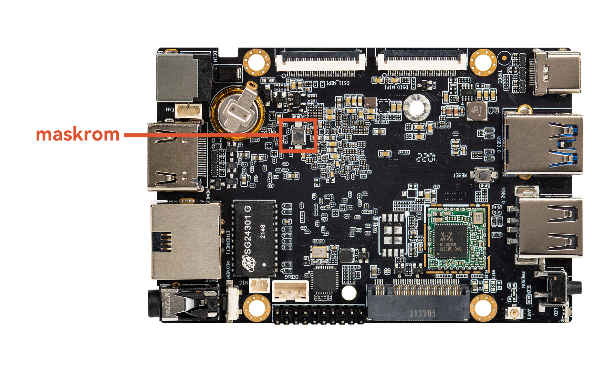
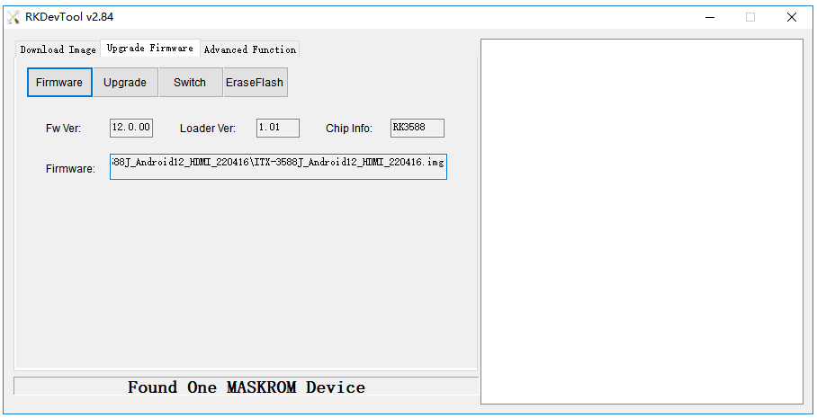

# MaskRom mode

***See startup mode for an introduction [startup mode](upgrade_bootmode.md)***

`MaskRom` pattern is the last line of defense equipment burn out. Forced entry `MaskRom` involved hardware operation, have certain risk, so only in the equipment into the `Loader` mode, can try `MaskRom` mode.

**Please read carefully and operate carefully!**

The operation steps are as follows:

You can press the MaskROM key and then power on the device  

At this point, the device should go into `MaskRom mode`.

