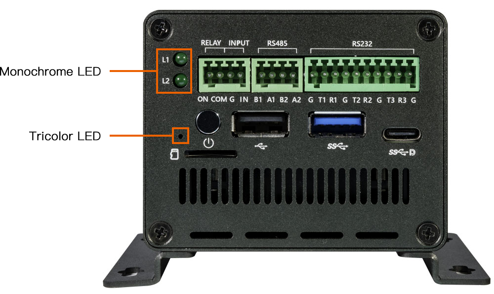

# LED

## Introduction

EC-R3588SPCThere is a three color LED light and two monochrome lights on the development board, as shown in the following table：

| LED     | Pin name  | Pin number |remarks|
| ----    | ----      | ----       |----|
| Blue    | GPIO1_D5  | 61         |Tricolor Led|
| Red     | GPIO3_B2  | 106        |Tricolor Led|
| Green   | GPIO3_C0  | 112        |Tricolor Led|
| Ext Yellow（L2）    | GPIO3_B7  | 111         |Lower Monochrome Led work with Relay|
| Ext Green（L1）    | GPIO3_C1  | 113        |Upper Monochrome Led|




LEDs can be controlled by using the LED device subsystem or by directly operating GPIO.

## Controlling LEDs by device

Linux has its own LED subsystem for LED devices. In EC-R3588SPC, LEDs are configured as LED class devices.You can control them via `/sys/class/leds/`.

Tricolor led：
*   Blue:  Turn on after the system powers on.
*   Red:   defined by user.
*   Green: defined by user.

Monochrome led：
*   Ext Yellow : Relay work in indicator(Silk screen：L2)
*   Ext Green : defined by user.  (Silk screen：L1)


You can change the behavior of each LED by using the echo command to write command to its brightness property:


Tricolor led：
```
echo 1 > sys/class/leds/\:power/brightness //Blue led on
echo 0 > sys/class/leds/\:power/brightness //Blue led off
```
```
echo 1 > sys/class/leds/\:user/brightness //Red led on
echo 0 > sys/class/leds/\:user/brightness //Red led off
```
```
echo 1 > sys/class/leds/\:user1/brightness //Green led on
echo 0 > sys/class/leds/\:user1/brightness //Green led off
```

L1 Monochrome led：
```
echo 1 > /sys/class/leds/ext_led1/brightness //Ext Yellow led on
echo 0 > /sys/class/leds/ext_led1/brightness //Ext Yellow led off
```

L2 Monochrome led：
```
echo 1 > /sys/class/leds/ext_led2/brightness //Ext Green led on
echo 0 > /sys/class/leds/ext_led2/brightness //Ext Green led off
```


## Using trigger control LED

Trigger contains a variety of ways to control the LED, here with two examples to illustrate.

* Simple trigger LED
* Complex trigger LED

For more information, please read the document `leds-class.txt`.

First of all, we need to know how many LED definition, while the corresponding property of the LED is.

Define Tricolor led node in file `kernel/arch/arm64/boot/dts/rockchip/roc-rk3588s-pc.dtsi`：
```
firefly_leds: leds {
    compatible = "gpio-leds";
    power_led: power {
        label = ":power"; //blue led
        linux,default-trigger = "ir-power-click";
        default-state = "on";
        gpios = <&gpio1 RK_PD5 GPIO_ACTIVE_HIGH>;
        pinctrl-names = "default";
        pinctrl-0 = <&led_power>;
    };

    user_led: user {
        label = ":user"; //red led
        linux,default-trigger = "ir-user-click";
        default-state = "off";
        gpios = <&gpio3 RK_PB2 GPIO_ACTIVE_HIGH>;
        pinctrl-names = "default";
        pinctrl-0 = <&led_user>;
    };

    user1_led: user1 {
        label = ":user1"; //green led
        default-state = "off";
        gpios = <&gpio3 RK_PC0 GPIO_ACTIVE_HIGH>;
        pinctrl-names = "default";
        pinctrl-0 = <&led_user1>;
    };
};

```
Define Monochrome led node in file `kernel/arch/arm64/boot/dts/rockchip/roc-rk3588s-pc-ext.dtsi` ：
```
&firefly_leds {
               ext_yellow_led: ext_led1 {
                       gpios = <&gpio3 RK_PB7 GPIO_ACTIVE_HIGH>;//yellow led
                       pinctrl-names = "default";
                       pinctrl-0 = <&led_user2>;
               };

               ext_green_led: ext_led2 {
                       gpios = <&gpio3 RK_PC1 GPIO_ACTIVE_HIGH>;//green led
                       pinctrl-names = "default";
                       pinctrl-0 = <&led_user3>;
               };
};
```


Note: The value of `compatible` must match the one in `drivers/leds/leds-gpio.c`.

### Simple trigger LED

It is a simple trigger mode to control LEDs, as follows on the default open yellow LED. And EC-R3588SPC's yellow LED will be turned on after boot.

(1) Defined LED trigger In the `kernel/drivers/leds/trigger/led-firefly-demo.c` add the following:

```
DEFINE_LED_TRIGGER(ledtrig_default_control);
```

(2) Register the trigger.

```
led_trigger_register_simple("ir-user-click", &ledtrig_default_control);
```

(3) Control the LED.

```
led_trigger_event(ledtrig_default_control, LED_FULL);     #yellow led on
```

（4）Enable LED demo.

led-firefly-demo is disabled in default,if you need to open the demo drive can use the following patch:

```
--- a/kernel/arch/arm64/boot/dts/rockchip/rk3588-firefly-demo.dtsi
+++ b/kernel/arch/arm64/boot/dts/rockchip/rk3588-firefly-demo.dtsi
@@ -52,7 +52,7 @@
            led_demo: led_demo {
-                status = "disabled";
+                status = "okay";
                 compatible = "firefly,rk3588-led";
                 };
```

### Complex trigger LED

The following is the trigger mode control LED complex example, `timer trigger` is to let the LED to achieve constant light off effect.

We need to configure the timer trigger on the kernel.

In the `kernel-5.10` path using `make menuconfig`, in accordance with the following method to chose `timer trigger` driver.

```
Device Drivers
--->LED Support
   --->LED Trigger support
      --->LED Timer Trigger
```
Save the configuration and compile the kernel, the `kernel.img` burn EC-R3588SPC board. We can use the serial input command, you can see the blue light non-stop interval flashing.

```
echo "timer" > /sys/class/leds/:user/trigger
```

The user can also use the `cat` command to get the available values for the trigger:

```
# cat /sys/class/leds/:user/trigger
none ir-power-click rfkill-any rfkill-none test_ac-online test_battery-charging-or-full 
test_battery-charging test_battery-full test_battery-charging-blink-full-solid 
test_usb-online mmc0 [timer] heartbeat backlight default-on ir-user-click mmc1 
rfkill0 tcpm-source-psy-6-0022-online rfkill1 rfkill2
```
