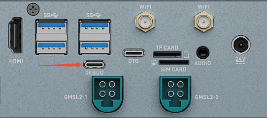
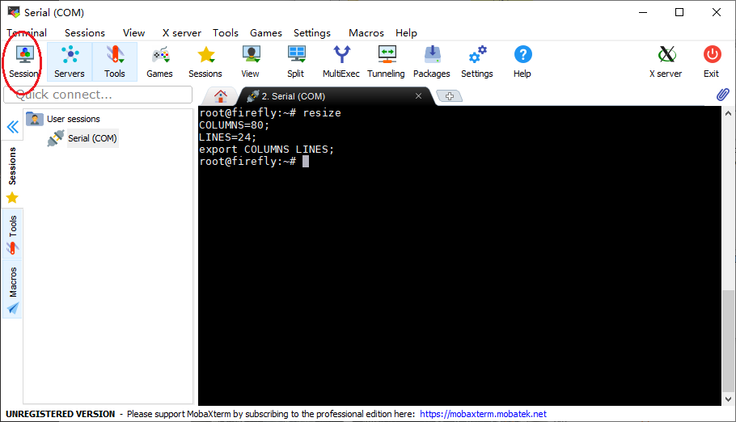
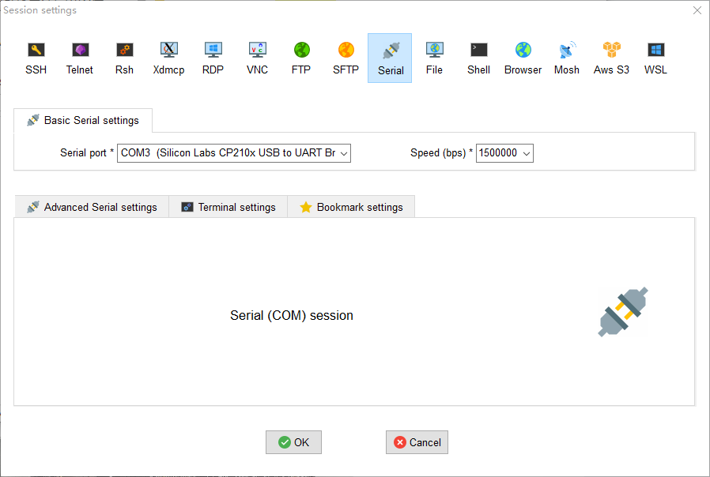

# Serial debug

USB-to-serial adapter is the abbreviation of USB-to-serial TTL adapter.

## Debugging 

You can connect EC-ThorT5000 to a PC for serial port debugging:



### Serial parameter configuration

EC-ThorT5000 uses the following serial port parameters:

* Baud rate: 115200
* Data bits: 8
* Stop bit: 1
* Parity: none
* Flow Control: None

### Using serial port debugging on Windows

On Windows, putty or SecureCRT is generally used. Among them, we recommend using the free version of MobaXterm. This is a powerful terminal software, which is introduced here. The usage of other software is similar.

Go here [download MobaXterm](https://mobaxterm.mobatek.net/):

1. Select `session` as `Serial`.
2. Modify `Serial port` to the COM port found in Device Manager.
3. Set `Speed (bsp)` to `115200`.
4. Click the `OK` button.




### Serial debugging on Linux

There are several options available on Linux:

* minicom
* picocom
* kermit

The following will introduce the use of minicom.

Install minicom:

```
sudo apt-get install minicom
```

After connecting the serial cable, see what the serial device file is. The following example is `/dev/ttyUSB0`:

```
$ ls /dev/ttyUSB*
/dev/ttyUSB0
```

Run:

```
$ sudo minicom
Welcome to minicom 2.7
OPTIONS: I18n
Compiled on Jan  1 2014, 17:13:19.
Port /dev/ttyUSB0, 15:57:00
Press CTRL-A Z for help on special keys
```

The above prompt `CTRL-A Z` is the escape key, press `Ctrl-a` and then `z` to bring up the menu:

```
   +-------------------------------------------------------------------+
                          Minicom Command Summary                      |
  |                                                                    |
  |              Commands can be called by CTRL-A <key>                |
  |                                                                    |
  |               Main Functions                  Other Functions      |
  |                                                                    |
  | Dialing directory..D  run script (Go)....G | Clear Screen.......C  |
  | Send files.........S  Receive files......R | cOnfigure Minicom..O  |
  | comm Parameters....P  Add linefeed.......A | Suspend minicom....J  |
  | Capture on/off.....L  Hangup.............H | eXit and reset.....X  |
  | send break.........F  initialize Modem...M | Quit with no reset.Q  |
  | Terminal settings..T  run Kermit.........K | Cursor key mode....I  |
  | lineWrap on/off....W  local Echo on/off..E | Help screen........Z  |
  | Paste file.........Y  Timestamp toggle...N | scroll Back........B  |
  | Add Carriage Ret...U                                               |
  |                                                                    |
  |             Select function or press Enter for none.               |
  +--------------------------------------------------------------------+
```

Press `O` according to the prompt to enter the setting interface, as follows:

```
           +-----[configuration]------+
           | Filenames and paths      |
           | File transfer protocols  |
           | Serial port setup        |
           | Modem and dialing        |
           | Screen and keyboard      |
           | Save setup as dfl        |
           | Save setup as..          |
           | Exit                     |
           +--------------------------+
```

Move the cursor to "Serial port setup", press enter to enter the serial port setup interface, then enter the letters indicated above, select the corresponding option, and set as follows:

```
   +-----------------------------------------------------------------------+
   | A -    Serial Device      : /dev/ttyUSB0                              |
   | B - Lockfile Location     : /var/lock                                 |
   | C -   Callin Program      :                                           |
   | D -  Callout Program      :                                           |
   | E -    Bps/Par/Bits       : 115200 8N1                                |
   | F - Hardware Flow Control : No                                        |
   | G - Software Flow Control : No                                        |
   |                                                                       |
   |    Change which setting?                                              |
   +-----------------------------------------------------------------------+
```

**Note:** `Hardware Flow Control` and `Software Flow Control` must be set to No, otherwise it may result in failure to input.

After the setup is complete, go back to the previous menu and select `Save setup as dfl` to save it as the default configuration, which will be used by default in the future.

