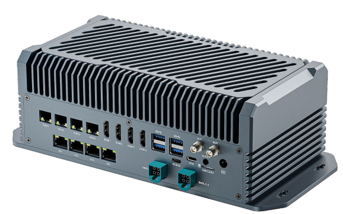
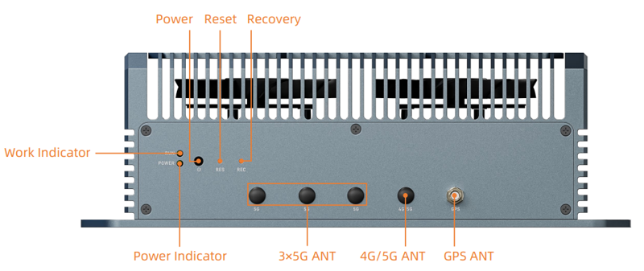

# Introduction

[Specification](https://download.t-firefly.com/Spec/Computers/EC-ThorT5000_Specification_EN.pdf) | [Purchase](https://www.t-firefly.com/products/ec-thort5000-computers) | [Downloads](https://community.t-firefly.com/en/doc/download/346)

EC-ThorT5000 is equipped with the NVIDIA official original Jetson Thor T5000 module, with 128GB of memory and up to 2070 TFLOPS of computing power. It can run all modern AI models, including Transformer and ROS robot models. It can realize larger and more complex deep neural networks, such as using TENSORFLOW, OPENCV, JETPACK, KERASMXNET, PY-TORCH, etc., to achieve object recognition, object detection and tracking, speech recognition, and other visual development functions, meeting the needs of higher AI artificial intelligence application scenarios.

## Interface Description

**EC-ThorT5000** provides rich interfaces, mainly including:

### CAN Version

* 1 x DC 24V power interface (5.5mm × 2.1mm, supports 9V~36V wide voltage input)
* 4 x 10Gbps Ethernet ports
* 4 x HDMI2.0 (supports 4K@60Hz output)
* 4 x USB3.0 (current limit 1A)
* 1 x Type-C (OTG)
* 1 x Type-C (Debug serial port)
* 8 x GMSL2
* 1 x SIM card slot
* 1 x 3.5mm Audio Jack (supports MIC recording, CTIA standard)
* 1 x 24Pin Phoenix terminal block (3.5mm pitch, including 4 x CAN, 1 x RS485, 1 x RS232 and IO)
* 2 x WiFi antenna, 3 x 5G antenna, 1 x 4G/5G antenna, 1 x GPS antenna
* Power key, Reset key, Recovery key
* Working LED, Power LED

As shown in the figures below:

### Ethernet Version

* 1 x DC 24V power interface (5.5mm × 2.1mm, supports 9V~36V wide voltage input)
* 4 x 10Gbps Ethernet ports
* 4 x RJ45 Gigabit Ethernet ports (support PSE power supply)
* 4 x HDMI2.0 (supports 4K@60Hz output)
* 4 x USB3.0 (current limit 1A)
* 1 x Type-C (OTG)
* 1 x Type-C (Debug serial port)
* 8 x GMSL2
* 1 x SIM card slot
* 1 x 3.5mm Audio Jack (supports MIC recording, CTIA standard)
* 2 x WiFi antenna, 3 x 5G antenna, 1 x 4G/5G antenna, 1 x GPS antenna
* Power key, Reset key, Recovery key
* Working LED, Power LED

As shown in the figures below:
As shown in the figure below:

### Back

## Resources and Support

* [[Technical Forum]](https://forum.t-firefly.com/): A communication platform with more than 100,000 enterprise customers and users

### Contact

* Email: sales@t-firefly.com
* Mobile: (+86) 186 8811 7175
* Landline: 0760-89881218
* National Service Hotline: 4001-511-533
* Address: Room 2101, Hongyu Building, No. 57 Zhongshan 4th Road, East District, Zhongshan City, Guangdong Province