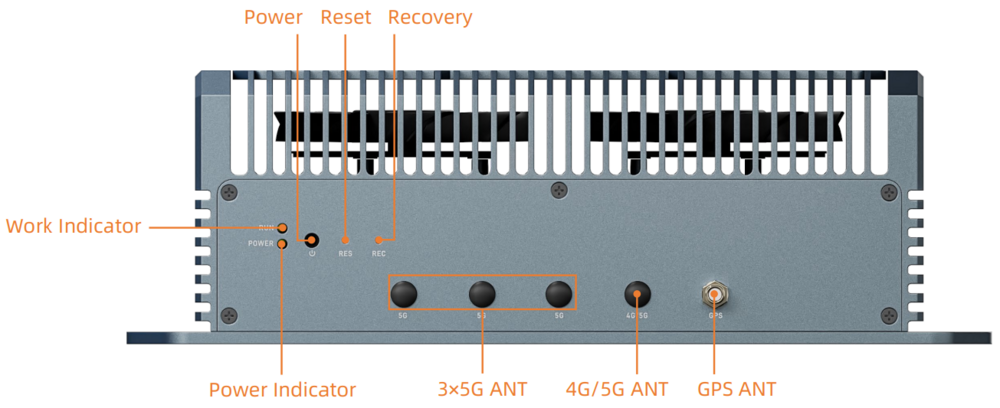
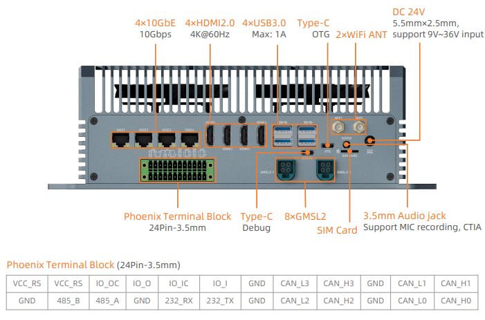
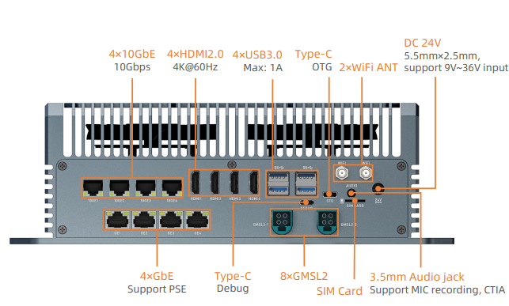

# Introduction
EC-ThorT5000 is equipped with the Nvidia Jetson Thor T5000 module, is available in 128GB Memory, up to 2070 TFLOPS. It can run AI models, including Transformer and ROS robot models. It can realize larger and more complex deep neural networks, such as using TENSORFLOW, OPENCV, JETPACK, KERASMXNET, PY-TORCH, etc., to achieve object recognition, object detection and tracking, speech recognition, and other visual development functions, meeting the needs of higher AI artificial intelligence application scenarios. 

# Interface description
## CAN Version

## Ethernet Version

