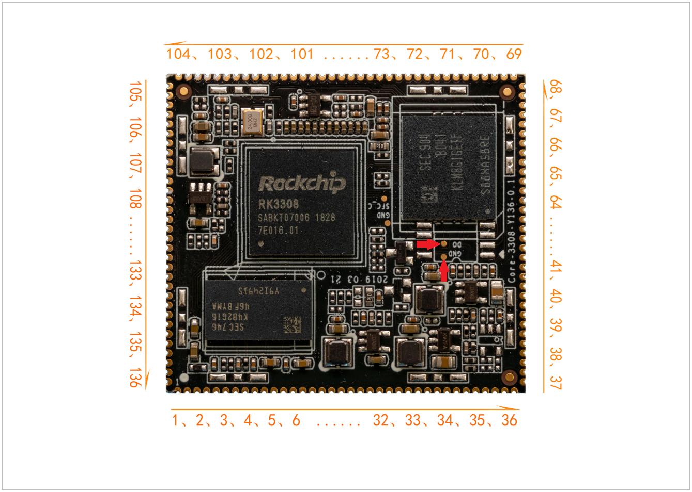
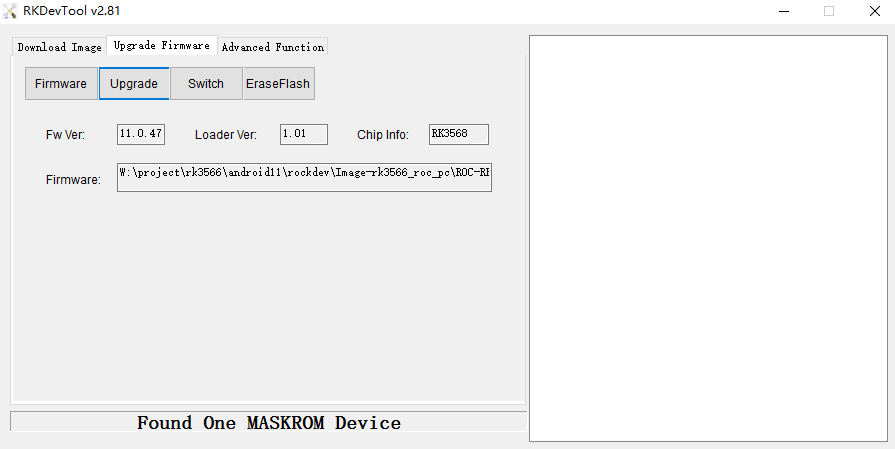

# MaskRom mode

***See startup mode for an introduction [startup mode](01-bootmode.md)***

`MaskRom` pattern is the last line of defense equipment burn out. Forced entry `MaskRom` involved hardware operation, have certain risk, so only in the equipment into the `Loader` mode, can try `MaskRom` mode.

**Please read carefully and operate carefully!**

The operation steps are as follows:

1. Disconnect all power supplies.
1. Unplug the SD card.
1. Connect the equipment and host machine with Type-C data cable.
1. Use metal tweezers to connect and hold the two test points as shown in the following figure on IHC-3308GW (as shown in the figure below).
1. Plug the device into the power supply.
1. Wait a moment, then loosen the tweezers.

At this point, the device should go into `MaskRom mode`.

