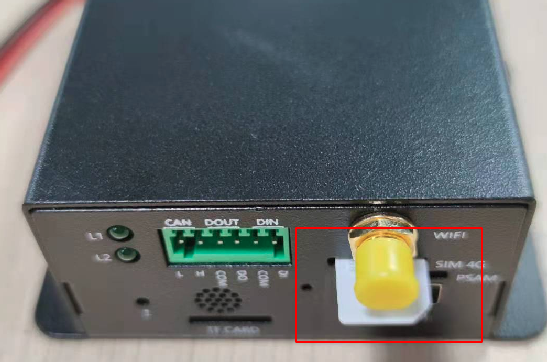
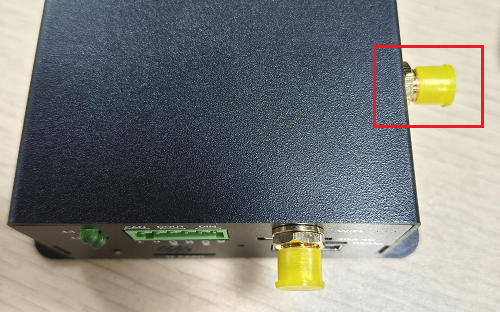
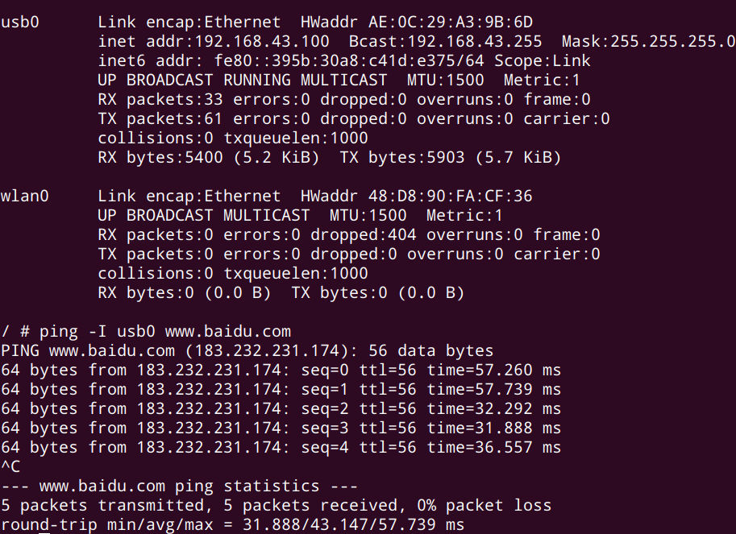
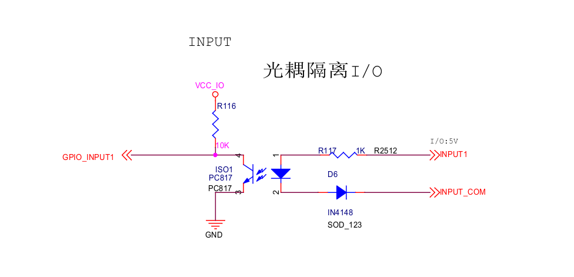
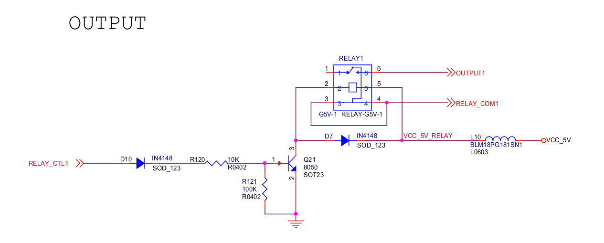

## 4G

IHC-3308GW has single wifi version and wifi+4g version, please confirm that the machine used is equipped with 4G module.

Resolution method: Check the number of antennas, if there is only one antenna interface, it is the single wifi version.  If there are two antenna interfaces, it is the wifi+4g version.

The 4G module used is `EC200S-CN`, for `Buildroot` or `Ubuntu` system, after power on, the system will automatically dial

### SIM card connection



### 4G antenna connection



### Manual AT command dial-up networking

If the system cannot dial normally, you can use AT commands to troubleshoot the problem manually.

- Confirm whether the `EC200S-CN` module starts normally, and the `usb0` network card corresponds to the `EC200S-CN` module

```bash
#ifconfig usb0
usb0 Link encap:Ethernet HWaddr AE:0C:29:A3:9B:6D
          inet addr:192.168.43.100 Bcast:192.168.43.255 Mask:255.255.255.0
          inet6 addr: fe80::ed5d:84b6:c27c:3825/64 Scope:Link
          UP BROADCAST RUNNING MULTICAST MTU:1500 Metric:1
          RX packets:18 errors:0 dropped:0 overruns:0 frame:0
          TX packets:39 errors:0 dropped:0 overruns:0 carrier:0
          collisions:0 txqueuelen:1000
          RX bytes: 3456 (3.3 KiB) TX bytes: 3811 (3.7 KiB)
````

- Configure serial port properties

  If it is an `Ubuntu` system, it needs to be configured

  ```bash
  # stty -F /dev/ttyUSB2 icrnl opost onlcr icanon echo echoe
  ````

- Query module status

  ```bash
  # cat /dev/ttyUSB2 &
  # echo AT+QCFG="usbnet" > /dev/ttyUSB2
  ````

  If it returns `+QCFG: "usbnet",1`, that is `ECM` status

- Module is configured to `ECM` NIC status

  ```bash
  echo AT+QCFG="usbnet",1 > /dev/ttyUSB2
  ````

- Dial

  ```bash
  echo AT+QNETDEVCTL=1,1,1 > /dev/ttyUSB2
  ````

- ping external network

  

- Other AT commands

disconnect dial

```bash
echo AT+QNETDEVCTL=0,1,1 > /dev/ttyUSB2
````

Check the strength of the antenna signal, return the value "0-31,99", try to ensure that the signal strength is "26-31,99"

```bash
echo "AT+CSQ" > /dev/ttyUSB2
````

Check whether the sim card or IoT card is inserted, and return to READY normally

```bash
echo "AT+CPIN?" > /dev/ttyUSB2
````

Check the operator, such as China Unicom CHN-UNICOM, mobile "CHINA MOBILE"

```bash
echo "AT+COPS?" > /dev/ttyUSB2
````

Check whether the traffic service of the sim card is normal

```bash
echo "AT+CGATT?" > /dev/ttyUSB2
````

Return +CGATT: 1 means attached, +CGATT: 0 means detached, when returning +CGATT: 0, please check whether the traffic service of the card is normal

## Uart

The expansion board expands multiple serial ports for use, including 3 `RS485` and 1 `RS232`.

The kernel already supports the above serial port functions by default. The device files corresponding to each serial port are as follows:

```bash
RS485_1: /dev/ttysWK0
RS485_2: /dev/ttysWK1
RS485_3: /dev/ttysWK2
RS232 : /dev/ttysWK3
````

Take RS485_1 as an example:

* connect

Connect the A and B pins of RS485_1 to the A and B pins of the host serial adapter (USB to 485 to serial port module) respectively.

* Open the serial terminal of the host

Open kermit in the terminal and set the baud rate:

```bash
$ sudo kermit
C-Kermit> set line /dev/ttysWK0
C-Kermit> set speed 9600
C-Kermit> set flow-control none
C-Kermit > connect
````

`/dev/ttyUSB0` is the device file of the USB-to-serial adapter recognized by the host.

* send data

Run the following command on the device:

```bash
echo "Firefly RS485 test..." > /dev/ttysWK0
````

The serial terminal in the host can receive the string "Firefly RS485 test...".

* Receive data

First run the following command on the device:

```bash
cat /dev/ttysWK0
````

Then enter the string "Firefly RS485 test..." in the serial terminal of the host, and the same string can be seen on the device side.

## CAN

- connect

Just connect the `CANH`, `CANL` of the device and the `CANH`, `CAHL` of the communication terminal correspondingly.

* send data

```bash
ip link set can0 down
ip link set can0 type can bitrate 250000
ip link set can0 up
cansend can0 123#1122334455667788
````

* Receive data

```bash
ip link set can0 down
ip link set can0 type can bitrate 250000
ip link set can0 up
candump can0
````

* loopback mode test

```bash
ip link set can0 down
ip link set can0 type can bitrate 50000 loopback on
ip link set can0 up
candump can0 &
cansend can0 123#11223344556677
````

## DIN

The gateway supports one optocoupler isolation interface, where `DI` corresponds to `INPUT1` in the hardware schematic diagram, and `COM` corresponds to `INPUT_COM` in the hardware schematic diagram.

- Circuit Schematic



* Detection

When `INPUT1`, `INPUT_COM` are on, `GPIO_INPUT1` will detect a low level; when `INPUT1`, `INPUT_COM` are off, `GPIO_INPUT1` will detect a high level.

The corresponding `GPIO` ports are as follows:

```bash
GPIO_INPUT1: GPIO1_A6, 38
````

The detection method is as follows:

```bash
# apply for GPIO
echo 38 > /sys/class/gpio/export
# set as input
echo in > /sys/class/gpio/gpio38/direction
# read level value
cat /sys/class/gpio/gpio38/value
````

## DOUT

The gateway supports one relay interface, `DO` corresponds to `OUTPUT1` in the hardware schematic diagram, and `COM` corresponds to `RELAY_COM1` in the hardware schematic diagram.

* Circuit schematic



* control

When `RELAY_CTL1` outputs a low level, `OUTPUT1`, `RELAY_COM1` are disconnected; when `RELAY_CTL1` outputs a high level, `OUTPUT1`, `RELAY_COM1` are turned on.

The corresponding `GPIO` ports are as follows:

````
RELAY_CTL1: GPIO1_B2, 42
````

The control method is as follows:

```bash
# apply for GPIO
echo 42 > /sys/class/gpio/export
# set as output
echo out > /sys/class/gpio/gpio42/direction
# Set the level value, 1 / 0
echo 1 > /sys/class/gpio/gpio42/value
````

## LED

The gateway supports 6 customizable LED lights, and the corresponding GPIO ports are as follows:

| **L1** | GPIO2_A7 (gpio71)     |
| ------ | --------------------- |
| **L2** | **GPIO2_A6 (gpio70)** |
| **L3** | **GPIO2_B3 (gpio74)** |
| **L4** | **GPIO2_B2 (gpio73)** |
| **L5** | **GPIO2_B5 (gpio76)** |
| **L6** | **GPIO2_B4 (gpio75)** |

The control method is as follows, taking L1 as an example:

```bash
# Bright
echo 1 > /sys/class/leds/firefly\:green\:L1/brightness
# off
echo 0 > /sys/class/leds/firefly\:green\:L1/brightness
````