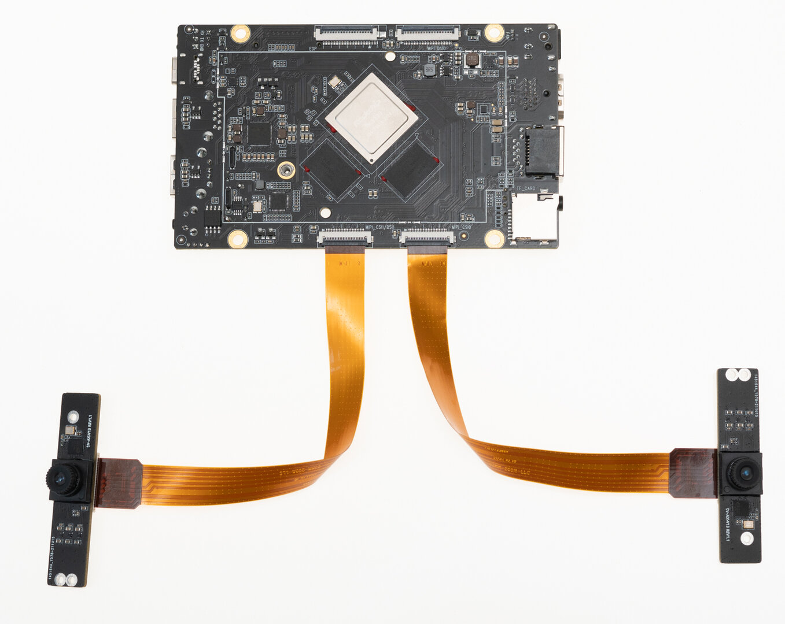
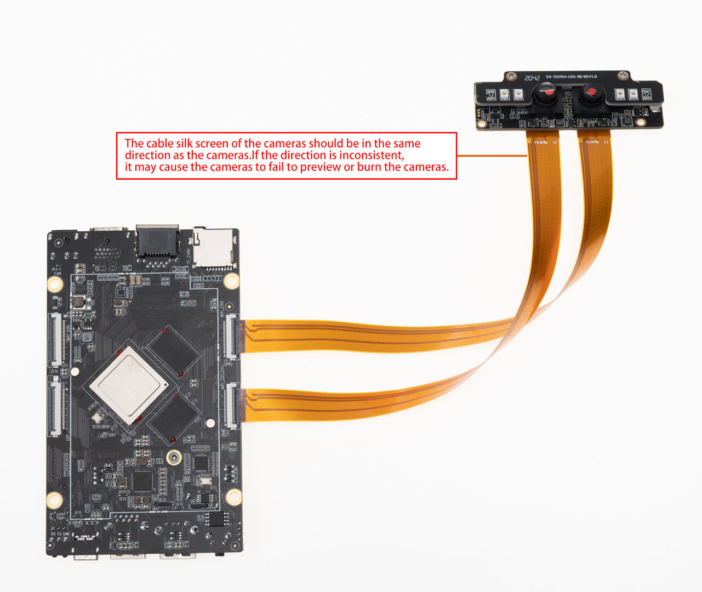

# Camera Module

## [OV13850 Camera Moudle](https://www.firefly.store/products)<font color=#ff0000>(Out of production)</font> <br />

### Product Parameter

* Brand：Omnivision
* Model：CMK-OV13850
* Interface：MIPI
* Pixels：1320W


### Reference firmware

* CMK-OV13850 camera module is supported by the default firmware of Android 7.1.
* The public firmware of Android 10.0 must be manually modified DTS.

#### The modified method of 10.0

```
--- a/kernel/arch/arm64/boot/dts/rockchip/rk3399-roc-pc-plus.dtsi
+++ b/kernel/arch/arm64/boot/dts/rockchip/rk3399-roc-pc-plus.dtsi
 &i2c1{

-    XC6130b@23{
+    ov13850b@10{
     status = "okay";
     };
-    XC7022b@1b{
+    ov13850f@10{
     status = "okay";
     };

-    /delete-node/ ov13850b@10;
-    /delete-node/ ov13850f@10;
+    /delete-node/ XC6130b@23;
+    /delete-node/ XC7022b@1b;

 };

```

Modify according to the patch, recompile the kernel, then burn boot.img and reboot.


### Datasheet

[DataSheet and schematic of OV13850 Camera Module](http://download.t-firefly.com/product/RK3288/Docs/Peripherals/OV13850%20datasheet/Sensor_OV13850-G04A_OmniVision_SpecificationV1.pdf).

### Picture


### Connection Method


### Renderings


## [CAM-8MS1M Monocular camera](https://www.firefly.store/products/cam-8ms1m-camera-module)

### Product Parameter
* **Brand**：SV
* **ISP**：XC7160
* **Sensor**: SC8238
* **Interface**: MIPI
* **Pixels**: 800W(Currently only supports up to 1080P, 4K is still being adapted)

### Reference firmware
Public Fimware support CAM-8MS1M camera module by default. If it doesn't work, please update the latest firmware.
[Android7.1 Download link](https://en.t-firefly.com/doc/download/127.html#other_259)

[Android10.0 Download link](https://en.t-firefly.com/doc/download/127.html#other_340)


### Physical map


### Connection method



### Real pictures


## SV-TAYSH-TQ Camera module

### Product parameters

* Model：XC7022(RGB)/XC6130(IR)

* Interface ：MIPI

* Pixel ：200W

### Patch

「 Android 7.1 」device/rockchip/rk3399/rk3399_roc_pc_plus.mk

```
 BOARD_NFC_SUPPORT := false
 BOARD_HAS_GPS := false
+BOARD_XC7022_XC6130_SUPPORT := true

 #for 3G/4G modem dongle support
 BOARD_HAVE_DONGLE := false
```
 Modify the above patch and [complie Android](compile_android7.1_industry_firmware.html#overall-compilation), then reboot after upgrading system.img.


 [Android 10] kernel/arch/arm64/boot/dts/rockchip/rk3399-roc-pc-plus.dtsi
```
    xc7160b@1b{
+    status = "disabled";
    };
    xc7160f@1b{
+    status = "disabled";
    };

    XC6130b@23{
+    status = "okay";
    };
    XC7022b@1b{
+    status = "okay";
    };
```
Modify the above patch and [complie kernel](compile_android10.0_firmware.html#step-by-step-compilation), then reboot after upgrading boot.img.


### Physical map


### Connection method



### Real pictures


