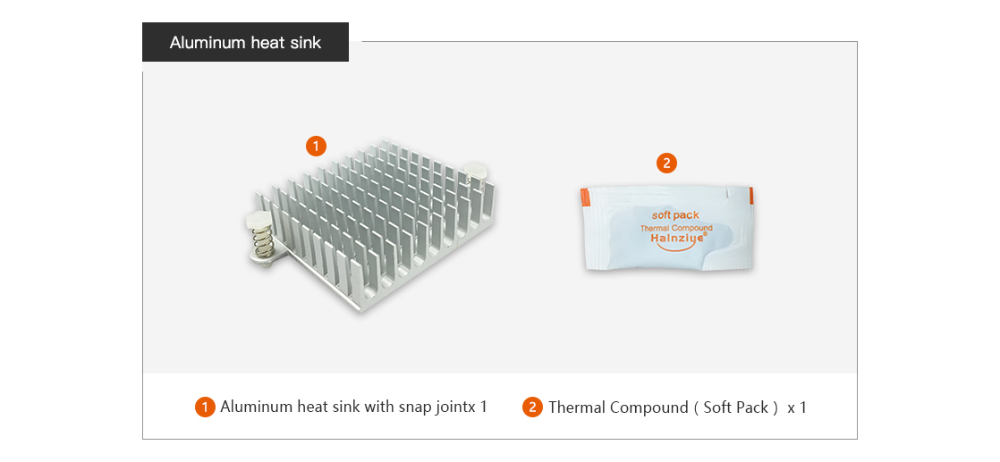
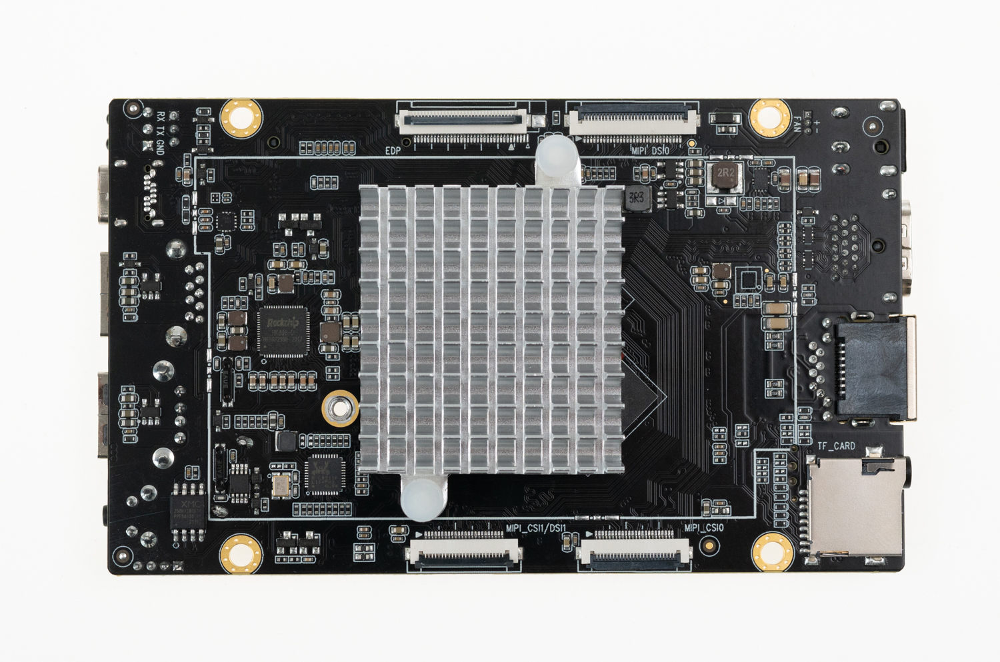
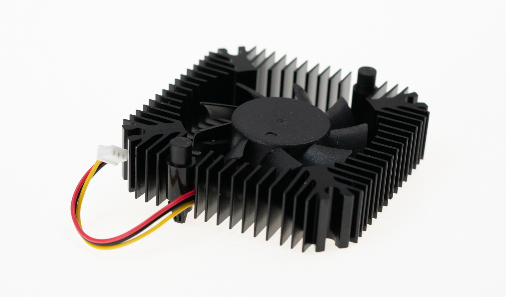
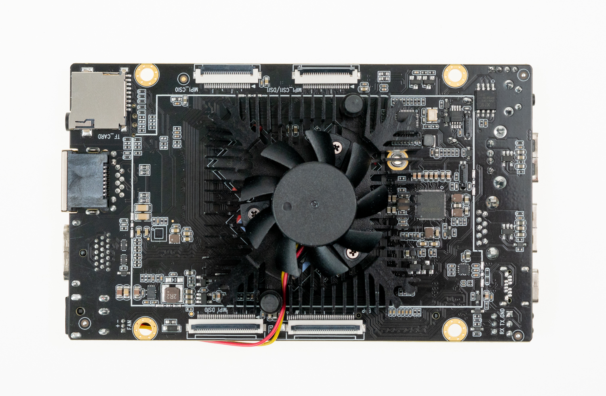
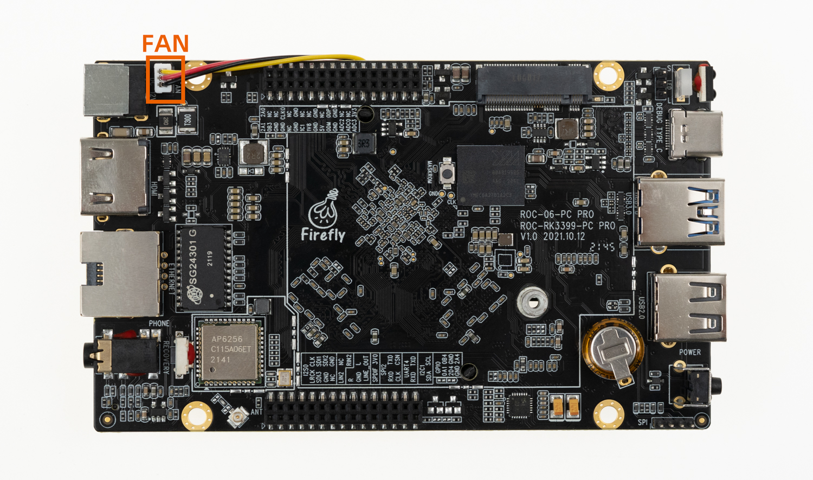

# Heat sink

## [Aluminum heat sink](https://www.firefly.store/products/aluminum-heat-sink-d)

### Product parameters

* Adaptation: ROC-RK3399-PC Pro
* size: 43mm (L)* 39.5mm(W)*11mm(H)

### Real figure

### Installation

## [Integral Cooling Fan](https://www.firefly.store/products/integral-cooling-fan-for-firefly-rk3399)

### Product Parameter

* Model: TFAN_55S_B
* Adapter: ROC-RK3399-PC Pro
* Size: 5.5±0.3mm * 55.5±0.3mm
* Voltage: 12V (10.8-13.2V)
* Max air flow: 5.8CFM

### Physical map

### Installation method

