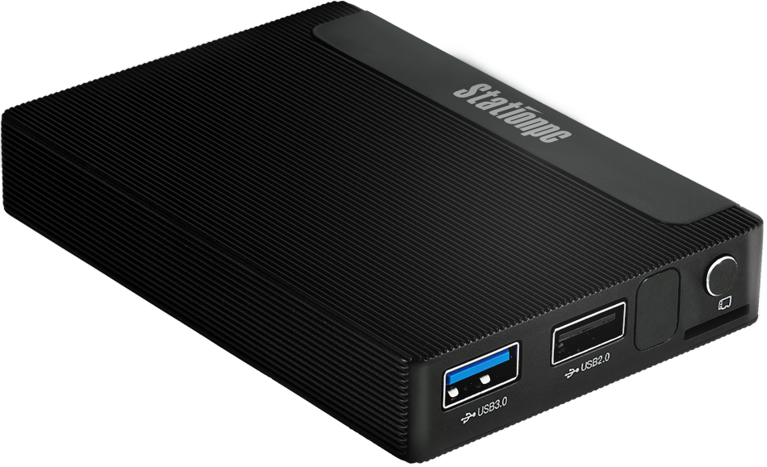

# Introduction
Station M2 Geek Mini PC. Based on ROC-RK3566-PC, The device features an ultra-slim design, making it highly portable and convenient. Support 8 GB RAM, M.2 slot for SSD; Support a variety of operating systems, geek play emerge in an endless stream; Equipped with mobile applications, you can remotely control the device and play the Mini PC no matter where you are.

With RK3566 quad-core 64-bit Cortex-A55 processor, features 22nm lithography process and frequency of up to 1.8GHz, ARM G52 2EE GPU. Integrated with a 1TOPS AI accelerator RKNN NPU

 