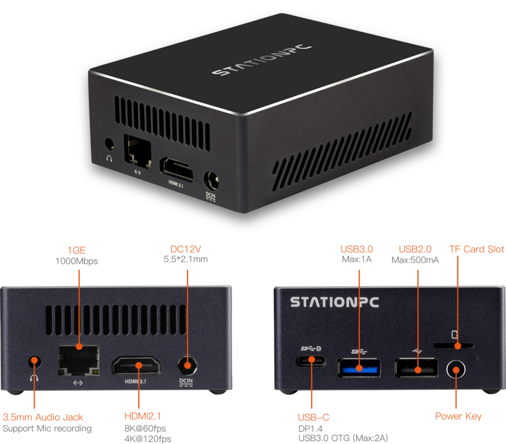

# Introduction

[Specification](（同中文版）) | [Purchase](https://www.t-firefly.com/products/station-m3-mini-pc) | [Downloads](https://community.t-firefly.com/en/doc/download/214)

Based on Rockchip new generation of flagship AIOT chip -- RK3588S, the Station-M3 features an 8nm LP process and an 8-core (Cortex-A76x4+Cortex-A55x4) 64-bit CPU with up to 2.4 GHz.Integrated ARM Mali-G610MP4 quad-core GPU, built-in AI accelerator NPU,can provide 6Tops computing power, support the mains, support up to 32 GB of memory, support 8K video codec and multiple formats of video input and output, support multiple operating systems can be applied to ARM PC, edge computing,cloud server, intelligent NVR and other fields.

## Interface Description

**** provides rich interfaces, mainly including:

* 1 x HDMI2.1 (Max output support 8K@60Hz)
* 1 x Display Port1.4 (Max output support 8K@30Hz)
* 1 x USB3.0 OTG(Type-C)
* 2 x MIPI-DSI
* 1 x MIPI-CSI
* 1 x SATA3.0 or PCIe2.0
* 1 x TF Card
* 1 x USB3.0
* 3 x USB2.0 (Two USB2.0 are led by a 20-pin pin row)
* 1 x WIFI
* 1 x Bluetooth
* 1 x FAN
* 1 x RJ45 (Suport 1Gbps)
* 1 × 3.5mm Headphone (V1.1 version support recording)
* 1 × Mic（2P-1.25mm）

As shown in the figure below:

## Structure and Dimensions

## Resources and Support

* [[Wiki]](../../Motherboard/ROC-RK3588S-PC/index.md): Contains Android & Ubuntu driver development and other materials (refer to the ROC-RK3588S-PC Wiki)
* [[Technical Forum]](https://forum.t-firefly.com/): A communication platform with more than 100,000 enterprise customers and users

### Contact

* Email: sales@t-firefly.com
* Mobile: (+86) 186 8811 7175
* Landline: 0760-89881218
* National Service Hotline: 4001-511-533
* Address: Room 2101, Hongyu Building, No. 57 Zhongshan 4th Road, East District, Zhongshan City, Guangdong Province