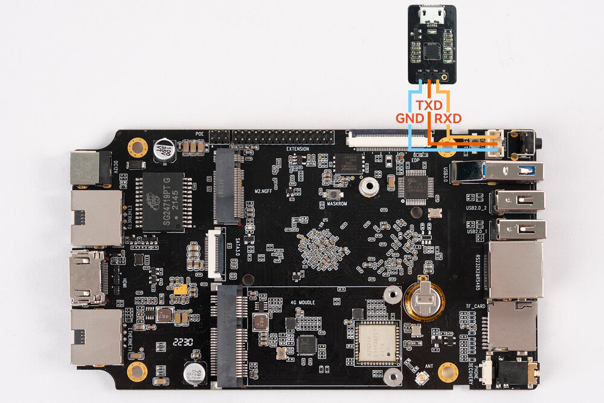

# Hardware Function Usage
## Debug Serial

The board has an on-board Debug serial port (3P-2.0mm). You need to connect a USB to TTL module to the debug serial port for viewing boot logs and system debugging. For the connection and usage of the debug serial port, see: [Debug Serial](debug.md).

The debug serial connection is shown below:

<center>


</center>

## UART (RS232 / RS485)

The ROC-RK3568-PC-SE provides 1 Control Port, which expands RS232 x 2 and RS485 x 1 signals. See the interface figures above for the position. The serial device nodes depend on the actual system and can be listed with `ls /dev/ttyS*`.

### Send/Receive Verification

Take RS485 as an example. Connect the host and the computer with a USB to RS485 adapter (the adapter node on the host depends on the actual device, e.g. `/dev/ttyUSB0`; the RS485 node on the computer depends on the actual system, `/dev/ttyS1` is used as an example below).

The computer sends, the host receives:

```
# Run on the host terminal first
cat /dev/ttyUSB0
# Run on the debug serial terminal of the computer
echo "firefly RS485 test..." > /dev/ttyS1
```

The host terminal will receive the string `firefly RS485 test...`.

The host sends, the computer receives:

```
# Run on the debug serial terminal of the computer first
busybox stty -echo -F /dev/ttyS1       # disable echo
cat /dev/ttyS1
# Run on the host terminal
echo "firefly RS485 test..." > /dev/ttyUSB0
```

The debug serial terminal of the computer will receive the string `firefly RS485 test...`. The RS232 signals can be verified in the same way, just replace the node with the corresponding RS232 device node.

## SIM Card

The on-board SIM card slot is used together with a Mini PCIe 4G module for mobile network connection. **The 4G module is optional**. The SIM card function can only work after a 4G module is installed. Please power off the device before inserting or removing the SIM card. The card orientation follows the silkscreen of the card slot, and the network status depends on the actual system.

## Display Interface

The ROC-RK3568-PC-SE provides 1 HDMI 2.0 output interface (up to 4K@60Hz output) and 1 MIPI-DSI interface (30P-0.5mm). On Android, the resolution and display mode can be adjusted in `Settings -> Display`.

Get the edid, supported modes and connection status of HDMI:

```
busybox hexdump /sys/class/drm/card0-HDMI-A-1/edid
cat /sys/class/drm/card0-HDMI-A-1/modes
cat /sys/class/drm/card0-HDMI-A-1/status
```

Generally, if the HDMI display fails, first run the commands above to check whether the connection status, edid and resolution are correct.

## Ethernet

The ROC-RK3568-PC-SE provides 2 RJ45 Gigabit Ethernet ports, corresponding to the `eth0` and `eth1` devices in the system.

After both ports are connected to the network, you can check the IP addresses via the debug serial port or adb:

```
ifconfig eth0
ifconfig eth1
```

Connectivity test:

```
ping -I eth0 -c 10 www.baidu.com
ping -I eth1 -c 10 168.168.4.168
```

When testing, please modify the target IP according to the actual network environment. On Linux, you can use `ip addr` or `ifconfig` to check the port status and IP address.

## Storage

The ROC-RK3568-PC-SE provides 1 M.2 PCIe3.0 slot (NVMe SSD 2242), 1 SATA 3.0 interface (HDD/SSD) and 1 TF Card slot. After the SSD/HDD is installed, you can check the recognized storage devices in the system with `lsblk`:

```
lsblk
```
