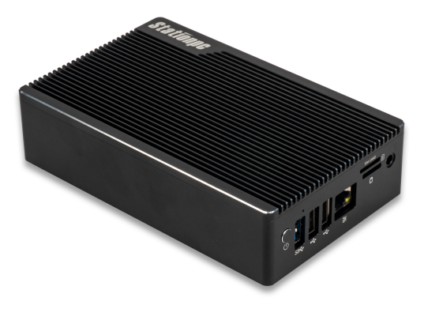
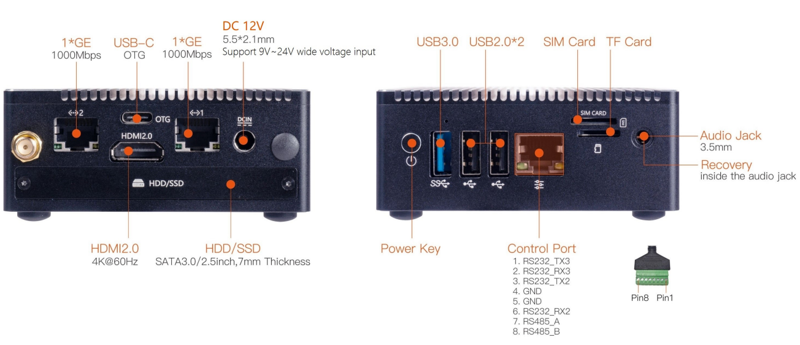
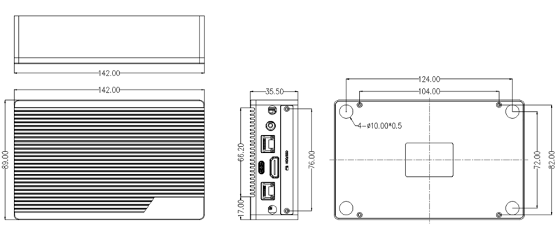

# Introduction

[Specification](（同中文版）) | [Purchase](https://www.firefly.store/products/roc-rk3568-pc-se-quad-core-64-bit-mini-computer) | [Downloads](https://community.t-firefly.com/en/doc/download/218)

Station P2S adopts the ROC-RK3568-PC-SE quad-core 64-bit Cortex-A55 processor with 22nm lithography process and a frequency up to 2.0GHz, integrating a dual-core GPU and a high-performance NPU (1TOPS); it supports up to 8G RAM, WiFi 6 and dual Gigabit Ethernet. With rich interface expansion and various video input/output interfaces, it is suitable for scenarios such as smart NVR, cloud terminal, IoT gateway, industrial control and edge computing.

## Interface Description

**Station P2S** provides rich interfaces, mainly including:

* 2 x RJ45 (1000Mbps)
* 1 x HDMI 2.0 (4K@60Hz)
* 1 x Control Port (RS232 x 2 + RS485 x 1)
* 1 x USB 3.0
* 2 x USB 2.0
* 1 x USB-C (OTG)
* 1 x TF Card slot
* 1 x SIM card slot
* 1 x 3.5mm Audio Jack
* 1 x M.2 PCIe3.0 slot (NVMe SSD 2242)
* 1 x Mini PCIe slot (4G module)
* 1 x SATA 3.0 interface (HDD/SSD)
* 1 x MIPI-CSI (30P-0.5mm)
* 1 x MIPI-DSI (30P-0.5mm)
* 1 x eDP (40P-0.5mm)
* 1 x 30P-2.0mm extension interface (ADC/USB2.0 HOST/I2C/I2S/PWM/UART/SPI/GPIO/SPEAKER/POWER KEY/RECOVERY)
* 1 x POE interface (6P-2.0mm)
* 1 x Debug serial port (3P-2.0mm)
* Reset / Recovery / Power Key buttons

As shown in the figures below:

## Structure and Dimensions

## Resources and Support

* [[Wiki]](../../Motherboard/ROC-RK3568-PC%20SE/index.md): Contains firmware building, system usage, interface usage and other tutorials (refer to the ROC-RK3568-PC-SE Wiki)
* [[Technical Forum]](https://forum.t-firefly.com/): A communication platform with more than 100,000 enterprise customers and users

### Contact

* Email: sales@t-firefly.com
* Mobile: (+86) 186 8811 7175
* Landline: 0760-89881218
* National Service Hotline: 4001-511-533
* Address: Room 2101, Hongyu Building, No. 57 Zhongshan 4th Road, East District, Zhongshan City, Guangdong Province
 