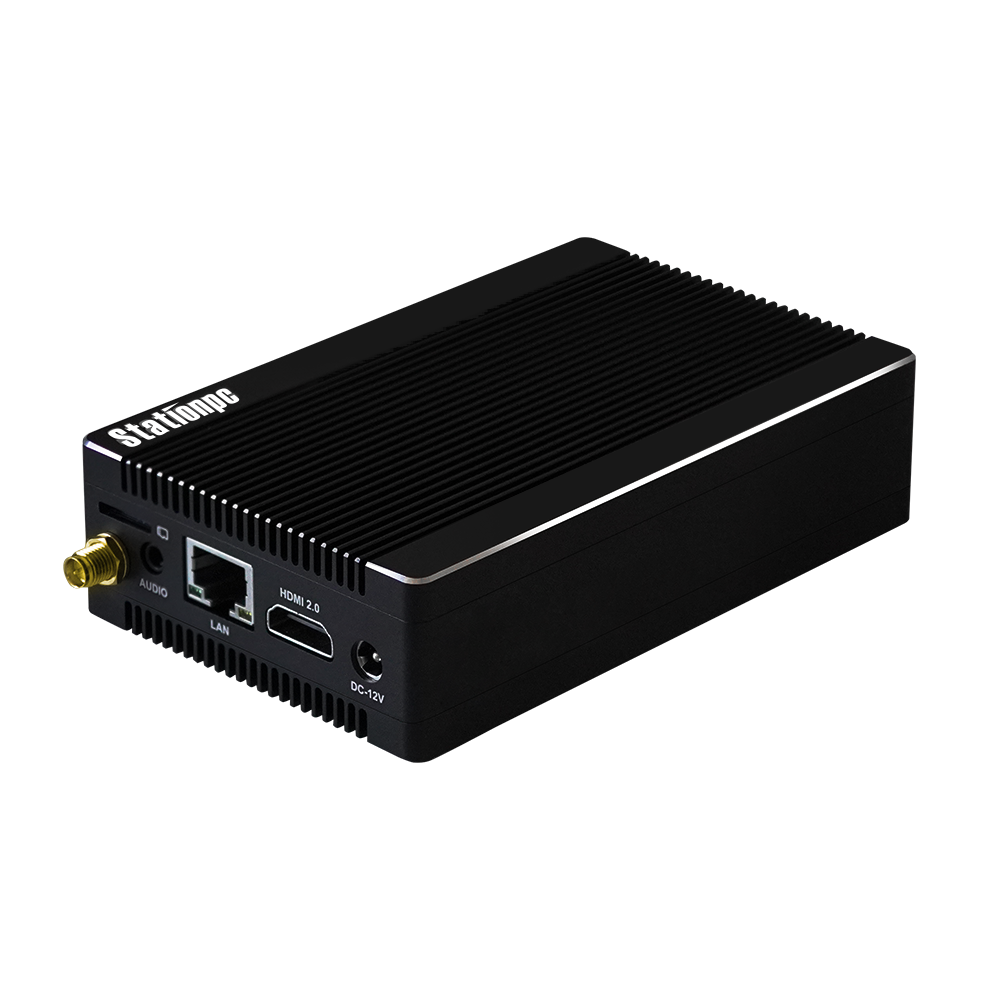
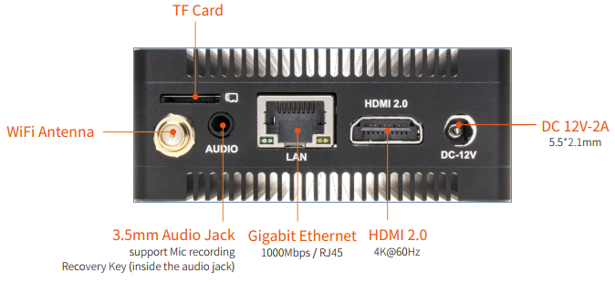
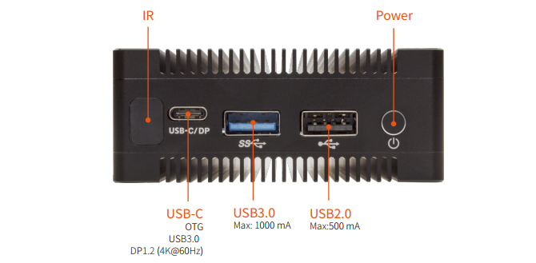
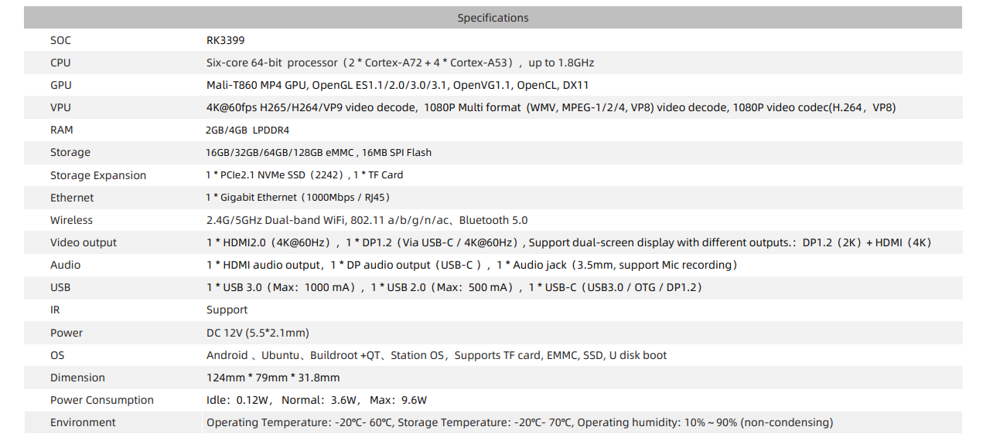
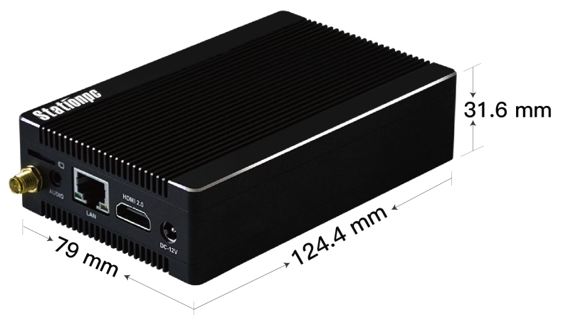

# Product Introduction

Station P1 Pro  Geek Mini PC，Based on ROC-RK3399-PC Pro high-performance open source platform, industrial shell configuration, dust and interference prevention, long-term stable operation, support 4K hard solution.Equipped with Rockchip RK3399 six-core processor, using "server level" (dual-core Cortex-A72+ quad-core Cortex-A53) size core architecture, the main frequency up to 1.8GHz, support OpenGL ES1.1/2.0/3.0/3.1, built-in VPU video processor.

# Product Specification

# Size

# Resorces
* [Station P1 Pro](https://www.stationpc.com/product/stationp1pro) StationPC details page

* [Wiki](https://wiki.t-firefly.com/en/ROC-RK3399-PC-Pro/started.html) Includes Android & Ubuntu development documents (ROC-RK3399-PC-Pro Wiki)

* [Station Community](https://bbs.stationpc.com/forum-59-1.html) Play with StationPC

* [Develop Forum](https://bbs.t-firefly.com/forum.php?mod=forumdisplay&fid=100) Tech communication platform for over 100K company and individual customers.

# Contact information

Contact customer service or post on forum for general supports. Professional tech supports or detail informations please contact sales:

* Email: sales@t-firefly.com

* Mobile: (+86) 186 8811 7175

* Landline: 0760-89881218

* National Service Hotline: 4001-511-533

* Address: Room 2101, Hongyu Building, No. 57 Zhongshan 4th Road, East District, Zhongshan City, Guangdong Province
 