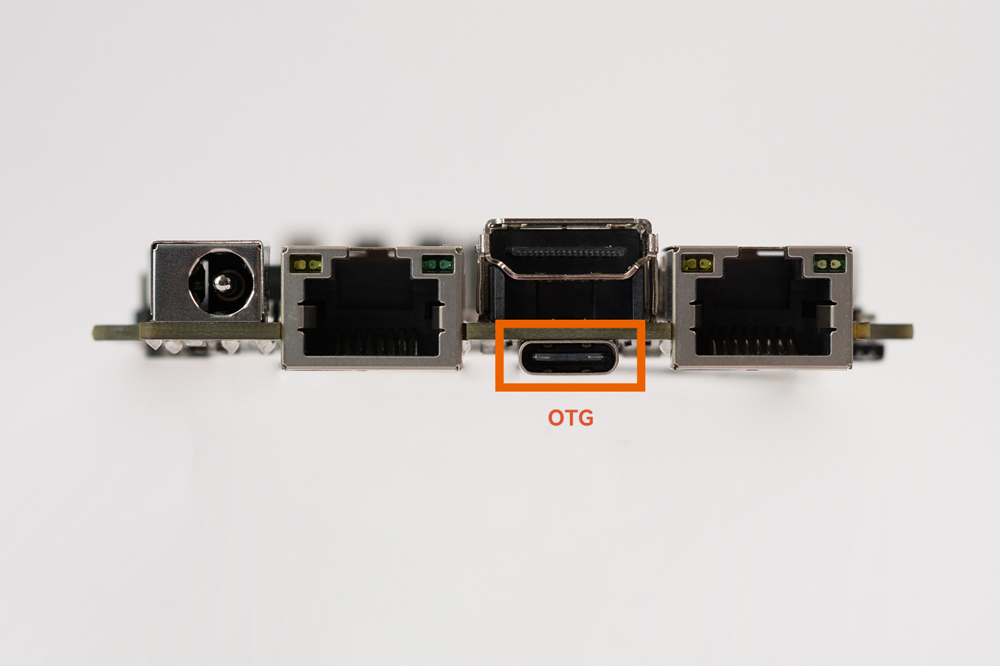
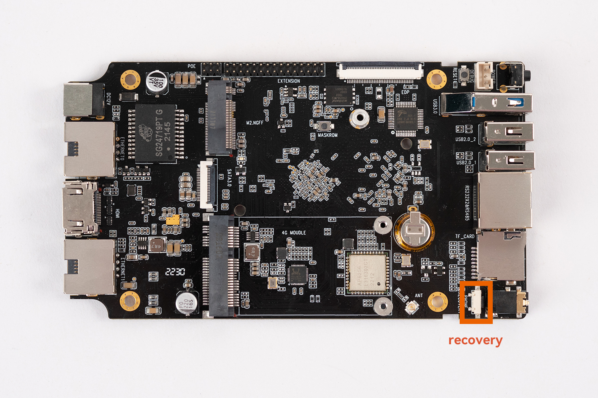

# Loader upgrade mode

***For the introduction of boot mode, please refer to the chapter ["Introduction to updating firmware"](01-bootmode.md)***

## Introduction

In Loader mode, the bootloader will enter the upgrade state, waiting for the host command for firmware upgrade and so on. To enter Loader mode, the bootloader must detect a `RECOVERY` key press at startup and the USB is connected.

Here's how to put your device into upgrade mode:

* Disconnect the power adapter first:
* Dual male usb data cable connects one end to the host and the other end to the development board.

* Press the `RECOVERY` button on the device and hold.

* Connect to the power supply.
* About two seconds later, release the `RECOVERY` button.

## upgrade firmware

Developers can choose different firmware upgrade tools according to their different PC operating systems.
* Windows environment

**If developers use `Windows` host for development, they can use `RKDevTool` to upgrade the tool. For details, please refer to ["Using RKDevTool to upgrade firmware"](Windows_upgrade_firmware.html).**

* Linux environment

**If developers use `Linux` host for development, they can use `upgrade_tool` to upgrade the tool. For details, please refer to ["Using upgrade_tool to upgrade firmware"](Linux_upgrade_firmware.html).**