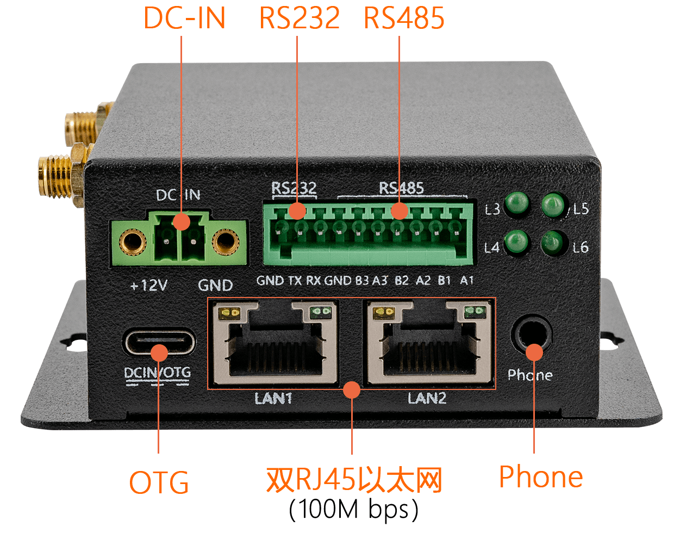
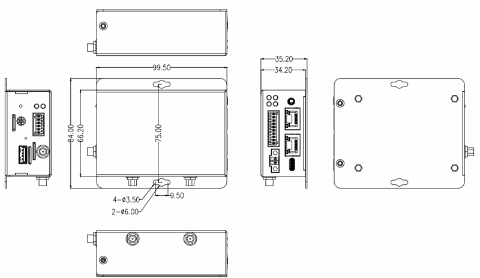

# Introduction

[Specification](https://download.t-firefly.com/Spec/Computers/iHC-3308GW_Specification_EN.pdf) | [Purchase](https://www.t-firefly.com/products/ihc-3308gw-industrial-4g-smart-gateway) | [Downloads](https://community.t-firefly.com/en/doc/download/102)

The IHC-3308GW is a 4G smart gateway designed for industrial environments, adopting the IoT-dedicated quad-core 64-bit processor RK3308B. It fully supports 4G LTE, NB-IoT and LoRa communication, provides dual 100Mbps Ethernet ports and control interfaces such as RS485, CAN and RS232, and supports Chinese commercial cryptography algorithms. It is widely used in industrial fields such as industrial 4G routers, IoT, and automation systems.

## Interface Description

**IHC-3308GW** provides rich interfaces, mainly including:

* 1 x DC IN (12V power interface)
* 1 x Type-C (OTG)
* 1 x USB 2.0
* 2 x RJ45 (100Mbps Ethernet)
* 1 x SIM card slot (4G)
* 1 x PSAM card slot
* 1 x CAN
* 1 x RS232
* 3 x RS485
* 1 x DIN (optocoupler isolated input)
* 1 x DOUT (relay output)
* 1 x Phone (headphone interface)
* 1 x TF-Card
* WiFi antenna (supports 2.4GHz WiFi, 802.11 b/g/n); the 4G version has an additional 4G antenna

The host interfaces are shown below:

## Structure and Dimensions

Dimensions: 99.4 mm × 84 mm × 35.2 mm, operating temperature -10℃~60℃, operating humidity 10%~90%.

## Product Specifications

| Basic Parameters     |                                                              |
| -------------------- | ------------------------------------------------------------ |
| Main control chip    | RK3308B (28nm process)                                       |
| Processor            | Quad-core 64-bit ARM Cortex-A35, 1.3GHz                      |
| Memory               | 256M DDR3 (128MB ~ 512MB optional)                           |
| Storage              | 4GB eMMC: 4G/8G/16G/32G/64G/128G supported SPI Flash: 16MB ~ 512MB supported MicroSD (TF) Card Slot expansion supported |
| **Hardware Features**|                                                              |
| Ethernet             | Dual RJ45 Ethernet ports (100M bps)                          |
| WiFi                 | Supports 2.4GHz WiFi, 802.11/b/g/n protocols                 |
| Audio                | Built-in audio CODEC with 8-channel ADC, integrated high-performance CODEC and Hardware VAD |
| Interfaces           | PSAM × 1 CAN × 1 SIM 4G × 1 RJ45 100M Ethernet × 2 RS232 × 1 RS485 × 3 DC IN (12V) × 1 Type-C (OTG) × 1 DIN × 1 DOUT × 1 Phone × 1 TF-Card × 1 USB 2.0 × 1 |
| **System Software**  |                                                              |
| System support       | Buildroot (Linux) embedded system, Ubuntu 18.04              |
| Wireless             | 4G LTE Cat1 wireless communication module for seamless access to the 4G network of any operator; NB-IoT communication supports global bands B1/B3/B5/B8/B20/B28, etc., fast and low power consumption; Industrial long-distance LoRa communication at 868MHz, outdoor line-of-sight communication distance up to 8Km, high stability |
| MQTT protocol        | Supports converting the Modbus industrial protocol to the MQTT protocol, cloud supports Alibaba Cloud and private cloud deployment, suitable for IoT PLC data acquisition and control scenarios |
| Chinese commercial cryptography | Onboard PSAM card slot for easy integration of the PSAM card function; powerful device authentication, data encryption and decryption functions; provides high-performance DES/3DES, AES, SHA, RSA, ECC; and national commercial cryptography algorithm modules SM1/SM2/SM3/SM4 |

## Resources and Support

* [[Technical Forum]](https://forum.t-firefly.com/): A communication platform with more than 100,000 enterprise customers and users

### Contact

* Email: sales@t-firefly.com
* Mobile: (+86) 186 8811 7175
* Landline: 0760-89881218
* National Service Hotline: 4001-511-533
* Address: Room 2101, Hongyu Building, No. 57 Zhongshan 4th Road, East District, Zhongshan City, Guangdong Province
 