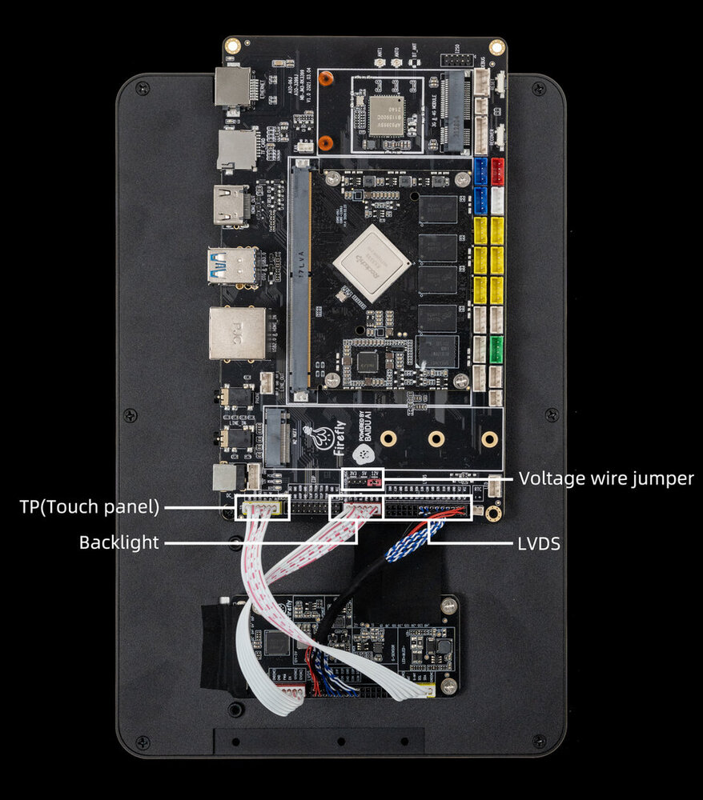
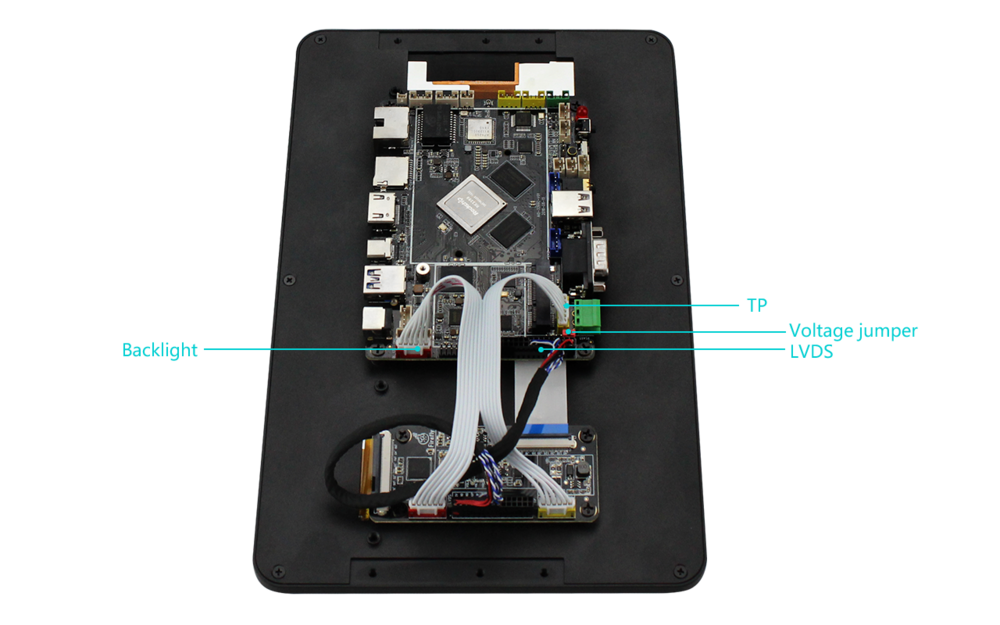

# Product Introduction

## Product Overview

### Baidu Face Recognition Development Kit

A face recognition kit that integrates Baidu face recognition algorithms, software, and hardware. It can be connected to monocular cameras, binocular cameras, and structured light cameras, and can quickly implement liveness recognition, face collection, face comparison, face recognition, and face database management. Only one kit is needed for one-stop face recognition development, accelerating the development and implementation of artificial intelligence products.

## Platform

The platforms that currently support the face recognition system are the `AIO-3399J` and `AIO-3399C` versions.

* AIO-3399J + 10.1-inch LVDS screen module + professional camera development kit
* AIO-3399C + 10.1-inch LVDS screen module + professional camera development kit

For more information about the development kit platform, search for [Baidu Face Recognition Kit](https://www.firefly.store/products/baidu-face-recognition-kit) in the store.

## Firmware and Application Downloads

No compilation is required. You can directly download and use ready-made firmware.

* [AIO-3399J 10.1-inch screen firmware download](https://community.t-firefly.com/en/doc/download/45)
* [AIO-3399C 10.1-inch screen firmware download](https://community.t-firefly.com/en/doc/download/45)
* [Face Recognition App Download](http://www.t-firefly.com/share/index/index/id/a6d7830a6f4f1146159b49a324172c67.html)

Notice:

1. After Baidu Face version 2.0.1, you can restore factory settings, update the system, and re-burn the firmware. One activation code corresponds to one device and is independent of the system.
2. Each activation code can only be activated up to 200 times. Do not uninstall and reinstall the application or clear the application storage data, otherwise the activation will become invalid. Ordinary users can reinstall it directly through `adb install -r faceOffline_v1.x.x.apk`; do not uninstall it. Developers can compile and install the Baidu face recognition code directly, but make sure that the package name and signature of the apk remain unchanged.
3. When the latest version of the application is opened, it may take 3 to 4 seconds to load the configuration files related to face recognition.
4. Baidu Face Recognition version 2.0.1 needs to be reactivated. Activation codes that were activated before version 2.0.1 cannot be used on version 2.0.1. To use version 2.0.1, apply for an activation code from the official team.

# Face Recognition SDK

Network access is required for the first activation. After activation, it can be used offline. For details, refer to [Face Offline Recognition SDK-Android Development Document](http://ai.baidu.com/docs#/Face-Offline-SDK-Android/top).

# Apply for SDK

Send the purchase information and order number of the face recognition kit to `sales@t-firefly.com`. The SDK will be provided by email within 2 days after the official review is successful.

# Hardware Connection

AIO-3399J screen wiring instructions:

AIO-3399C screen wiring instructions:

# Community Forum

* Platform questions can be posted to the [Firefly Face Recognition Development Kit Community Forum](https://bbs.t-firefly.com/forum.php?mod=forumdisplay&fid=279)
* Questions about application algorithms can be asked on the [Baidu Face Recognition Exchange Platform](http://ai.baidu.com/forum/topic/list/165)

# Q&A

Q: The 10.1-inch screen does not display?

A: Confirm whether the hardware connection is abnormal. For details, refer to the connection method.

Q: The face recognition app crashes?

A: The crash issue generally only appears in version 1.0.7.1, mainly because the algorithm model occupies too much memory. Upgrade to the latest version or downgrade to another version.

Q: Can't connect with adb for debugging?

A: [AIO-3399J ADB usage](../../Motherboard/AIO-3399J/adb_use.md)

A: [AIO-3399C ADB usage](../../Motherboard/AIO-3399C/adb_use.md)

Q: The upper USB3.0 port cannot be recognized?

A: Turn off `device` mode and switch to `host` mode. Go to `Settings` -> `USB` -> `Connect to PC` and uncheck it to switch to `host` mode.