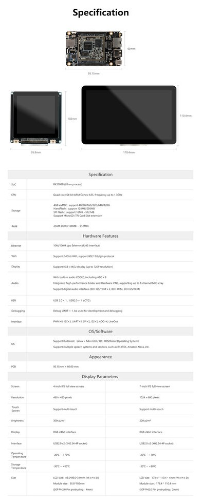

# Introduction
## Introduction

### Product Overview 
The micro IoT motherboard can be combined with one or more modules to form a high-performance intelligent IoT development kit. It supports a variety of IoT systems, speech systems and services, as well as the application development of buildroot + QT. It has rich expansion interfaces and can be quickly applied to IoT intelligent Internet of things, intelligent speech recognition, human-machine interface, industrial control, intelligent robot and other fields.

## Intelligent IoT Development Kit Application
### QT Application Development
Micro IoT motherboard with high-resolution display screen for QT application development, SDK provides open source QT applications, including music applications, video applications, image applications, setting applications 

* [QT development](../../../en/System\ on\ Module/Core-3308Y/qt_development.md)
* [ROC-RK3308B-CC-PLUS QT firmware download](https://community.t-firefly.com/en/doc/download/97)
* [Intelligent IoT Development Kit purchase link ](https://www.firefly.store/products/intelligent-iot-development-kit)

### Speech Development 
Micro IoT motherboard is combined with speech module for speech system and service development. For intelligent speech recognition development, if customers need in-depth business customization cooperation, they can communicate with our company or corresponding speech company

* [Speech module connection](../../../en/System\ on\ Module/Core-3308Y/module_speech.md)
* [Using](../../../en/System\ on\ Module/Core-3308Y/faq.md)
* [Speech module purchase link](https://www.firefly.store/products/intelligent-voice-control-kit-6-mai-voice-intelligent-development-kit)

### Intelligent Gateway Development
 The micro IoT motherboard is combined with 4G module EC20 for intelligent gateway development. After connecting the USB interface of IoT motherboard with EC20 module with USB adapter board, the network can be obtained through command, and the network can be shared with connecting devices through Ethernet port

* [EC20 module connection](../../../en/System\ on\ Module/Core-3308Y/module_wireless.md)
* [EC20 module purchase link](https://www.firefly.store/goods.php?id=49)

## Resources
* [SDK download](https://community.t-firefly.com/en/doc/download/97)
* [Community Forum](http://bbs.t-firefly.com/forum.php?mod=forumdisplay&fid=100)

 