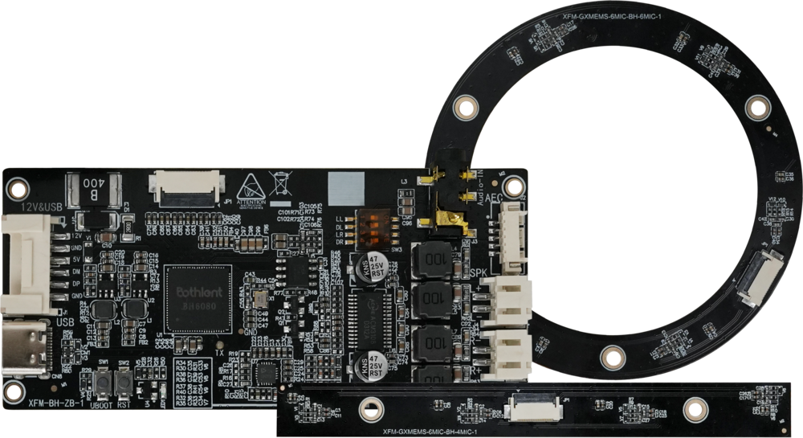

# Product Introduction
## Product Overview
### Intelligent Voice Development Kit

An intelligent voice development kit designed for efficient development, integrating high performance, low power consumption, and cross-platform compatibility. The kit features an integrated USB sound card and 4/6-microphone array, equipped with CAE noise reduction and AEC echo cancellation technologies. It has a built-in power amplifier to directly drive dual speakers, and comes with an AI SDK and AIUI cloud service.

With low-code integration, it enables quick implementation and shortens project cycles. Boasting a microphone sensitivity of -32dBA and a signal-to-noise ratio of 65dB, it supports stable wake-up and recognition within a 3-5 meter range. Its wide-temperature and low-power design makes it suitable for multiple scenarios, and it is widely applied in products and fields such as robots, industrial development boards, intelligent service terminals, smart mirrors, smart home panels, and commercial display devices.



## Detailed Specifications
### Microphone Array Board

| Microphone Type |	Linear 4-Microphone Array |	Circular 6-Microphone Array |
| ---- | ---- | ---- |
| Module Array Shape | Long Strip | Circular |
| Number of Array Elements | Supports 4 ECM Electret Microphones (6027 specification recommended) | Supports 6 On-Board MEMS Analog Silicon Microphones |
| MIC Signal-to-Noise Ratio	| SNR > 70dB | SNR > 65dB |
| MIC Sensitivity | -32dBA, Consistency Error ≤ 2dB | -32dBA, Consistency Error ≤ 1dB |
| Wake-up Distance | 3 ~ 5m | 3 ~ 5m |
| Recognition Distance | 3 ~ 5m | 3 ~ 5m |
| Sound Source Localization | Horizontal 180° | 360° Circular |
| Localization Accuracy | ±15° | ±15° |
| Other Features | AEC Function Supported, 60° Pickup Beam (3 Beams Supported) | AEC Function Supported, 60° Pickup Beam (6 Beams Supported) |
| Communication Interface | 14Pin-0.5mm FPC Connector | 14Pin-0.5mm FPC Connector |
| Dimensions | 111.5mm × 12mm, Maximum Height 8mm | Diameter 79.5mm, Maximum Height 8mm, Mounting Hole Diameter 3mm |
| Operating Temperature | -10°C ~ 70°C | -10°C ~ 70°C |
| Storage Temperature | -40°C ~ 85°C | -40°C ~ 85°C |

<br>

### USB Sound Card

| Module | Specifications |
| ---- | ---- |
| Interfaces | 1 × 12V Power Amplifier Power Supply & UAC (6Pin-2mm), 1 × Type-C (5V Power Supply & Audio Transmission), 1 × 4&6-Microphone Board Interface (14Pin-0.5mm FPC Connector), 1 × 3.5mm Audio Input Interface, 1 × AEC Interface (5Pin-1.25mm), 1 × Left Channel Speaker (2Pin-2mm), 1 × Right Channel Speaker (2Pin-2mm) |
| Dimensions | 88mm × 40mm, Maximum Height 8mm |

# Hardware Usage

## Hardware Connection


### DIP Switch


# Android Development
For mass production authorization SN codes and the Android platform SDK, please contact the business department at (sales@t-firefly.com) to obtain them.
## 1. Noise Reduction Algorithm Authorization
Each device requires a unique SN code for authentication. The SN code included in the demo is configured in assets/auth.ini of the app module. The currently used authorization API for the noise reduction algorithm engine is as follows:
```java
/**
** Authorization API
** sn: Authorization code, provided by our company; each device must use a unique SN code.
**/
public static native int CAEAuth(String sn);
```
Local Authorization: Burn the authorization code to the specified directory of the device, then read the authorization code through code for authentication. Users need to properly manage the "unique device code" and "SN authorization code" to prevent loss of the authorization code due to device flashing.

For official mass production, it is necessary to purchase official SN authorization codes in bulk before use. The algorithm library verifies the validity of the SN code each time it is initialized; therefore, the device must be connected to the network during initialization, and the system time must be accurate. After successful initialization, the algorithm can be used continuously regardless of subsequent network disconnections.


## 2. HLW Noise Reduction Algorithm Development

### 2.1 Processing Framework of the Noise Reduction Algorithm


<br>

Audio Format Conversion: Engines for different microphone types have different requirements for audio data formats. The specific formats are as follows:

| Microphone Type | Channels |
| ---- | ---- |
| 4-Microphone | 4 mics + 2 refs, 6 channels in total, 32-bit per channel |
| 6-Microphone | 6 mics + 2 refs, 8 channels in total, 32-bit per channel |

<br>

### 2.2 Description of Engine-Related Files

| File | Description |
| ---- | ---- |
| cae.jar | Engine jar package |
| libhlw.so | Engine so library; separate engines are required for different microphone types |
| libcae-jni.so | Engine jni layer encapsulation library |
| hlw.ini | External configuration file |
| res_cae_model.bin | Engine model file; separate files are required for different microphone types |
| hlw.param | Customer identification file, including appid and authentication configuration information |
| res_ivw_model.bin | Wake-up word file |

<br>

### 2.3 Description of Related APIs
```java
public class CAE {
    public static final int CAE_ERROR_UNINIT = 4;
    public static final int CAE_FAIL = -1;
    public static final int CAE_SUCCESS = 0;
    private static boolean LIB_LOADED;

    public CAE() {
    }

     /**
    **  Write data to the engine
    **  data: Audio data [converted audio data]
    **  length: Length of the audio data
    */
    public static native int CAEAudioWrite(byte[] data, int length);

    /**
    **  Destroy the engine
    **/
    public static native void CAEDestory();

    /**
    **  Get the engine version number
    */
    public static native String CAEGetVersion();

    /**
    **  Engine initialization
    **  iniPath: Pass in the actual path of the hlw.ini file
    **  paramPath: Pass in the actual path of the hlw.param file
    **  listener: Engine listener
    ** 
    **  return: Return initialization code value: 0: Initialization successful
                            Other values: Initialization failed
    */
    public static native int CAENew(String iniPath, String paramPath, ICAEListener listener);
    
    
    /**
    **  Authentication
    **  sn: Authorization code
    **/
    public static native int CAEAuth(String sn);
    
    /**
    **  Set beam
    ** 
    */
    public static native int CAESetRealBeam(int beam);
	
    /**
    **  Set debug log
    **  level: Value range [1-5]; the larger the value, the higher the level and the fewer debug messages displayed
    */
    public static native int CAESetShowLog(int level);

     /**
    **  Load so library
    */
    public static void loadLib() {
        if (!LIB_LOADED) {
            try {
                System.loadLibrary("cae-jni");
                LIB_LOADED = true;
            } catch (Exception var1) {
                LIB_LOADED = false;
            }
        }

    }
}
```
```java
/**
** Engine callback interface
**/
public interface ICAEListener {
    /**
    ** Audio processed by the engine ["Audio Extraction" in Figure 1], format: 16K, 16bit, single channel
    ** data: Audio data
    ** length: Data length
    **
    ** Note: This interface will not be triggered for callback when the engine runs for the first time. There are two ways to enable the callback:
    ** 1. After waking up via the wake-up word, this interface will be called back continuously
    ** 2. Calling CAESetRealBeam() can also trigger the callback
    **/
    void onAudioCallback(byte[] data, int lenght);

    // This interface can be ignored
    void onIvwAudioCallback(byte[] var1, int var2);
	
    /**
    ** Voice wake-up callback
    ** power: Wake-up energy value
    ** angle: Wake-up angle
    ** beam: Beam value
    ** jsonParam: Wake-up related information in JSON format, including angle and beam related information
    **/
    void onWakeup(float power, int angle, int beam, String jsonParam);
}
```

<br>

### 2.4 Algorithm API Calling Process


### 2.5 Interface Encapsulation Example
```java
package com.voice.bothlent.caeLib.engine;

import android.content.Context;
import android.util.Log;

import com.iflytek.iflyos.cae.CAE;
import com.voice.bothlent.caeLib.bean.CheckResultBean;
import com.voice.bothlent.caeLib.bean.WakeInfo;
import com.voice.bothlent.caeLib.utils.FileUtils;

import org.json.JSONException;
import org.json.JSONObject;

import java.io.File;
import java.io.FileOutputStream;
import java.io.IOException;
import java.util.Arrays;
import java.util.Collections;
import java.util.List;
import java.util.Locale;
import java.util.Map;

/**
 * Short-range HLW engine [approx. 1.5 meters]
 */
public class HlwNearEngine extends BaseEngine {
    private static final String configCAE_RES = "CAE_RES";
    private static final String configIVW_RES = "IVW_RES";
    private static final String configINI_RES = "INI_RES";
    private static final String configPARAM_RES = "PARAM_RES";
    private static final String configCAE_DIST = "CAE_DIST";
    private static final String iniHlwName = "hlw.ini";
    private static final String configMicNum = "nMicNum";
    private static final String assetParentPath = "hlw_near/";
    private static final String TAG = "HlwNearEngine";

    static {
        CAE.loadLib("hlw");
    }


    @Override
    protected WakeInfo parseWakeInfo(String s) {
        // {"cur_ms":288768, "start_ms":287290, "end_ms":288310, "beam":1, "physical":1, "similar":1498.000000, "similar_thresh":900.000000, "power":1210436681728.000000, "angle":75.000000, "keyword":"ni3 hao3 hua1 sheng1"}
        JSONObject jsonObject = null;
        WakeInfo wakeInfo = new WakeInfo();
        try {
            jsonObject = new JSONObject(s);
            int beam = jsonObject.optInt("physical");
            int angle = jsonObject.optInt("angle");
            int similar = jsonObject.optInt("similar");
            wakeInfo.setBeam(beam);
            wakeInfo.setAngle(angle);
            wakeInfo.setScore(similar);
        } catch (JSONException e) {
            e.printStackTrace();
            wakeInfo.setAngle(0);
            wakeInfo.setBeam(0);
        }
        return wakeInfo;
    }

    @Override
    public CheckResultBean init(Context context, String sn) {
        //res check
        CheckResultBean checkResult = new CheckResultBean();
        List<String> keyList = Arrays.asList(configCAE_RES, configIVW_RES,configINI_RES,configPARAM_RES,configCAE_DIST);
        Map<String, String> stringStringMap = FileUtils.readAssetValueByKey(context,
                assetParentPath + iniHlwName, keyList);
        if (stringStringMap != null && stringStringMap.size() == keyList.size()) {
            try {
                configParentPath = context.getFilesDir().getAbsolutePath();

                String cae_res_path = stringStringMap.get(configCAE_RES);
                checkResource(context, configParentPath+cae_res_path, assetParentPath);
                String ivw_res_path = stringStringMap.get(configIVW_RES);
                checkResource(context, configParentPath+ivw_res_path, assetParentPath);

                String ini_res_path = stringStringMap.get(configINI_RES);
                checkResource(context, configParentPath+ini_res_path, assetParentPath);
                String param_res_path = stringStringMap.get(configPARAM_RES);
                checkResource(context, configParentPath+param_res_path, assetParentPath);
                String cae_dist = stringStringMap.get(configCAE_DIST);

                File fileIni = null ;
                FileOutputStream fileOutputStream =null ;
                try {
                    fileIni = new File(configParentPath + new File(ini_res_path).getParent(), "hlw_real.ini");
                    fileIni.createNewFile();
                    fileOutputStream = new FileOutputStream(fileIni);
                    fileOutputStream.write(String.format("CAE_RES = %s\n",configParentPath+cae_res_path).getBytes());
                    fileOutputStream.write(String.format(Locale.getDefault(),"CAE_DIST = %d\n",Integer.parseInt(cae_dist)).getBytes());
                    fileOutputStream.write(String.format("IVW_RES = %s\n",configParentPath+ivw_res_path).getBytes());
                    fileOutputStream.close();
                }finally {
                    if (fileOutputStream != null){
                        fileOutputStream.close();
                    }
                }

                // Step 1: Initialize according to the configuration resources
                int isInit = CAE.CAENew(fileIni.getAbsolutePath(), configParentPath+param_res_path, mCAEListener);
                if (isInit == 0) {
                    // Step 2: Authenticate with the authorization code, and it can be used after successful authentication
                    String version = CAE.CAEGetVersion();
                    Log.e(TAG, "init: " + sn + "   " + version);
                    int auth = CAE.CAEAuth(sn);
                    if (auth >= 0) {
                        checkResult.setState(1);
                        List<String> keyListMicNum = Collections.singletonList(configMicNum);
                        Map<String, String> MicNumMap = FileUtils.readAssetValueByKey(context,
                                assetParentPath + new File(cae_res_path).getName(), keyListMicNum);
                        checkResult.setCheckResult(String.format(Locale.getDefault(), "%s,%s,micNum=%s",  version,cae_res_path, MicNumMap.get(configMicNum)));
                    } else {
                        checkResult.setState(0);
                        checkResult.setCheckResult("cae auth error, code  = " + auth);
                    }
                } else {
                    checkResult.setState(0);
                    checkResult.setCheckResult("cae init error,please check res file " + (configParentPath+ini_res_path) + ";" + (configParentPath+param_res_path));
                }

            } catch (IOException ignored) {
                checkResult.setState(0);
                checkResult.setCheckResult("copy res file error " + ignored);
            }
        } else {
            checkResult.setState(0);
            checkResult.setCheckResult("hlw.ini config error");
        }
        return checkResult;
    }


    @Override
    public void setBeam(int beam) {
        int i = CAE.CAESetRealBeam(beam);
        Log.e(TAG, "setBeam: " + i + "   " + beam);
    }


    @Override
    public void writeAudio(byte[] audio, int len) {
        CAE.CAEAudioWrite(audio, len);
    }


    @Override
    public void setShowLog(boolean show) {
        CAE.CAESetShowLog(show ? 0 : 1);
    }

    @Override
    public void onDestroy() {
        CAE.CAEDestory();
    }
}
```