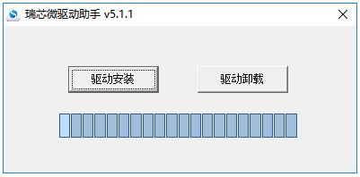
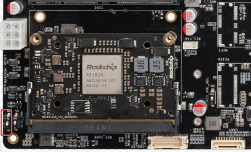
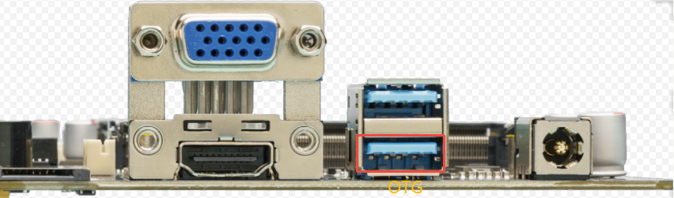
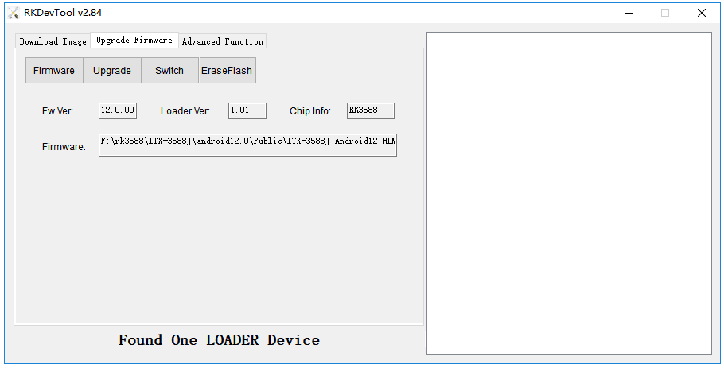
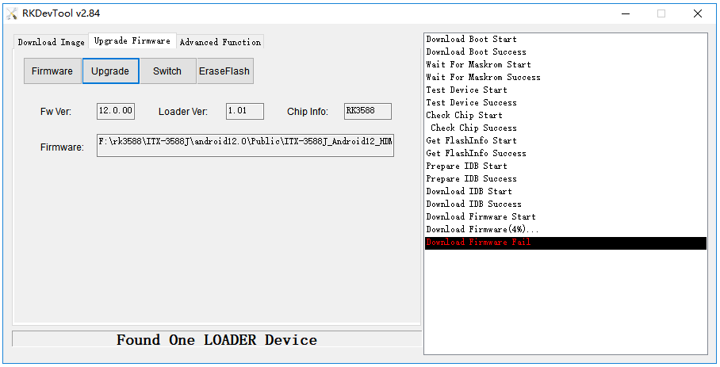

# Upgrade Firmware via USB Cable

This page contains the complete USB firmware upgrade procedure. All steps can be completed on this page without opening another guide.

## 1. Prepare the Firmware and Upgrade Tools

### Required Equipment

* RK182X Developer Kit development board
* [Firmware](https://community.t-firefly.com/en/doc/download/369)
* Host computer
* Type-A Cable

The firmware can be obtained by compiling the SDK or downloaded as public unified firmware from the [resource download page](https://community.t-firefly.com/en/doc/download/369).

### Firmware Formats

There are two types of firmware files:

* **A single unified firmware**: a single file containing the partition table, bootloader, uboot, kernel, system, and other partitions. Upgrading it updates all partition data and erases the existing data on the board.
* **Multiple partition images**: independent files such as the partition table, bootloader, and kernel. An individual image updates only its corresponding partition, which is useful during development.

> The unified firmware packing tool can unpack a unified firmware into partition images or merge partition images into a unified firmware.

### Install the Upgrade Tool

#### Windows

1. Download [Release_DriverAssistant.zip](https://community.t-firefly.com/en/doc/download/369), extract it, and run `DriverInstall.exe`.
2. Select **Driver uninstall** first, then select **Driver install** so all devices use the updated driver.



3. Download [AndroidTool](https://community.t-firefly.com/en/doc/download/369) separately, extract it, and run `RKDevTool.exe` in the `RKDevTool_Release_v2.xx` directory. On Windows 7/8, run it as administrator.

To avoid version-related burning problems, use the tool packaged inside the public firmware package when possible:

```
ITX-3588J_Android12_HDMI_220308
├── ITX-3588J_Android12_HDMI_220308.img
├── linux
│   └── Linux_Upgrade_Tool_v1.65.zip
└── windows
    ├── DriverAssitant_v5.1.1.zip
    └── RKDevTool_Release_v2.84.zip
```


#### Linux

Linux does not require a device driver.

Install [Linux_Upgrade_Tool](https://community.t-firefly.com/en/doc/download/369) so it can be called from any directory:

```
unzip Linux_Upgrade_Tool_xxxx.zip
cd Linux_UpgradeTool_xxxx
sudo mv upgrade_tool /usr/local/bin
sudo chown root:root /usr/local/bin/upgrade_tool
sudo chmod a+x /usr/local/bin/upgrade_tool
```

Install [Linux_adb_fastboot](https://community.t-firefly.com/en/doc/download/369):

```
sudo mv adb /usr/local/bin
sudo chown root:root /usr/local/bin/adb
sudo chmod a+x /usr/local/bin/adb

sudo mv fastboot /usr/local/bin
sudo chown root:root /usr/local/bin/fastboot
sudo chmod a+x /usr/local/bin/fastboot
```

## 2. Enter and Check MaskRom Mode

The RK182X development kit does not provide a Loader mode. USB firmware upgrades use the board's `MaskRom` key.

### Enter MaskRom Mode

1. Disconnect the development kit from the power supply.
2. Set the `USB SEL` switch to `1`.
3. Connect the OTG port to the host computer with a Type-A data cable.
4. Press and hold the board's `MaskRom` key.
5. Power on the development kit while holding the key.
6. Check the upgrade tool for a MaskRom device.
7. Release the key after the device is detected.






### Check MaskRom Mode

#### Windows

AndroidTool should display a MaskRom device in the device list. If the device is not detected, check the USB driver, the Type-A data cable, the `USB SEL` switch, and the OTG connection.

#### Linux

Run `upgrade_tool` and check whether the connected device is listed as MaskRom:

```shell
sudo upgrade_tool
```

## 3. Write the Firmware

### Windows

#### Write a Unified Firmware - `update.img`

1. Switch to the **Upgrade Firmware** page.
2. Click **Firmware** and open the firmware file.
3. Click **Upgrade** to start writing.
4. If the upgrade fails, click **EraseFlash** first and then upgrade again.



#### Write Partition Images

1. Switch to the **Download Image** page.
2. Select the partitions to write.
3. Confirm that each image path is correct.
4. Click **Run**. The device restarts automatically after the upgrade.


### Linux

#### Write a Unified Firmware - `update.img`

```shell
sudo upgrade_tool uf update.img
```

If the upgrade fails, erase the flash and try again:

```shell
# The ef parameter requires a bootloader file or the corresponding update.img.
sudo upgrade_tool ef update.img
sudo upgrade_tool uf update.img
```

#### Write Partition Images

```shell
sudo upgrade_tool di -b /path/to/boot.img
sudo upgrade_tool di -r /path/to/recovery.img
sudo upgrade_tool di -m /path/to/misc.img
sudo upgrade_tool di -u /path/to/uboot.img
sudo upgrade_tool di -dtbo /path/to/dtbo.img
sudo upgrade_tool di -p parameter
sudo upgrade_tool ul bootloader.bin
```

If the upgrade fails because of flash errors, try low-level formatting and erasing the eMMC:

```shell
sudo upgrade_tool lf update.img
sudo upgrade_tool ef update.img
```

#### Fastboot Dynamic Partitions

```shell
adb reboot fastboot
sudo fastboot flash vendor vendor.img
sudo fastboot flash system system.img
sudo fastboot reboot
```

## Upgrade Failure

If `Download Boot Fail` or another error appears during the upgrade, check the USB cable and the computer USB port first. Poor-quality cables and insufficient USB power can cause the failure.


