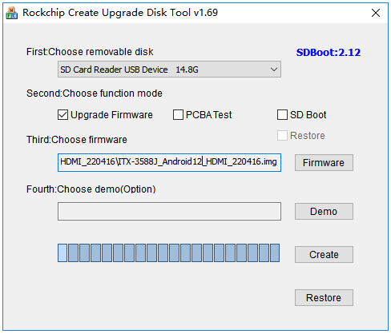

# Upgrade the firmware via SD card

## Introduction

This article mainly introduced how to upgrade the firmware on the host to the SD card, which needs to be selected according to the host operating system.

## Preparatory Tools

* RK182X Developer Kit
* firmware
* host computer
* USB Card Reader 
* MicroSD card
* [**SD_Firmware_Tool**](https://community.t-firefly.com/en/doc/download/358)
## Operation Steps
 
* Insert microSD card into USB card reader and then into USB port of host computer 
* Run SD_Firmware_Tool, check the "Upgrade Firmware" box and select the correct removable disk device
* Choose firmware we want to upgrade into the RK182X Developer Kit
* Click the `Create` button and wait until the process is finished

* Remove the microSD card, insert it into the microSD card slot of the motherboard, power on the board, it will start upgrading automatically
* After the upgrade, remove the microSD card. The motherboard will restart automatically to complete the firmware update.