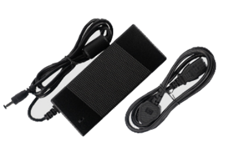

# 12V power adapter

## Product parameters

* Product: Power Adapter (desktop type)
* Specifications: US/EU
* Input standard: AC100-240V 50/60Hz
* Output standard: 12V-5A

**Note:** The AIO-1684JD4 all-in-one machine requires a 12V/5A power supply for normal operation. If the current is lower than 5A, it may restart abnormally due to insufficient current. To ensure normal operation of the development board, use a power supply with 12V voltage and 5A current. Firefly official power accessories are recommended.

## Physical picture

