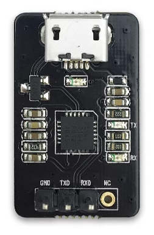
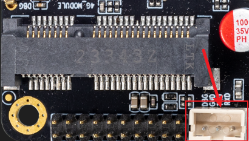

# Serial Port Module

## [USB to TTL Serial Port Module](https://store.t-firefly.com/goods.php?id=24)

### Product Parameters

* Brand: Firefly
* Size: 25mm*15.5mm

### Technical Information

Driver Download: [https://www.prolific.com.tw/en/portfolio-item/pl2303gl/](https://www.prolific.com.tw/en/portfolio-item/pl2303gl/)

### Physical Image

### Connection Method

USB to Serial Adapter, with four pins:

* 3.3V Power (NC), no need to connect
* GND, ground line for the serial port, connect to the GND pin of the development board
* TXD, output line for the serial port, connect to the TX pin of the development board
* RXD, input line for the serial port, connect to the RX pin of the development board

**Note:** If using another serial adapter and encountering issues with TX and RX not being able to input and output, try swapping the connections of TX and RX.

AIO-1688JD4 DEBUG Port:

