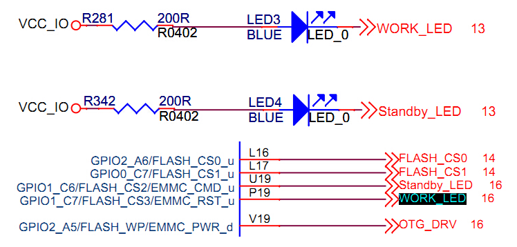
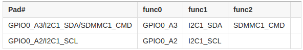

# GPIO Use

## Introduction

GPIO, short for General-Purpose Input/Output, is a flexible software-controlled digital signal.  
AIO-3128C has 4 GPIO bank： GPIO0，GPIO1, GPIO2, GPIO3.  Each bit of the bank is numbered with A0~A7, B0~B7, C0~C7, D0~D7.  
Besides the general-purpose input/output, GPIO may be multiplexed with other functions. For example, GPIO1_C2, has the following extra functions: 

* GPIO1_C2
* SDMMC0_D0
* UART2_TX

The drive current, pull up/down and reset state of all the gpios are not neccessary the same. Please refer section titled "RK3128 function IO description" in [RK3128 datasheet](http://www.t-firefly.com/download/fireprime/hardware/RK3128%20Datasheet%20V0.6_20140815.pdf).    			

AIO-3128C GPIO driver is implemented in the following pinctrl file:
```
kernel/drivers/pinctrl/pinctrl-rockchip.c
```

The core logic is filling up methods and parameters of each GPIO bank before calling gpiochip_add to register into the kernel.

## Use

The development board has two power leds controlled by GPIO, which are:  


From the schematic, the led will be on if outputing low voltage level from GPIO, and off if high voltage level otherwse.

## Input/Output

We will use the power led driver as an example, to describe how to control GPIO in the kernel driver.

To begin with, you need to add resource description to the dts (Device Tree) file aio-3128c.dts:
```
firefly-led{
    compatible = "firefly,led";
    led-work = <&gpio1 GPIO_C6 GPIO_ACTIVE_LOW>;
    led-power = <&gpio1 GPIO_C7 GPIO_ACTIVE_LOW>;
    status = "okay";
};
```

Two led lights are declared here:
```
led-work  GPIO1_C6  GPIO_ACTIVE_LOW
led-power GPIO1_C7  GPIO_ACTIVE_LOW
```

GPIO_ACTIVE_LOW means low level voltage is effective for light on. If high level voltage is effective, replace it with GPIO_ACTIVE_HIGH.  

Next, add requesting and controlling of GPIO to the device driver:
```
#ifdef CONFIG_OF
#include <linux/of.h>
#include <linux/of_gpio.h>
#endif 
static int firefly_led_probe(struct platform_device *pdev) {
    int ret = -1;
    int gpio, flag;
    struct device_node *led_node = pdev->dev.of_node; 
    gpio = of_get_named_gpio_flags(led_node, "led-power", 0, &flag);
    if (!gpio_is_valid(gpio)){
        printk("invalid led-power: %d\n",gpio);
        return -1;
    } 
    if (gpio_request(gpio, "led_power")) {
        printk("gpio %d request failed!\n",gpio);
        return ret;
    }
    led_info.power_gpio = gpio;
    led_info.power_enable_value = (flag == OF_GPIO_ACTIVE_LOW) ? 0 : 1;
    gpio_direction_output(led_info.power_gpio, !(led_info.power_enable_value));
    ...
    on_error:gpio_free(gpio);
}
```

First call of_get_named_gpio_flags to read number and flag of the gpio named "led-power”. Use gpio_is_valid to check whether this gpio number is valid, then request this gpio from kernel with gpio_request. If errors occur, call gpio_free to free the gpio which was previously requested successfully.

Call gpio_direction_output to set gpio in output direction, with high or low output. Here the flag is GPIO_ACTIVE_LOW, in order to turn on the led, write 0 to it.  

If you want to read from gpio, you need to set it in input direction before reading the value:
```
int val;
gpio_direction_input(your_gpio);
val = gpio_get_value(your_gpio);
```

Here are the definition of some commonly used GPIO APIs:
```
#include <linux/gpio.h>
#include <linux/of_gpio.h> 
enum of_gpio_flags {
    OF_GPIO_ACTIVE_LOW = 0x1,
}; 

int of_get_named_gpio_flags(struct device_node *np, const char *propname,
			   int index, enum of_gpio_flags *flags); 
int gpio_is_valid(int gpio); 
int gpio_request(unsigned gpio, const char *label); 
void gpio_free(unsigned gpio); 
int gpio_direction_input(int gpio); 
int gpio_direction_output(int gpio, int v);
```

## Multiplexing

The gpio has multiplexing functions. How to declare it, and how to switch it at the runtime? We take I2C1 for a brief descrition.
First look up I2C1_SDA and I2C1_SCL in the data sheet:  


In /kernel/arch/arm/boot/dts/rk312x.dtsi, there is：
```
i2c1: i2c@20056000 {
    compatible = "rockchip,rk30-i2c";
    reg = <0x20056000 0x1000>;
    interrupts = <GIC_SPI 25 IRQ_TYPE_LEVEL_HIGH>;#address-cells = <1>;#size-cells = <0>;
    pinctrl-names = "default", "gpio";
    pinctrl-0 = <&i2c1_sda &i2c1_scl>;
    pinctrl-1 = <&i2c1_gpio>;
    gpios = <&gpio0 GPIO_A3 GPIO_ACTIVE_LOW>, <&gpio0 GPIO_A2 GPIO_ACTIVE_LOW>;
    clocks = <&clk_gates8 5>;
    rockchip,check-idle = <1>;
    status = "disabled";
};
```

Here, related to the multiplex control is the attribute that starts with pinctrl-：

* pinctrl-names defines a state name list: default (i2c) and gpio.
* pinctrl-0 defines the pinctrls which needs to apply in state 0: i2c1_sda and i2c1_scl
* pinctrl-1 defines the pinctrls which needs to apply in state 1: i2c1_gpio

These pinctrls are defined in /kernel/arch/arm/boot/dts/rk312x-pinctrl.dtsi:
```
/ { 
    pinctrl: pinctrl@20008000 {
        compatible = "rockchip,rk312x-pinctrl";
        ...		
        gpio0_i2c1 {
            i2c1_sda:i2c1-sda {
                rockchip,pins = <I2C1_SDA>;
                rockchip,pull = <VALUE_PULL_DEFAULT>;
            }; 
            i2c1_scl:i2c1-scl {
                rockchip,pins = <I2C1_SCL>;
                rockchip,pull = <VALUE_PULL_DEFAULT>;
            }; 
            i2c1_gpio: i2c1-gpio {
                rockchip,pins = <FUNC_TO_GPIO(I2C1_SDA)>, <FUNC_TO_GPIO(I2C1_SCL)>;
                rockchip,pull = <VALUE_PULL_DEFAULT>;
            };
        };
        ...
    }
}
```

Constants of I2C1_SDA, I2C1_SCL are defined in /kernel/arch/arm/boot/dts/include/dt-bindings/pinctrl/rockchip-rk312x.h：
```
#define GPIO0_A3 0x0a30
#define I2C1_SDA 0x0a31
#define MMC1_CMD 0x0a32 
#define GPIO0_A2 0x0a20
#define I2C1_SCL 0x0a21
```

FUN_TO_GPIO is defined in /kernel/arch/arm/boot/dts/include/dt-bindings/pinctrl/rockchip.h:
```
#define FUNC_TO_GPIO(m)		((m) & 0xfff0)
```

That is to say： FUNC_TO_GPIO(I2C1_SDA) == GPIO0_A3, FUNC_TO_GPIO(I2C1_SCL) == GPIO0_A2.
The encoding rule of value 0x0a31 is:
```
0 a3 1
| |  `- func
| `---- offset
`------ bank
0x0a31 represents GPIO0_A3 func1, i.e. I2C1_SDA.
```

Therefore, when using multiplexing, if you select "default" (I2C function here) state， the kernel will apply pinctrls of i2c1_sda and i2c1_scl, which results in switching GPIO0_A3 pin and GPIO0_A2 pin to I2C functions i2c1_sda and i2c1_scl respectively; if you select "gpio" state, the kernel will apply the i2c1_gpio pinctrl, restoring the two pins back to general-purpose input/output function.  

We'll check the i2c driver file /kernel/drivers/i2c/busses/i2c-rockchip.c, to find out how to switch the multiplexing functions: 
```
static int rockchip_i2c_probe(struct platform_device *pdev){
    struct rockchip_i2c *i2c = NULL;
    struct resource *res;
    struct device_node *np = pdev->dev.of_node;
    int ret;
    // ...
    i2c->sda_gpio = of_get_gpio(np, 0);
    if (!gpio_is_valid(i2c->sda_gpio)) {
        dev_err(&pdev->dev, "sda gpio is invalid\n");
        return -EINVAL;
    }
    ret = devm_gpio_request(&pdev->dev, i2c->sda_gpio, dev_name(&i2c->adap.dev));
    if (ret) {
        dev_err(&pdev->dev, "failed to request sda gpio\n");
        return ret;
     }
    i2c->scl_gpio = of_get_gpio(np, 1);
    if (!gpio_is_valid(i2c->scl_gpio)) {
        dev_err(&pdev->dev, "scl gpio is invalid\n");
        return -EINVAL;
    }
    ret = devm_gpio_request(&pdev->dev, i2c->scl_gpio, dev_name(&i2c->adap.dev));
    if (ret) {
        dev_err(&pdev->dev, "failed to request scl gpio\n");
        return ret;
    }
    i2c->gpio_state = pinctrl_lookup_state(i2c->dev->pins->p, "gpio");
    if (IS_ERR(i2c->gpio_state)) {
        dev_err(&pdev->dev, "no gpio pinctrl state\n");
        return PTR_ERR(i2c->gpio_state);
    }
    pinctrl_select_state(i2c->dev->pins->p, i2c->gpio_state);
    gpio_direction_input(i2c->sda_gpio);
    gpio_direction_input(i2c->scl_gpio);
    pinctrl_select_state(i2c->dev->pins->p, i2c->dev->pins->default_state);
    // ...
}
```

First call of_get_gpio to get the gpio pins from the "gpios" list property in the i2c1 node in device tree:
```
gpios = <&gpio0 GPIO_A3 GPIO_ACTIVE_LOW>, <&gpio0 GPIO_A2 GPIO_ACTIVE_LOW>;
```

Then call devm_gpio_request request gpio, followed by calling pinctrl_lookup_state to look up the “gpio” state. The "default" state is already saved in i2c->dev-pins->default_state by the kernel device tree parsing.   

Finally, call pinctrl_select_state to select between "default" or "gpio" state, which results in the correspoding multiplexing function.  

Here are some commonly used multiplexing APIs:
```
#include <linux/pinctrl/consumer.h> 
struct device {
    //...
    #ifdef CONFIG_PINCTRL
    struct dev_pin_info	*pins;#endif//...}; 
    struct dev_pin_info {struct pinctrl *p;
    struct pinctrl_state *default_state;
    #ifdef CONFIG_PMstruct pinctrl_state *sleep_state;
    struct pinctrl_state *idle_state;#endif}; 
    struct pinctrl_state * pinctrl_lookup_state(struct pinctrl *p, const char *name); 
    int pinctrl_select_state(struct pinctrl *p, struct pinctrl_state *s);
```