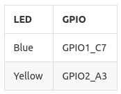

# LED Use

## Introduction
AIO-3128C development board has 2 LEDs, as shown in the table below:



The user can use LED equipment subsystem or directly operate GPIO to control this LED.

## Control LED in the form of equipment

Standard Linux specially defines LED subsystem for LED equipment. Two LEDs on AIO-3128C development board are defined in the form of equipment.  
The user can control these two LEDs through `/sys/class/leds/` catalog.
For more detailed descriptions, please refer to [leds-class.txt](https://www.kernel.org/doc/Documentation/leds/leds-class.txt) .    
The default states of LED on development board include:

* Blue: turn on when the system is electrified
* Yellow: user defined

The user can input command to trigger attribute through echo to control each LED:
```
root@firefly:~ # echo none >/sys/class/leds/firefly:blue:power/trigger
root@firefly:~ # echo default-on >/sys/class/leds/firefly:blue:power/trigger
```

The user can use cat command to obtain the available value of trigger:
```
root@firefly:~ # cat /sys/class/leds/firefly:blue:power/trigger
none [ir-power-click] test_ac-online test_battery-charging-or-full test_battery-charging
test_battery-full test_battery-charging-blink-full-solid test_usb-online mmc0 mmc1 mmc2
backlight default-on rfkill0 rfkill1 rfkill2
```

## Operate LED in kernel

The steps to operate LED in kernel are as follows:

1. Define LED node in the dts file.  
Define LED node in file kernel/arch/arm/boot/dts/aio-3128c.dts:
```
leds {
	compatible = "gpio-leds";
    power {
    	label = "firefly:blue:power";
        linux,default-trigger = "ir-power-click";
        default-state = "on";
        gpios = <&gpio1 GPIO_C7 GPIO_ACTIVE_LOW>;
        };
    
    user {
    	label = "firefly:yellow:user";
        linux,default-trigger = "ir-user-click";
        default-state = "off";
        gpios-v01 = <&gpio2 GPIO_A3 GPIO_ACTIVE_HIGH>;
        };
};
```
Note: The value of .compatible must match the one in drivers/leds/leds-gpio.c.

2. Include head files in the driver.

```
#include <linux/leds.h>
```

3. Control LED in driver file.  

(1). Define LED trigger.

```
DEFINE_LED_TRIGGER(ledtrig_ir_click);
```
(2). Register this trigger.

```
led_trigger_register_simple("ir-power-click", &ledtrig_ir_click);
```
(3). Control on/off of LED.

```
led_trigger_event(ledtrig_ir_click, LED_FULL); //ON
led_trigger_event(ledtrig_ir_click, LED_OFF); //OFF
```