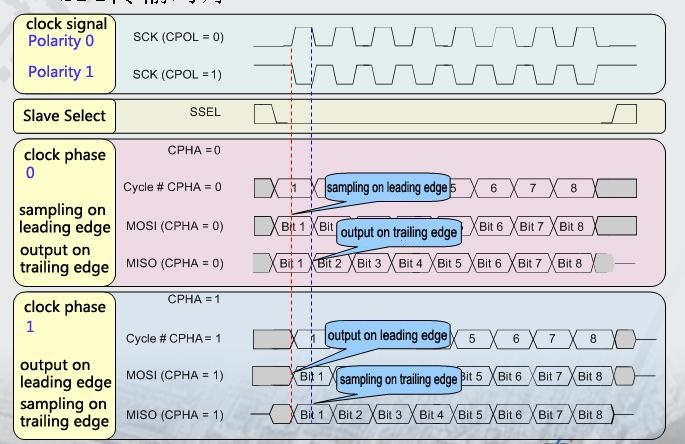

# SPI Use

SPI is a kind of high-speed, full duplex, synchronous serial communication interface, and is used for connecting microcontroller, sensor and storage device. This text takes fingerprint identification module as the example to briefly introduce the use of SPI.

## SPI working mode

SPI works by master-slave mode. This mode generally requires one master device and one or more slave devices, and at least 4 wires, which respectively are:
```
CS		Chip select signals
SCLK		Clock signal
MOSI		Master data output, and Slave data input
MISO		Master data input, and Slave data output
```
Linux kernel uses the combinations of CPOL and CPHA to express the current working mode of SPI (four modes):
```
CPOL＝0，CPHA＝0		SPI_MODE_0
CPOL＝0，CPHA＝1		SPI_MODE_1
CPOL＝1，CPHA＝0		SPI_MODE_2
CPOL＝1，CPHA＝1		SPI_MODE_3
```

* CPOL:Represents the initial level of the state of the clock signal,0 is low,1 is high.  
* CPHA:Represents the sampling clock edge, 0 is leading edge, 1 is trailing edge.  

The oscillograms of four working modes of SPI are shown below:


## Add own driver file in the kernel

Create a new driver file under the kernel source code catalog kernel/drivers/spi/, for example: spi-rockchip-firefly.c; add corresponding driver file configurations in the Kconfig file under the catalog where the driver file locates, for example:
```
@@ -525,6 +525,10 @@ config SPI_ROCKCHIP_TEST
       bool "ROCKCHIP spi test code"
       depends on SPI_ROCKCHIP

+config SPI_ROCKCHIP_FIREFLY
+       bool "ROCKCHIP spi firefly code"
+       depends on SPI_ROCKCHIP
+
#
# There are lots of SPI device types, with sensors and memory
# being probably the most widely used ones.
```

Add corresponding driver file name in the Makefile file under the catalog where the driver file locates, for example:
```
+obj-$(CONFIG_SPI_ROCKCHIP_FIREFLY) += spi-rockchip-firefly.o
```

Select the added driver file in the kernel option with make menuconfig, for example:
```
There is no help available for this option.                                                                                             
 │ Symbol: SPI_ROCKCHIP_FIREFLY [=y]                                                                                                       
 │ Type  : boolean                                                                                                                         
 │ Prompt: ROCKCHIP spi firefly code                                                                                                                
 │   Location:                                                                                                                             
 │     -> Device Drivers                                                                                                                   
 │       -> SPI support (SPI [=y])                                                                                                         
 │         -> ROCKCHIP SPI controller core support (SPI_ROCKCHIP_CORE [=y])                                                                
 │           -> ROCKCHIP SPI interface driver (SPI_ROCKCHIP [=y])                                                                          
 │   Defined at drivers/spi/Kconfig:528                                                                                                    
 │   Depends on: SPI [=y] && SPI_MASTER [=y] && SPI_ROCKCHIP [=y]
 ```
 
 ## Define and register SPI device

Add description of SPI driver node in DTS, as shown below: kernel/arch/arm/boot/dts/firefly-rk3288-aio-3128c.dts
```
&spi0 {
         status = "okay";                               
         max-freq = <24000000>;
         spidev@00 {                                     
                 compatible = "rockchip,spi_firefly";
                 reg = <0x00>;
                 spi-max-frequency = <14000000>;
                 spi-cpha = <1>;
                 //spi-cpol = <1>;
         };
};
```

* Status: If you want to enable SPI, then set "okay", if not enabled, set "disable".  
* spidev@00:Because this example uses the SPI0, and the use of CS0, so here is set to 00, if you use CS1, is set to 01.  
* Compatible:This property must be consistent with the structure of_device_id members.  
* Reg: Make this 0x00, consistent with spidev@00.  
* spi-max-frequency: the highest frequency of SPI.  
* spi-cpha，spi-cpol: Set the SPI work mode here, The SPI module in this example work in SPI_MODE_1, so we set `spi-cpha = <1>`. You should mask this two, if your SPI module work in SPI_MODE0. You should set `spi-cpha = <1>`;`spi-cpol = <1>`, if your SPI module work in SPI_MODE3.

## Define and register SPI driver

### Define SPI driver

Before defining SPI driver, the user should firstly define the variable of_device_id. of_device_id is used for calling the device information defined in dts file in the driver, and the definitions are shown below:
```
static const struct of_device_id spidev_dt_ids[] = {                                                                                       
        { .compatible = "rockchip,spi_firefly" },
        {},
};
```

The compatible here should coincide to the DTS file. Definition of spi_driver is shown below:

```
static struct spi_driver spidev_spi_driver = {
          .driver = {
                .name =         "silead_fp",
                .owner =        THIS_MODULE,
                .of_match_table = of_match_ptr(spidev_dt_ids),
        },
        .probe =        spi_gsl_probe,                                                                                                     
        .remove =       spi_gsl_remove,
};
```

### Register SPI driver

Create a character device in the initialization function static int __init spidev_init(void):
```
alloc_chrdev_region(&devno, 0,255, "sileadfp");
```

Add this device to the kernel:
```
spidev_major = MAJOR(devno);                                                                                                        
cdev_init(&spicdev, &spidev_fops);
spicdev.owner = THIS_MODULE;
status = cdev_add(&spicdev,MKDEV(spidev_major, 0),N_SPI_MINORS);
```

Create device class:
```
class_create(THIS_MODULE, "spidev");
```

Register SPI driver to the kernel:
```
spi_register_driver(&spidev_spi_driver);
```

When kernel starts, successful matching will call the probe function of this driver. The probe function is shown below:
```
static int spi_gsl_probe(struct spi_device *spi)
{
	struct spidev_data	*spidev;
	int					status;
	unsigned long		minor;
	struct gsl_fp_data  *fp_data;

	printk("===============spi_gsl_probe ==============\n");
	if(!spi)	
		return -ENOMEM;
	
	/* Allocate driver data */
	spidev = kzalloc(sizeof(*spidev), GFP_KERNEL);
	if (!spidev)
		return -ENOMEM;
		
	/* Initialize the driver data */
	spidev->spi = spi;
	spin_lock_init(&spidev->spi_lock);//Initialize spin lock
	mutex_init(&spidev->buf_lock);//Initialize the mutex
	INIT_LIST_HEAD(&spidev->device_entry);//Initialize the device l ist

	//init fp_data
	fp_data = kzalloc(sizeof(struct gsl_fp_data), GFP_KERNEL);
	if(fp_data == NULL){
		status = -ENOMEM;
		return status;
	}
	//set fp_data struct value
	fp_data->spidev = spidev;
	
	mutex_lock(&device_list_lock);//open the mutex
	minor = find_first_zero_bit(minors, N_SPI_MINORS);//Find the first value of 0 in the memory area
	if (minor < N_SPI_MINORS) {
		struct device *dev;
		spidev->devt = MKDEV(spidev_major, minor);
		dev = device_create(spidev_class, &spi->dev, spidev->devt, spidev, "silead_fp_dev");//Create device nodes in /dev/
		status = IS_ERR(dev) ? PTR_ERR(dev) : 0;
	} else {
		dev_dbg(&spi->dev, "no minor number available!\n");
		status = -ENODEV;
	}
	if (status == 0) {
		set_bit(minor, minors);
		list_add(&spidev->device_entry, &device_list);//Added to the device list
	}
	mutex_unlock(&device_list_lock);//close the mutex
	if (status == 0)
		spi_set_drvdata(spi, spidev);
	else
		kfree(spidev);

	printk("%s:name=%s,bus_num=%d,cs=%d,mode=%d,speed=%d\n",__func__,spi->modalias, spi->master->bus_num, spi->chip_select, spi->mode,
spi->max_speed_hz);//print SPI message

	return status;
}
```
If SPI driver is registered successfully, you can see the name of driver you register under /dev/ catalog, and can see the class of driver device you register under `sys/class/`.

## SPI data reading and writing processes

### SPI data writing
```
static ssize_t spidev_write(struct file *filp, const char __user *buf, size_t count, loff_t *f_pos)
{
        struct spidev_data      *spidev;
        ssize_t                 status = 0;
        unsigned long           missing;
        if (count > bufsiz)
                return -EMSGSIZE;

        spidev = filp->private_data;

        mutex_lock(&spidev->buf_lock);
        missing = copy_from_user(spidev->buffer, buf, count);//copying data from user space to kernel space
        if (missing == 0) {
                status = spidev_sync_write(spidev, count);//Write synchronization function calls
        } else
                status = -EFAULT;
        mutex_unlock(&spidev->buf_lock);

        return status;                                                                                                                      
}
```

Write synchronization function:
```
spidev_sync_write(struct spidev_data *spidev, size_t len)                                                                                  
{
        struct spi_transfer     t = {
                        .tx_buf         = spidev->buffer,//Send buffer
                        .len            = len,//Send data length
                };
        struct spi_message      m;
        spi_message_init(&m);//initialize spi_message
        spi_message_add_tail(&t, &m);//add the new spi_transfer to the tail of spi_message
        return spidev_sync(spidev, &m);//Synchronous
}
```

### SPI data reading

In the module used in this example, data reading process is:

* Host write register address and read the instructions to the module  
* SPI module send the data to host in the form of page, after it receive the reading instruction  
* Host Set the read mode  
* The host reads data and save  

```
static ssize_t
spidev_read(struct file *filp, char __user *buf, size_t count, loff_t *f_pos)
{
	struct spidev_data	*spidev;
	int			status = 0;
	int 		i = 0;

	spidev = filp->private_data;
	mutex_lock(&spidev->buf_lock);
	
	gsl_fp_write(spidev, 0x00, 0xf0);//Host write register address and read the instructions to the module
	while(1){ 
		for(i=0;i <= 110*118/128/read_pages;i++){
			status = gsl_fp_getOneFrame(spidev,0x00);//read data
		}
		pos = 0;
		break;
	}
	
	if(status > 0){
		printk("gsl read data success!!!\n");
	}else{
		printk("gsl read data failed!!!");
	}
	
	mutex_unlock(&spidev->buf_lock);
	return status;
}
static inline unsigned int
gsl_fp_getOneFrame(struct spidev_data *spidev,unsigned char reg_8b)
{
	int status,i;
	unsigned char buf_d[128*1+3] = {0x00,0x00};
	struct spi_transfer t;
	t.tx_buf = buf_d;
	t.rx_buf = buf_d;
	t.len = 131;

	status = gsl_spidev_sync_read(spidev, &t);
	
	if (status > 0){
		
		for(i=0;i<128*read_pages;i++)
			kmalloc_area[pos++] = buf_d[i+3];
	}
	
	return status;
}
static inline ssize_t 
gsl_spidev_sync_read(struct spidev_data *spidev,struct spi_transfer *t)
{
	struct spi_message m;
	spi_message_init(&m);

	t->bits_per_word = 8;//read data length is 8
	t->delay_usecs = 1;//Read delay
	t->speed_hz = 14*1000*1000;//Read rate
	t->cs_change = 1;//CS pin change
	
	spi_message_add_tail(t, &m);
	return spidev_sync(spidev, &m);
}
```
Note: SPI driver of Firefly is a universal driver under Linux; refer to the source code: kernel/drivers/spi/spidev.c