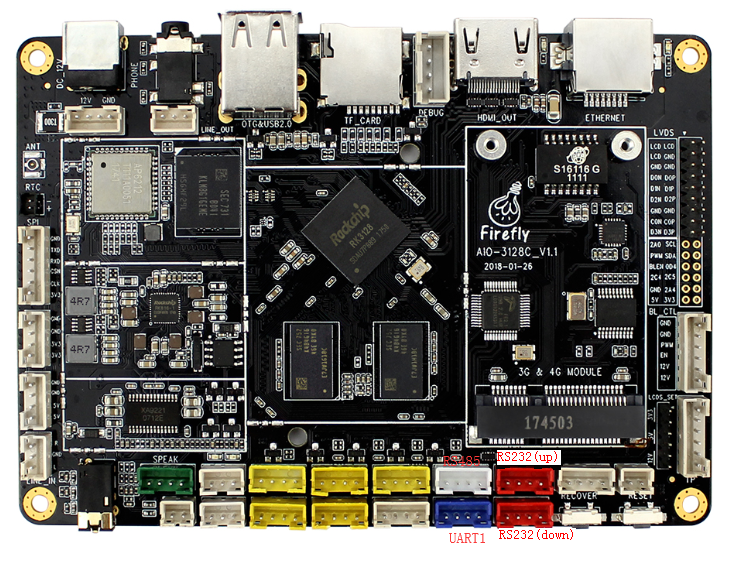

# UART Use

## Introduction

There are 3 uarts on AIO-3128C development board, which are uart0, uart1, uart2.  
uart0 is used by bluetooth for data transmission. To use uart0, the bluetooth must be disabled.  
uart1 is also multiplexed:

* BT_HOST_WAKE/SPI_TXD/UART1_TX
* BT_WAKE/SPI_RXD/UART1_RX
* WIFI_REG_ON/SPI_CSN0/UART1_RTS

To use uart1, bluetooth and SPI must be disabled.  

AIO-3128C uses SPI to bridge/expand the functions of four enhanced serial ports (UART), which are UART1, RS232 (up), RS232 (down), and RS485 functions. The RS232 (down) port hardware can be modified to TTL function. Each UART has a 256-byte FIFO buffer for data reception and transmission.



uart2 is generally used as debug port. It is also multiplexed with the TF card, hence uart2 and TF card can not be used at the same time:  

* SDMMC_D0/UART2_TX
* SDMMC_D1/UART2_RX


Both uart1 and uart2 have 32 bytes FIFO. Uart0 has double 64 byte FIFOs for optimised for bluetooth use. All the uarts support 5/6/7/8 bit serial data communication in DMA-based or interrupt-based operation mode.

## Create DTS Node

The DTS node have already been created in file kernel/arch/arm/boot/dts/rk312x.dtsi, shown as following:
```
uart0: serial@20060000 {
    compatible = "rockchip,serial";
    reg = <0x20060000 0x100>;
    interrupts = <GIC_SPI 20 IRQ_TYPE_LEVEL_HIGH>;
    clock-frequency = <24000000>;
    clocks = <&clk_uart0>, <&clk_gates8 0>;
    clock-names = "sclk_uart", "pclk_uart";
    reg-shift = <2>;
    reg-io-width = <4>;
    dmas = <&pdma 2>, <&pdma 3>;#dma-cells = <2>;
    pinctrl-names = "default";
    pinctrl-0 = <&uart0_xfer &uart0_cts &uart0_rts>;
    status = "disabled";}; 
uart1: serial@20064000 {
    compatible = "rockchip,serial";
    reg = <0x20064000 0x100>;
    interrupts = <GIC_SPI 21 IRQ_TYPE_LEVEL_HIGH>;
    clock-frequency = <24000000>;
    clocks = <&clk_uart1>, <&clk_gates8 1>;
    clock-names = "sclk_uart", "pclk_uart";
    reg-shift = <2>;
    reg-io-width = <4>;
    dmas = <&pdma 4>, <&pdma 5>;#dma-cells = <2>;
    pinctrl-names = "default";
    pinctrl-0 = <&uart1_xfer &uart1_cts &uart1_rts>;
    status = "disabled";};
```

### Configure uart0

You need to enable uart0 and disable bluetooth in  kernel/arch/arm/boot/dts/aio-3128c.dts:
```
&uart0 {
  status = "okay";
  dma-names = "!tx", "!rx";
  pinctrl-0 = <&uart0_xfer &uart0_cts>;}; 
  wireless-bluetooth {
  compatible = "bluetooth-platdata";
  ...
  status = "disabled";
};
```

### Configure uart1

You need to enable uart1 and disable both bluetooth and SPI in kernel/arch/arm/boot/dts/aio-3128c.dts:
```
//...
wireless-bluetooth {
  compatible = "bluetooth-platdata";
  ...
  status = "disabled";
};//...
&spi0 {  
  status = "disabled";
};
&uart1 {
  status = "okay";
  dma-names = "!tx", "!rx";
  pinctrl-0 = <&uart1_xfer &uart1_cts>;
};
```

## Compile and Flash Kernel

Compile the kernel as followed:
```
make firefly_defconfig
make aio-3128c.img
```

After successful compilation, flash kernel.img and resource.img under kernel directory to the development board.

## Data Commuincation

You can now communicate with the uart (uart0 as an example here) via a USB-to-serial adapter in your host PC. Follow the steps below:  

### (1) Connect the uart port.
Connect the TX, RX, GND pins of uart0 to the serial adapter's RX, TX, GND pins respectively.  

<font color=#ff0000 size=3>Note: if you are using the Firefly serial adapter, connect TX to TX, RX to RX.</font>

### (2) Open a serial terminal in host PC.
Run kermit in a shell window, and set baud rate:  
```
$ sudo kermit
C-Kermit> set line /dev/ttyUSB0
C-Kermit> set speed 9600
C-Kermit> set flow-control none
C-Kermit> connect
```

* /dev/ttyUSB0 is the device file of the PC's serial adapter
* uart0 baud defaults to 9600

### (3) Transmit data.
The device file for uart0 is /dev/ttyS0. Run the following command in device:
```
echo firefly uart test... > /dev/ttyS0
```
The serial terminal in the host PC will receive string "firefly uart test...".

### (4) Receive data.
First, run the following command in device:
```
cat /dev/ttyS0
```
Then input string "Firefly uart3 test..." in the serial terminal. You can see the same string received in the device.  
To change baud of uart0, for example, to 115200, run the following command:
```
stty -F /dev/ttyS0 115200
```