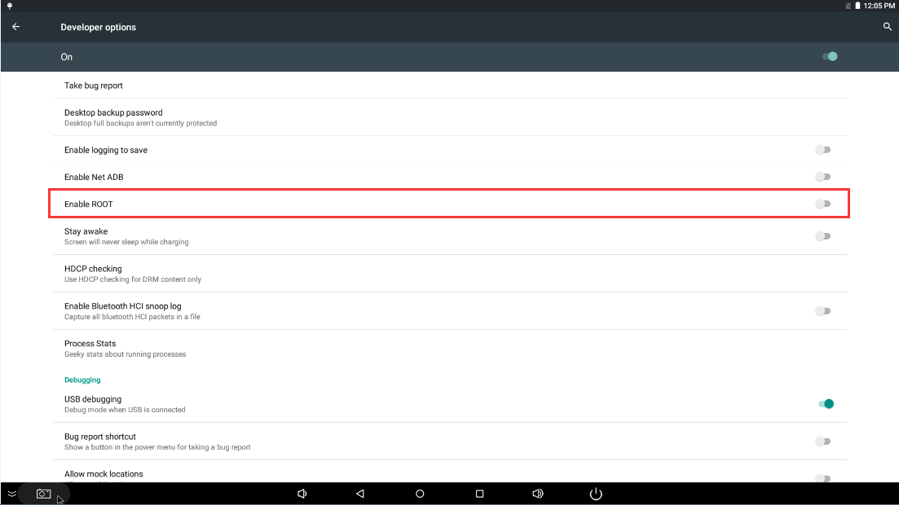
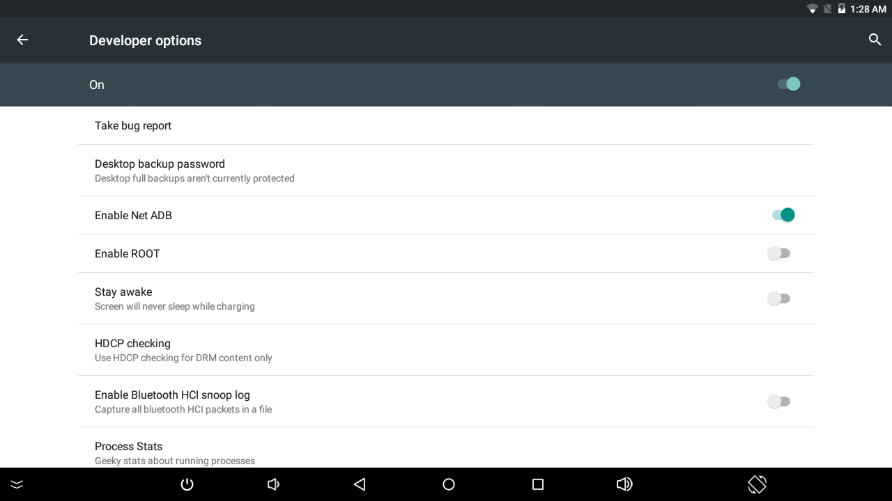

# FAQ

## Abnormal boot and reboot cycle
It probably not enough supply current, please use the voltage of 5V, current is 2.5A ~ 3A power.

## username and password of ubuntu
```
Username: root   		  
Password: firefly			

Username: firefly					   
Password: firefly
```

## Git link address

[https://bitbucket.org/T-Firefly/firenow-lollipop](https://bitbucket.org/T-Firefly/firenow-lollipop)

## MAC address programming

You can change MAC address of the AIO-3128C by yourself, and you can program MAC address by UpgradeDllTool (RKTools/windows/UpgradeDllTool_v1.35.zip in SDK).

## How do I get the system to grab the LOG in Android?
Settings -> About phone -> click 5 times Build number -> Developer options -> Enable logging to save

After opening the function, the system storage root directory will generate *.LOGSAVE* folder, which includes system *logcat* and kernel *KMSG*.

## Open Root permissions
The Android system has a lot of powerful functions that require root permissions. Developers often encounter problems with permissions when using it.
How to open the root function of the system on the Firefly platform? Firefly has added the function of starting root authority in the system. The specific steps are as follows:
1. Find About device in Settgins apk and click in it
2. Click Build number for 7 times and you are now a developer will be prompted.
3. Then, after clicking Developer options option on the previous level, click Enable ROOT to open the ROOT permissions function


## Use of Net ADB
Adb debugging mode has two types: 1. Use usb cable; 2. Use network.<br />

Adb mode: the development board and PC need to be in the same local area network, which can use wired network. Either the PC terminal can be connected to the development board in the same wifi route, or the development board can be connected to the PC terminal to create wifi hotspots.

*  Setting -> Developer options -> Enable Net ADB



*  Use busybox ifconfig to view the IP address of the development board, which is accessed by the PC side.<br />
```
adb connect + IP
adb shell
```
