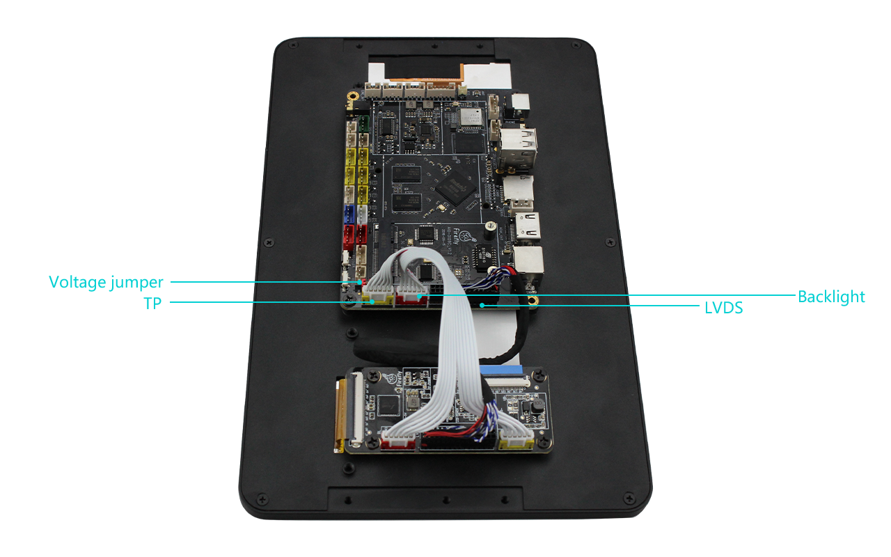

# Display module

## 10.1 inch LVDS display module

### Product parameters

* Model: HSX101H40C-L28B  
* Size: 10.1 inch
* Resolution: 1280x800
* Interface: LVDS
* Viewing angle: 170°
* Touch screen: multi-point capacitive touch

**Note:**

1.Firmware for 10.1-inch screen [AIO-3128C LVDS Firmware](https://drive.google.com/open?id=1OC3kIfb6RnAd-wPSj03MmsTcnMINLiIY)  

2.After updating the latest code of AIO-3128C, support for 10.1-inch screen.

### Reference materials

[Display module Datasheet](https://drive.google.com/open?id=1O0AyalT3W-2L1woR3Ui4EJFPWq-zDqAG)

### Wiring method

